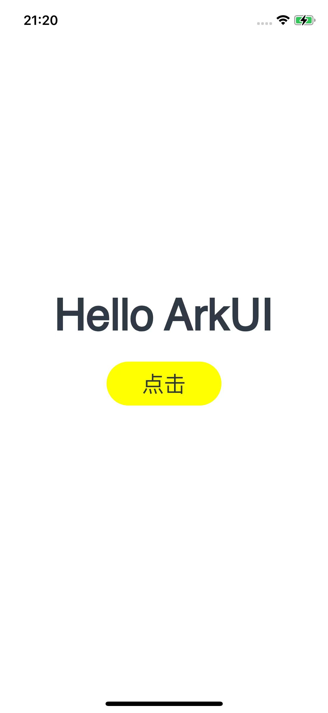

# HelloWorld应用示例
## 介绍
本示例展示ArkUI-X入门HelloWorld工程，可通过点击Button按钮改变Text组件展示内容。

## 效果预览

* Android平台展示效果
  
  <table>
  <tr>
      <td>
          <center>
              
          </center>
      </td>
      <td>
          <center>
              
          </center>
      </td>
  </tr>
  </table> 
  
* iOS平台展示效果
  
  <table>
  <tr>
      <td>
          <center>
              
          </center>
      </td>
      <td>
          <center>
              
          </center>
      </td>
  </tr>
  </table> 
  
* 鸿蒙平台展示效果

  <table>
  <tr>
      <td>
          <center>
              
          </center>
      </td>
      <td>
          <center>
              
          </center>
      </td>
  </tr>
  </table> 

### 使用说明

1. 打开应用，首页面显示一个Button和一个Text。

2. 点击Button按键，Text内容发生改变。

## 工程目录

```
HelloWorld
  ├── AppScope                    // App信息配置文件
  ├── entry/src/main
  │   ├── ets
  │   │   ├── entryability        // 应用入口
  │   │   └── pages               // 应用页面
  │   └── resources               // 放置颜色、文字等资源
```

## 具体实现

+ 基本的页面展示封装在Index，源码参考: [Index.ets](entry/src/main/ets/pages/Index.ets)
  + 展示基本的UI界面：Text和Button组件的基本构造实现。
  + 点击按钮切换Text组件中的内容：通过.onClick方法监听点击，从而改变文本内容。

## 相关权限

不涉及。

## 依赖

不涉及。

## 约束与限制

1. 本示例支持在Android\iOS\鸿蒙系统上运行。

2. 本示例已适配API version 12版本ArkUI-X SDK，版本号：2.0.0.27。

3. 本示例需要使用DevEco Studio NEXT Developer Beta1 (Build Version: 5.0.3.403, built on June 20, 2024)及以上版本才可编译运行。

## 下载

如需单独下载本工程，执行如下命令：

```
git init
git config core.sparsecheckout true
echo /HelloWorld > .git/info/sparse-checkout
git remote add origin https://gitcode.com/arkui-x/samples.git
git pull origin master
```