# 组件集合

## 介绍

本示例为ArkUI中组件、通用、动画、全局方法的集合。<br>

## 效果预览

| 页面     | HarmonyOS Next平台                                                     | Android平台                                                 | iOS平台                                                 |
| -------- | ------------------------------------------------------------ | ----------------------------------------------------------- | ------------------------------------------------------- |
| 组件     | 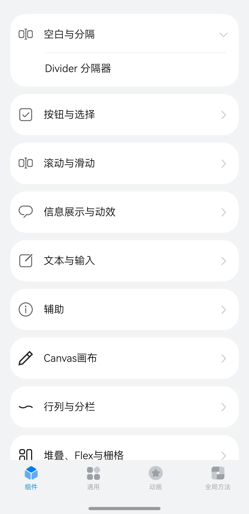 | 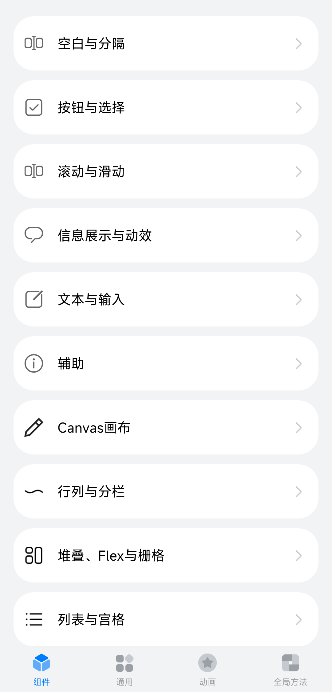 | 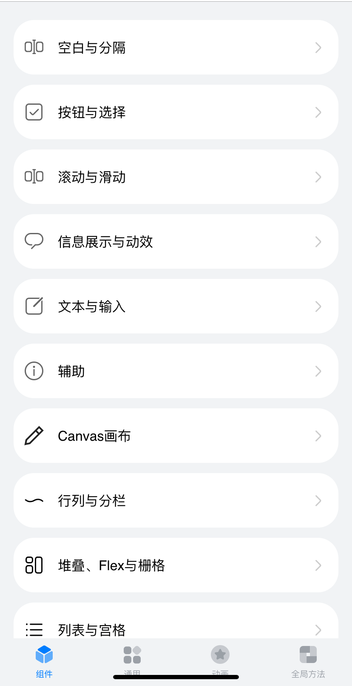 |
| 通用     | 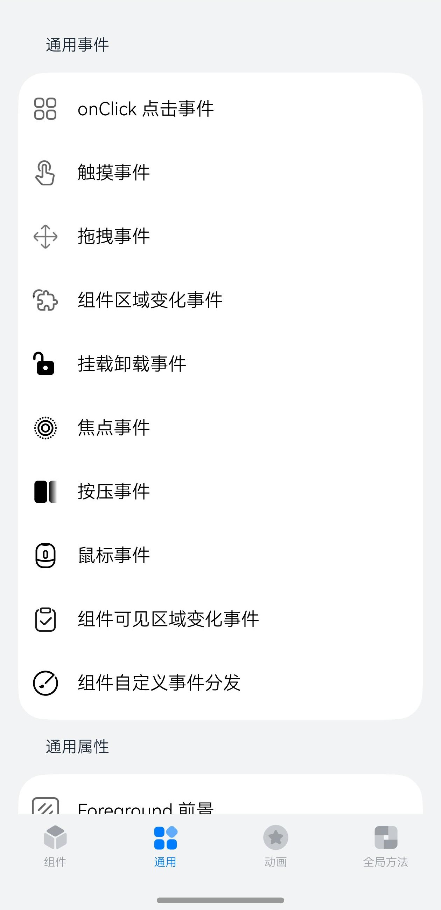 | 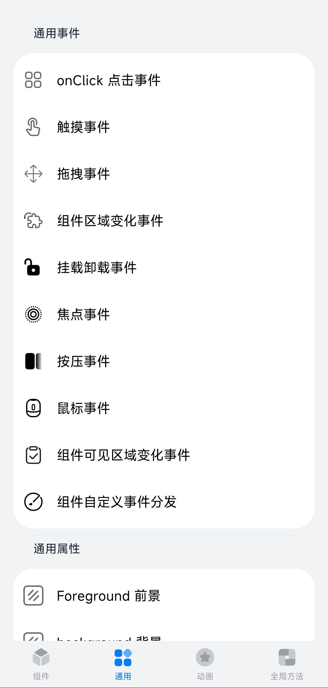 | 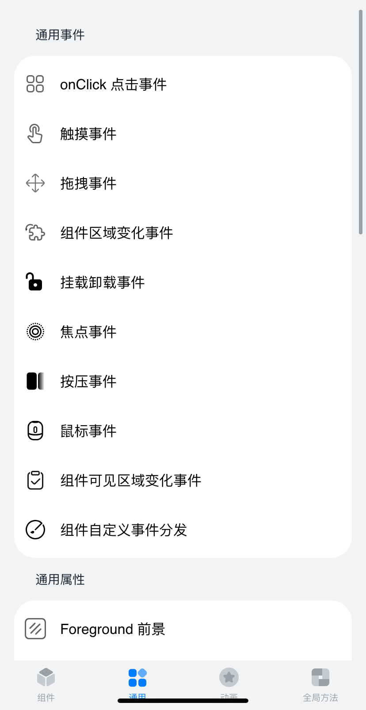 |
| 动画     | 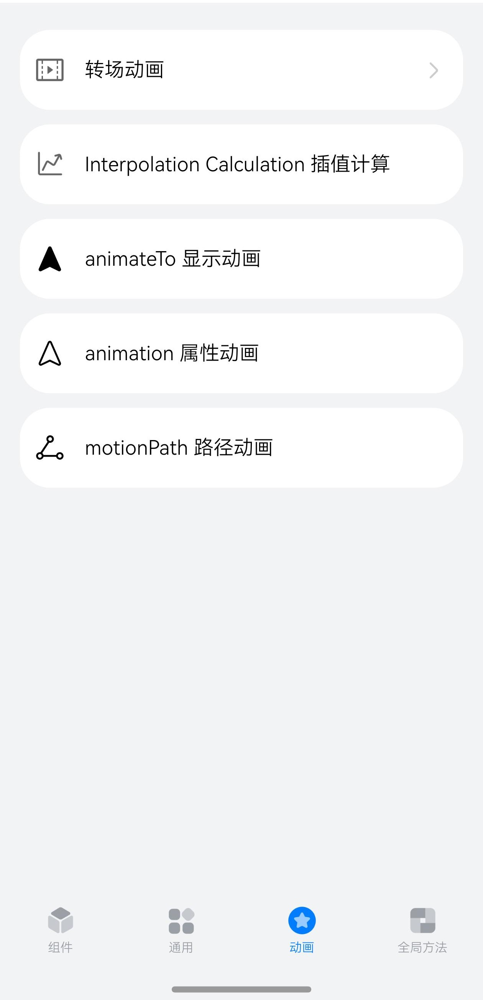 | 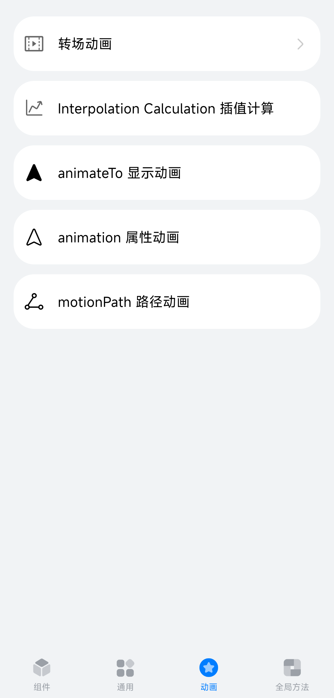 | 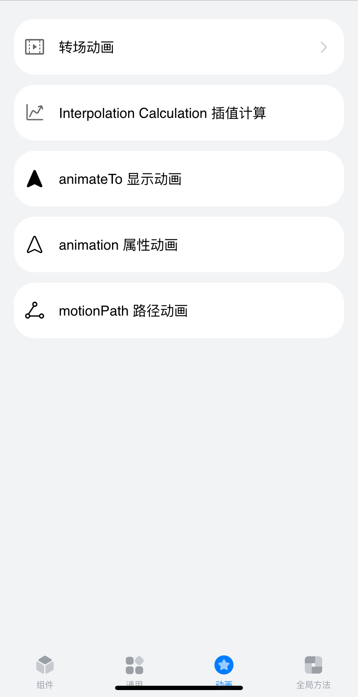 |
| 全局方法 | 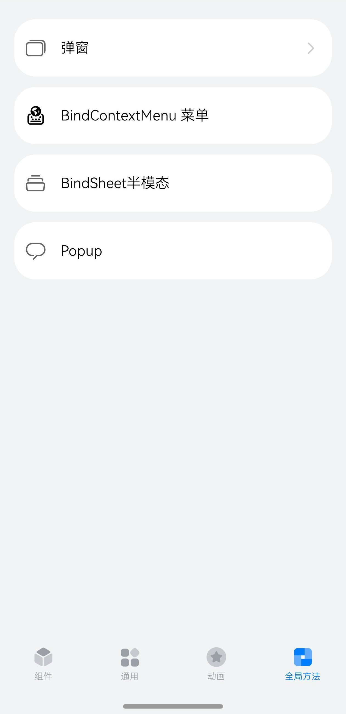 | 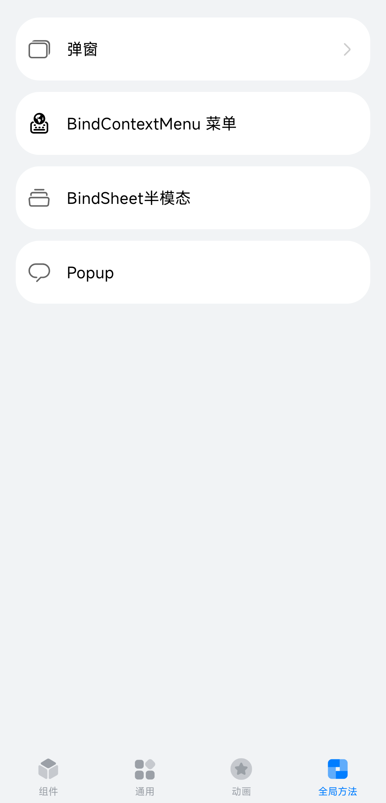 | 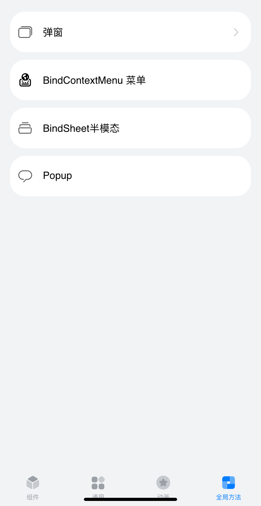 |

### 使用说明

- 点击**组件**、**通用**、**动画**、**全局方法**四个按钮或左右滑动切换不同视图。<br>
- 点击二级导航（如通用属性、通用事件等），若存在三级导航则展开三级导航（如Border 边框、点击事件等）；若不存在三级导航，则跳转至详情页面。<br>
- 若存在三级导航（如Border 边框、点击事件等），点击跳转至详情页面。<br>

## 案例适配状况

​		当前工程存在部分案例目前不支持运行于Android、iOS平台。<br>

- 所有的鼠标相关案例均不支持运行于iOS平台。<br>

- 以下案例整体不支持。Android、iOS平台运行应用将无法进入以下案例的展示界面。<br>

  | 案例名称                          | 案例位置                                    | Android | iOS    |
  | --------------------------------- | ------------------------------------------- | ------- | ------ |
  | QRCode二维码                      | 组件 信息展示与动效 QRCode二维码            | 不支持  | 不支持 |
  | RichText富文本                    | 组件 文本与输入 RichText富文本              | 不支持  | 不支持 |
  | RichEditor富文本编辑              | 组件 文本与输入 RichEditor富文本编辑        | 不支持  | 不支持 |
  | Navigation 滚动组件延伸底部导航条 | 组件 导航 Navigation 滚动组件延伸底部导航条 | 不支持  | 不支持 |
  | Navigation 扩展安全区             | 组件 导航 Navigation 扩展安全区             | 不支持  | 不支持 |
  | Navigation 避让底部导航条         | 组件 导航 Navigation 避让底部导航条         | 不支持  | 不支持 |
  | 多模输入                          | 通用 通用属性 互动 多模输入                 | 不支持  | 不支持 |
  | 分布式迁移标识                    | 通用 通用属性 分布式迁移标识                | 不支持  | 不支持 |
  | SafeArea安全区域                  | 通用 通用属性 SafeArea安全区域              | 不支持  | 不支持 |
  | BindSheet半模态                   | 全局方法 BindSheet半模态                    | 不支持  | 不支持 |

- 以下案例存在部分功能不支持。Android、iOS平台运行应用将不展示相关的功能点。<br>

  | 案例功能点   | 案例位置                                | Android | iOS    |
  | ------------ | --------------------------------------- | ------- | ------ |
  | 可否复制     | 组件 文本与输入 TextArea 多行文本输入框 | 不支持  | 不支持 |
  | 可否复制     | 组件 文本与输入 Search 搜索框           | 不支持  | 不支持 |
  | 取色效果调整 | 通用 通用属性 图像效果 背景模糊取色类型 | 不支持  | 不支持 |

  

## 具体实现

本示例使用[Tabs容器组件](https://gitee.com/openharmony/docs/blob/master/zh-cn/application-dev/reference/apis-arkui/arkui-ts/ts-container-tabs.md)搭建整体应用框架，每个[TabContent内容视图](https://gitee.com/openharmony/docs/blob/master/zh-cn/application-dev/reference/apis-arkui/arkui-ts/ts-container-tabcontent.md)使用[List容器组件](https://gitee.com/openharmony/docs/blob/master/zh-cn/application-dev/reference/apis-arkui/arkui-ts/ts-container-list.md)布局，在每个[ListItem](https://gitee.com/openharmony/docs/blob/master/zh-cn/application-dev/reference/apis-arkui/arkui-ts/ts-container-listitem.md)中使用[循环渲染](https://gitee.com/openharmony/docs/blob/master/zh-cn/application-dev/ui/state-management/arkts-rendering-control-foreach.md)加载此分类下分类导航数据，底部导航菜单使用[TabContent中tabBar属性](https://gitee.com/openharmony/docs/blob/master/zh-cn/application-dev/reference/apis-arkui/arkui-ts/ts-container-tabcontent.md#%E5%B1%9E%E6%80%A7)设置自定义样式 。<br>

* 将组件库分成四大类，切换查看<br>
  * 组件模块：<br>
    * 空白与分隔<br>
      * 封装自定义组件：CommonItemSlider，CommonItemSelect，CommonItemColorSelect <br>
      * 接口参考：[@ohos.app.ability.common](https://gitee.com/openharmony/docs/blob/master/zh-cn/application-dev/reference/apis-ability-kit/js-apis-app-ability-common.md)<br>
    * 按钮与选择<br>
      * 使用全局组件ShowToast，TitleBar，IntroductionTitle实现按钮，时间选择器，单选按钮，选择菜单，滑动条，切换按钮，勾选框，文本选择器，时间选择器，计数器，评分条组件功能 <br>
      * 使用getStringArrayData，getStringData获取数据，详见[ResourceDataHandle.ets](entry/src/main/ets/data/ResourceDataHandle.ets)<br>
    * 滚动与滑动<br>
      * 使用全局组件TitleBar实现滚动，翻页组件功能<br>
    * 信息展示与功效<br>
      * 使用全局组件TitleBar，AttributeModificationTool实现二维码，进度条，跑马灯，文字计时器，文字时钟，仪表盘，数据面板组件功能 <br>
      * 使用getStringArrayData，getStringData获取数据，详见[ResourceDataHandle.ets](entry/src/main/ets/data/ResourceDataHandle.ets)<br>
    * 文本与输入<br>
      * 使用全局组件ShowToast，TitleBar，AttributeModificationTool，IntroductionTitle实现行内文本，行内图像，文本输入，文本，富文本组件功能 <br>
      * 使用getStringArrayData，getStringData获取数据，详见[ResourceDataHandle.ets](entry/src/main/ets/data/ResourceDataHandle.ets)<br>
    * 辅助<br>
      * 使用全局组件TitleBar实现标记，滚动条，下拉刷新，弹出面板，字母索引条组件功能 <br>
      * 使用getStringArrayData，getStringData获取数据，详见[ResourceDataHandle.ets](entry/src/main/ets/data/ResourceDataHandle.ets)<br>
    * 画布<br>
      * 使用全局组件TitleBar， CanvasGradient， CanvasPattern， ImageBitmap， Path2D等实现图形绘制属性，图形绘制方法，渐变对象绘制，路径对象绘制，位图的绘制，阴影绘制，变换绘制<br>
      * 使用getStringArrayData，getStringData获取数据，详见[ResourceDataHandle.ets](entry/src/main/ets/data/ResourceDataHandle.ets)<br>
  * 通用模块：<br>
    * 通用事件<br>
      * 使用全局组件TitleBar，IntroductionTitle实现页面<br>
      * resetBallMotion，isSideReached，calculateReachedSide，decideMoveDirection方法计算区域坐标，moveBall方法移动球体<br>
    * 通用属性<br>
      * 使用全局组件TitleBar，AttributeModificationTool实现组件页面 <br>
  * 动画模块：<br>
    * 转场动画<br>
      * 使用全局组件TitleBar，IntroductionTitle实现页面 <br>
      * 接口参考：[@ohos.promptAction](https://gitee.com/openharmony/docs/blob/master/zh-cn/application-dev/reference/apis-arkui/js-apis-promptAction.md)<br>
    * 插值计算<br>
      * 使用全局组件TitleBar，IntroductionTitle实现页面 <br>
      * 接口参考：[@ohos.curves](https://gitee.com/openharmony/docs/blob/master/zh-cn/application-dev/reference/apis-arkui/js-apis-curve.md)， [@ohos.router](https://gitee.com/openharmony/docs/blob/master/zh-cn/application-dev/reference/apis-arkui/js-apis-router.md)<br>
    * 显示动画<br>
      * 使用全局组件TitleBar，IntroductionTitle实现页面<br>
      * 接口参考：[animateTo](https://gitee.com/openharmony/docs/blob/master/zh-cn/application-dev/reference/apis-arkui/arkui-ts/ts-explicit-animation.md)<br>
    * 属性动画
      * 使用全局组件TitleBar，IntroductionTitle实现页面<br>
      * 接口参考：[animation](https://gitee.com/openharmony/docs/blob/master/zh-cn/application-dev/reference/apis-arkui/arkui-ts/ts-animatorproperty.md)<br>
    * 路径动画<br>
      * 使用全局组件TitleBar，IntroductionTitle实现页面<br>
      * 接口参考：[path](https://gitee.com/openharmony/docs/blob/master/zh-cn/application-dev/reference/apis-arkui/arkui-ts/ts-motion-path-animation.md)<br>
  * 全局方法模块：<br>
    * 弹窗<br>
      * 使用全局组件ShowToast，TitleBar，IntroductionTitle实现弹窗组件页面<br>
      * 使用getStringArrayData，getStringData获取数据，详见[ResourceDataHandle.ets](entry/src/main/ets/data/ResourceDataHandle.ets)<br>
    * Popup<br>
      * 使用全局组件TitleBar，IntroductionTitle实现Popup组件页面<br>
      * 接口参考：[bindPopup](https://gitee.com/openharmony/docs/blob/master/zh-cn/application-dev/reference/apis-arkui/arkui-ts/ts-universal-attributes-popup.md)，[Popup高级组件](https://gitee.com/openharmony/docs/blob/master/zh-cn/application-dev/reference/apis-arkui/arkui-ts/ohos-arkui-advanced-Popup.md)<br>

## 相关权限

[ohos.permission.INTERNET](https://gitee.com/openharmony/docs/blob/master/zh-cn/application-dev/security/AccessToken/permissions-for-all.md#ohospermissioninternet)
- 本项目使用Web组件加载网页，请确保设备已连接网络

## 依赖

不涉及

## 约束与限制

1.本示例仅支持标准HarmonyOS Next、Android和iOS和设备系统上运行。<br>

2.本示例已适配API version 16版本的ArkUI-X SDK。<br>

3.本示例需要使用DevEco Studio 5.0.4 Release。<br>

4.本示例需要修改使用的DevEco Studio相关SDK的配置项，详见[关于deveco-studio编译时报错问题解决](https://gitcode.com/arkui-x/docs/blob/master/zh-cn/application-dev/tutorial/how-to-use-arkuix-on-applicationRetrofit.md#五、关于deveco-studio编译时报错问题解决)。<br>

## 工程目录

```
├── AppScope
│   ├── app.json5
│   └── resources
├── build-profile.json5
├── entry
│   ├── build-profile.json5
│   ├── hvigorfile.ts
│   ├── obfuscation-rules.txt
│   ├── oh-package.json5
│   └── src
│       └── main
│           ├── ets
│           │   ├── Application
│           │   │   └── MyAbilityStage.ts
│           │   ├── common
│           │   │   ├── AttributeModificationTool.ets
│           │   │   ├── IntroductionTitle.ets
│           │   │   ├── TabContentNavigation.ets
│           │   │   └── TitleBar.ets
│           │   ├── data
│           │   │   ├── CollectionCategory.ets
│           │   │   └── ResourceDataHandle.ets
│           │   ├── entryability
│           │   │   └── EntryAbility.ets
│           │   ├── model
│           │   │   └── CategoricalDataType.ets
│           │   ├── pages
│           │   │   ├── animations
│           │   │   │   ├── animateToSample
│           │   │   │   │   └── AnimateToSample.ets
│           │   │   │   ├── AnimationData.ets
│           │   │   │   ├── animationSample
│           │   │   │   │   └── AnimationSample.ets
│           │   │   │   ├── interpolationCalculationSample
│           │   │   │   │   └── InterpolationCalculationSample.ets
│           │   │   │   ├── motionPathSample
│           │   │   │   │   └── MotionPathSample.ets
│           │   │   │   └── TransitionAnimations
│           │   │   │       ├── componentTransitionSample
│           │   │   │       │   └── ComponentTransitionSample.ets
│           │   │   │       ├── floatingSample
│           │   │   │       │   ├── FloatingWindowComponent.ets
│           │   │   │       │   └── FloatingWindowSample.ets
│           │   │   │       ├── folderSample
│           │   │   │       │   ├── Folder.ets
│           │   │   │       │   ├── FolderItem.ets
│           │   │   │       │   └── FolderSample.ets
│           │   │   │       ├── gallerySample
│           │   │   │       │   └── GalleryCardSample.ets
│           │   │   │       ├── layoutAnimationSample
│           │   │   │       │   └── LayoutAnimationSample.ets
│           │   │   │       ├── multiplexSample
│           │   │   │       │   ├── MultiplexModel.ets
│           │   │   │       │   ├── MultiplexSample.ets
│           │   │   │       │   └── ScrollItem.ets
│           │   │   │       ├── pageTransitionSample
│           │   │   │       │   ├── PageTransitionSample.ets
│           │   │   │       │   └── PageTransitionSampleTo.ets
│           │   │   │       ├── shareElementTransitionSample
│           │   │   │       │   ├── ShareElementTransitionSample.ets
│           │   │   │       │   └── ShareElementTransitionSampleTo.ets
│           │   │   │       ├── shopSample
│           │   │   │       │   └── ShopCardSample.ets
│           │   │   │       ├── sideBarTransitionSample
│           │   │   │       │   ├── ChangePanel.ets
│           │   │   │       │   └── SideBarTransitionSample.ets
│           │   │   │       ├── sizeTransitionSample
│           │   │   │       │   └── SizeTransitionSample.ets
│           │   │   │       └── systemIcon
│           │   │   │           └── SystemIcon.ets
│           │   │   ├── components
│           │   │   │   ├── auxiliary
│           │   │   │   │   ├── alphabetIndexerSample
│           │   │   │   │   │   └── AlphabetIndexerSample.ets
│           │   │   │   │   ├── badgeSample
│           │   │   │   │   │   └── BadgeSample.ets
│           │   │   │   │   ├── refreshSample
│           │   │   │   │   │   └── RefreshSample.ets
│           │   │   │   │   └── scrollbarSample
│           │   │   │   │       └── ScrollBarSample.ets
│           │   │   │   ├── blankAndDivider
│           │   │   │   │   └── dividerSample
│           │   │   │   │       ├── ChangePanel.ets
│           │   │   │   │       └── DividerSample.ets
│           │   │   │   ├── buttonAndSelection
│           │   │   │   │   ├── buttonSample
│           │   │   │   │   │   └── ButtonSample.ets
│           │   │   │   │   ├── checkboxSample
│           │   │   │   │   │   └── CheckboxSample.ets
│           │   │   │   │   ├── counterSample
│           │   │   │   │   │   └── CounterSample.ets
│           │   │   │   │   ├── datePickerSample
│           │   │   │   │   │   └── DatePickerSample.ets
│           │   │   │   │   ├── radioSample
│           │   │   │   │   │   └── RadioSample.ets
│           │   │   │   │   ├── ratingSample
│           │   │   │   │   │   └── RatingSample.ets
│           │   │   │   │   ├── selectSample
│           │   │   │   │   │   └── SelectSample.ets
│           │   │   │   │   ├── sliderSample
│           │   │   │   │   │   ├── ChangePanel.ets
│           │   │   │   │   │   └── SliderSample.ets
│           │   │   │   │   ├── textPickerSample
│           │   │   │   │   │   └── TextPickerSample.ets
│           │   │   │   │   ├── timePickerSample
│           │   │   │   │   │   └── TimePickerSample.ets
│           │   │   │   │   └── toggleSample
│           │   │   │   │       └── ToggleSample.ets
│           │   │   │   ├── canvas
│           │   │   │   │   ├── attributesSample
│           │   │   │   │   │   └── AttributesSample.ets
│           │   │   │   │   ├── gradientSample
│           │   │   │   │   │   └── GradientSample.ets
│           │   │   │   │   ├── imageBitmapSample
│           │   │   │   │   │   └── ImageBitmapSample.ets
│           │   │   │   │   ├── methodsSample
│           │   │   │   │   │   └── MethodsSample.ets
│           │   │   │   │   ├── path2dSample
│           │   │   │   │   │   └── Path2dSample.ets
│           │   │   │   │   ├── sampleResources
│           │   │   │   │   │   ├── icon.png
│           │   │   │   │   │   └── smoothoff.png
│           │   │   │   │   ├── shadowsSample
│           │   │   │   │   │   └── ShadowsSample.ets
│           │   │   │   │   └── transformSample
│           │   │   │   │       └── TransformSample.ets
│           │   │   │   ├── canvasAndGraphicDrawing
│           │   │   │   │   ├── canvasSample
│           │   │   │   │   │   └── CanvasSample.ets
│           │   │   │   │   ├── circleSample
│           │   │   │   │   │   ├── ChangePanel.ets
│           │   │   │   │   │   └── CircleSample.ets
│           │   │   │   │   ├── ellipseSample
│           │   │   │   │   │   ├── ChangePanel.ets
│           │   │   │   │   │   └── EllipseSample.ets
│           │   │   │   │   ├── lineSample
│           │   │   │   │   │   ├── ChangePanel.ets
│           │   │   │   │   │   └── LineSample.ets
│           │   │   │   │   ├── pathSample
│           │   │   │   │   │   ├── ChangePanel.ets
│           │   │   │   │   │   └── PathSample.ets
│           │   │   │   │   ├── polygonSample
│           │   │   │   │   │   ├── ChangePanel.ets
│           │   │   │   │   │   └── PolygonSample.ets
│           │   │   │   │   ├── polylineSample
│           │   │   │   │   │   ├── ChangePanel.ets
│           │   │   │   │   │   └── PolylineSample.ets
│           │   │   │   │   ├── rectSample
│           │   │   │   │   │   ├── ChangePanel.ets
│           │   │   │   │   │   └── RectSample.ets
│           │   │   │   │   └── shapeSample
│           │   │   │   │       ├── ChangePanel.ets
│           │   │   │   │       └── ShapeSample.ets
│           │   │   │   ├── ComponentData.ets
│           │   │   │   ├── imageVideoAndMedia
│           │   │   │   │   ├── imageAnimatorSample
│           │   │   │   │   │   └── ImageAnimatorSample.ets
│           │   │   │   │   ├── imageSample
│           │   │   │   │   │   ├── ImageControlPanel.ets
│           │   │   │   │   │   └── ImageSample.ets
│           │   │   │   │   ├── pluginComponentSample
│           │   │   │   │   │   └── PluginComponentSample.ets
│           │   │   │   │   ├── videoSample
│           │   │   │   │   │   ├── VideoControlPanel.ets
│           │   │   │   │   │   └── VideoSample.ets
│           │   │   │   │   └── xcomponentSample
│           │   │   │   │       └── XComponentSample.ets
│           │   │   │   ├── informationPresentationAndDynamicEffects
│           │   │   │   │   ├── dataPanelSample
│           │   │   │   │   │   └── DataPanelSample.ets
│           │   │   │   │   ├── gaugeSample
│           │   │   │   │   │   └── GaugeSample.ets
│           │   │   │   │   ├── imageFitFullSample
│           │   │   │   │   │   └── ImageFitFullSample.ets
│           │   │   │   │   ├── listSample
│           │   │   │   │   │   └── ListSample.ets
│           │   │   │   │   ├── loadingProgressSample
│           │   │   │   │   │   └── LoadingProgressSample.ets
│           │   │   │   │   ├── marqueeSample
│           │   │   │   │   │   └── MarqueeSample.ets
│           │   │   │   │   ├── particleSample
│           │   │   │   │   │   └── ParticleSample.ets
│           │   │   │   │   ├── progressSample
│           │   │   │   │   │   └── ProgressSample.ets
│           │   │   │   │   ├── qrCodeSample
│           │   │   │   │   │   └── QRCodeSample.ets
│           │   │   │   │   ├── scrollToSample
│           │   │   │   │   │   └── ScrollToSample.ets
│           │   │   │   │   ├── tapsSwitchSample
│           │   │   │   │   │   └── TapsSwitchSample.ets
│           │   │   │   │   ├── textclockSample
│           │   │   │   │   │   └── TextClockSample.ets
│           │   │   │   │   └── textTimerSample
│           │   │   │   │       └── TextTimerSample.ets
│           │   │   │   ├── listAndGrid
│           │   │   │   │   ├── gridItemSample
│           │   │   │   │   │   ├── GridItemControlPanel.ets
│           │   │   │   │   │   └── GridItemSample.ets
│           │   │   │   │   ├── gridSample
│           │   │   │   │   │   ├── GridControlPanel.ets
│           │   │   │   │   │   └── GridSample.ets
│           │   │   │   │   ├── listItemSample
│           │   │   │   │   │   └── ListItemSample.ets
│           │   │   │   │   ├── listSample
│           │   │   │   │   │   ├── ListControlPanel.ets
│           │   │   │   │   │   └── ListSample.ets
│           │   │   │   │   └── waterFlowSample
│           │   │   │   │       ├── WaterFlowDataSource.ets
│           │   │   │   │       └── WaterFlowSample.ets
│           │   │   │   ├── navigation
│           │   │   │   │   ├── navigationSample
│           │   │   │   │   │   ├── BindSheetSafeArea.ets
│           │   │   │   │   │   ├── ListExpandSafeArea.ets
│           │   │   │   │   │   ├── NavigationBasic.ets
│           │   │   │   │   │   ├── NavigationExpandSafeArea.ets
│           │   │   │   │   │   ├── NavigationFullSafeArea.ets
│           │   │   │   │   │   ├── NavigationHideBar.ets
│           │   │   │   │   │   ├── NavigationModeChange.ets
│           │   │   │   │   │   ├── NavigationReplace.ets
│           │   │   │   │   │   ├── NavigationRouter.ets
│           │   │   │   │   │   ├── NavigationSample.ets
│           │   │   │   │   │   ├── NavigationSideBar.ets
│           │   │   │   │   │   └── NavigationSplit.ets
│           │   │   │   │   ├── navigatorSample
│           │   │   │   │   │   ├── NavigatorSample.ets
│           │   │   │   │   │   ├── NavigatorSecondPage.ets
│           │   │   │   │   │   └── NavigatorThirdPage.ets
│           │   │   │   │   ├── navRouterSample
│           │   │   │   │   │   └── NavRouterSample.ets
│           │   │   │   │   ├── stepperAndStepperItemSample
│           │   │   │   │   │   └── StepperAndStepperItemSample.ets
│           │   │   │   │   ├── tabContentSample
│           │   │   │   │   │   └── TabContentSample.ets
│           │   │   │   │   └── tabSample
│           │   │   │   │       ├── TabControlPanel.ets
│           │   │   │   │       └── TabSample.ets
│           │   │   │   ├── rowsAndColumns
│           │   │   │   │   ├── columnSample
│           │   │   │   │   │   ├── ColumnControlPanel.ets
│           │   │   │   │   │   └── ColumnSample.ets
│           │   │   │   │   ├── columnSplitSample
│           │   │   │   │   │   └── ColumnSplitSample.ets
│           │   │   │   │   ├── rowSample
│           │   │   │   │   │   ├── RowControlPanel.ets
│           │   │   │   │   │   └── RowSample.ets
│           │   │   │   │   ├── rowSplitSample
│           │   │   │   │   │   └── RowSplitSample.ets
│           │   │   │   │   └── sideBarContainerSample
│           │   │   │   │       ├── SideBarContainerControlPanel.ets
│           │   │   │   │       └── SideBarContainerSample.ets
│           │   │   │   ├── scrollAndSwipe
│           │   │   │   │   ├── scrollSample
│           │   │   │   │   │   └── ScrollSample.ets
│           │   │   │   │   └── swiperSample
│           │   │   │   │       ├── SwiperControlPanel.ets
│           │   │   │   │       ├── SwiperCustomAnimationControlPanel.ets
│           │   │   │   │       └── SwiperSample.ets
│           │   │   │   ├── stackFlexAndGrid
│           │   │   │   │   ├── flexSample
│           │   │   │   │   │   ├── FlexControlPanel.ets
│           │   │   │   │   │   └── FlexSample.ets
│           │   │   │   │   └── stackSample
│           │   │   │   │       ├── StackControlPanel.ets
│           │   │   │   │       └── StackSample.ets
│           │   │   │   ├── textAndInput
│           │   │   │   │   ├── imageSpanSample
│           │   │   │   │   │   ├── ChangePanel.ets
│           │   │   │   │   │   └── ImageSpanSample.ets
│           │   │   │   │   ├── InputUtil.ts
│           │   │   │   │   ├── patternLockSample
│           │   │   │   │   │   ├── ChangePanel.ets
│           │   │   │   │   │   └── PattternLockSample.ets
│           │   │   │   │   ├── richEditorSample
│           │   │   │   │   │   ├── RichEditorSample.ets
│           │   │   │   │   │   └── Title.ets
│           │   │   │   │   ├── richTextSample
│           │   │   │   │   │   └── RichTextSample.ets
│           │   │   │   │   ├── searchSample
│           │   │   │   │   │   ├── ChangePanel.ets
│           │   │   │   │   │   └── SearchSample.ets
│           │   │   │   │   ├── spanSample
│           │   │   │   │   │   ├── ChangePanel.ets
│           │   │   │   │   │   └── SpanSample.ets
│           │   │   │   │   ├── textAreaSample
│           │   │   │   │   │   ├── ChangePanel.ets
│           │   │   │   │   │   └── TextAreaSample.ets
│           │   │   │   │   ├── textInputSample
│           │   │   │   │   │   └── TextInputSample.ets
│           │   │   │   │   ├── textSample
│           │   │   │   │   │   ├── ChangePanel.ets
│           │   │   │   │   │   └── TextSample.ets
│           │   │   │   │   └── textStyledStringSample
│           │   │   │   │       ├── IntroductionTitle.ets
│           │   │   │   │       └── TextStyledStringSample.ets
│           │   │   │   └── web
│           │   │   │       └── webSample
│           │   │   │           └── WebSample.ets
│           │   │   ├── globalMethods
│           │   │   │   ├── dialogs
│           │   │   │   │   ├── actionSheetDialogSample
│           │   │   │   │   │   └── ActionSheetDialogSample.ets
│           │   │   │   │   ├── alertDialogSample
│           │   │   │   │   │   └── AlertDialogSample.ets
│           │   │   │   │   ├── bindSheetSample
│           │   │   │   │   │   └── BindSheetSample.ets
│           │   │   │   │   ├── customDialogSample
│           │   │   │   │   │   ├── CustomDialog.ets
│           │   │   │   │   │   └── CustomDialogSample.ets
│           │   │   │   │   ├── dateDialogSample
│           │   │   │   │   │   └── DateDialogSample.ets
│           │   │   │   │   ├── menuSample
│           │   │   │   │   │   └── MenuSample.ets
│           │   │   │   │   ├── popUpSample
│           │   │   │   │   │   └── PopUpSample.ets
│           │   │   │   │   ├── textPickerDialogSample
│           │   │   │   │   │   └── TextPickerDialogSample.ets
│           │   │   │   │   └── timeDialogSample
│           │   │   │   │       └── TimeDialogSample.ets
│           │   │   │   └── GlobalMethodData.ets
│           │   │   ├── Index.ets
│           │   │   └── universal
│           │   │       ├── events
│           │   │       │   ├── areaChangeEventSample
│           │   │       │   │   └── AreaChangeEventSample.ets
│           │   │       │   ├── clickEventSample
│           │   │       │   │   └── ClickEventSample.ets
│           │   │       │   ├── customEventSample
│           │   │       │   │   ├── CustomClickEvent.ets
│           │   │       │   │   ├── CustomEventHome.ets
│           │   │       │   │   └── CustomScrollingEvent.ets
│           │   │       │   ├── dragEventSample
│           │   │       │   │   ├── component
│           │   │       │   │   │   ├── GridItemDrag.ets
│           │   │       │   │   │   ├── HyperlinkDrag.ets
│           │   │       │   │   │   ├── ImageDrag.ets
│           │   │       │   │   │   ├── ListItemDrag.ets
│           │   │       │   │   │   ├── MultiSelectDrag.ets
│           │   │       │   │   │   ├── TextDrag.ets
│           │   │       │   │   │   └── VideoDrag.ets
│           │   │       │   │   └── DragEventSample.ets
│           │   │       │   ├── focusEventSample
│           │   │       │   │   └── FocusEventSample.ets
│           │   │       │   ├── keyPressEventSample
│           │   │       │   │   └── KeyPressEventSample.ets
│           │   │       │   ├── mountUnmountEventSample
│           │   │       │   │   └── MountUnmountEventSample.ets
│           │   │       │   ├── mouseEventSample
│           │   │       │   │   └── MouseEventSample.ets
│           │   │       │   ├── scrollEventSample
│           │   │       │   │   └── ScrollEventSample.ets
│           │   │       │   └── touchEventSample
│           │   │       │       └── TouchEventSample.ets
│           │   │       ├── gesture
│           │   │       │   ├── bindGestureSample
│           │   │       │   │   └── BindGestureSample.ets
│           │   │       │   ├── combinedSample
│           │   │       │   │   └── CombinedSample.ets
│           │   │       │   ├── customGesture
│           │   │       │   │   └── CustomGestureJudge.ets
│           │   │       │   ├── longPressSample
│           │   │       │   │   └── LongPressSample.ets
│           │   │       │   ├── panSample
│           │   │       │   │   └── PanSample.ets
│           │   │       │   ├── pinchSample
│           │   │       │   │   └── PinchSample.ets
│           │   │       │   ├── rotationSample
│           │   │       │   │   └── RotationSample.ets
│           │   │       │   ├── swipeSample
│           │   │       │   │   └── SwipeSample.ets
│           │   │       │   └── tapGestureSample
│           │   │       │       └── TapGestureSample.ets
│           │   │       ├── properties
│           │   │       │   ├── attributeModifierSample
│           │   │       │   │   └── AttributeModifierSample.ets
│           │   │       │   ├── backgroundSample
│           │   │       │   │   ├── BackgroundSample.ets
│           │   │       │   │   └── ChangePanel.ets
│           │   │       │   ├── borderSample
│           │   │       │   │   └── BorderSample.ets
│           │   │       │   ├── componentBlurredSample
│           │   │       │   │   └── ComponentBlurredSample.ets
│           │   │       │   ├── componentIDSample
│           │   │       │   │   └── ComponentIDSample.ets
│           │   │       │   ├── displaySample
│           │   │       │   │   └── DisplaySample.ets
│           │   │       │   ├── effectsSample
│           │   │       │   │   ├── ChangePanel.ets
│           │   │       │   │   └── EffectsSample.ets
│           │   │       │   ├── flexSample
│           │   │       │   │   └── FlexSample.ets
│           │   │       │   ├── focusControlSample
│           │   │       │   │   └── FocusControlSample.ets
│           │   │       │   ├── fontSample
│           │   │       │   │   └── FontSample.ets
│           │   │       │   ├── foregroundSample
│           │   │       │   │   └── ForegroundSample.ets
│           │   │       │   ├── interactionSample
│           │   │       │   │   └── InteractionSample.ets
│           │   │       │   ├── layoutConstraintSample
│           │   │       │   │   └── LayoutConstraintSample.ets
│           │   │       │   ├── locationSample
│           │   │       │   │   └── LocationSample.ets
│           │   │       │   ├── outlineSample
│           │   │       │   │   └── OutlineSample.ets
│           │   │       │   ├── pictureBorderSample
│           │   │       │   │   └── PictureBorderSample.ets
│           │   │       │   ├── restoreIdSample
│           │   │       │   │   └── RestoreIdSample.ets
│           │   │       │   ├── rotateSample
│           │   │       │   │   └── RotateSample.ets
│           │   │       │   ├── safeAreaSample
│           │   │       │   │   ├── ChangePanel.ets
│           │   │       │   │   └── SafeAreaSample.ets
│           │   │       │   ├── scaleSample
│           │   │       │   │   └── ScaleSample.ets
│           │   │       │   ├── shapeCropSample
│           │   │       │   │   └── ShapeCropSample.ets
│           │   │       │   ├── sizeSample
│           │   │       │   │   └── SizeSample.ets
│           │   │       │   ├── transformSample
│           │   │       │   │   └── TransformSample.ets
│           │   │       │   └── translateSample
│           │   │       │       └── TranslateSample.ets
│           │   │       └── UniversialData.ets
│           │   └── util
│           │       ├── Logger.ts
│           │       ├── PlatformInfo.ets
│           │       └── ShowToast.ets
│           ├── module.json5
│           └── resources
├── harA
│   ├── build-profile.json5
│   ├── hvigorfile.ts
│   ├── index.ets
│   ├── oh-package.json5
│   └── src
│       └── main
│           ├── ets
│           │   └── components
│           │       └── mainpage
│           │           └── HarA.ets
│           ├── module.json5
│           └── resources
├── harB
│   ├── build-profile.json5
│   ├── hvigorfile.ts
│   ├── index.ets
│   ├── oh-package.json5
│   └── src
│       └── main
│           ├── ets
│           │   └── components
│           │       └── mainpage
│           │           └── HarB.ets
│           ├── module.json5
│           └── resources
├── RouterModule
|   ├── build-profile.json5
|   ├── hvigorfile.ts
|   ├── index.ets
|   ├── oh-package.json5
|   └── src
|       └── main
|           ├── ets
|           │   └── utils
|           │       └── RouterModule.ets
|           ├── module.json5
|           └── resources
├── hvigor
│   └── hvigor-config.json5
├── hvigorfile.ts
├── local.properties
└── oh-package.json5
```

## 下载

如需单独下载本工程，执行如下命令：

```
git init
git config core.sparsecheckout true
echo /CodeLab/ArkTSComponentCollection > .git/info/sparse-checkout
git remote add origin https://gitcode.com/arkui-x/samples.git
git pull origin master
```