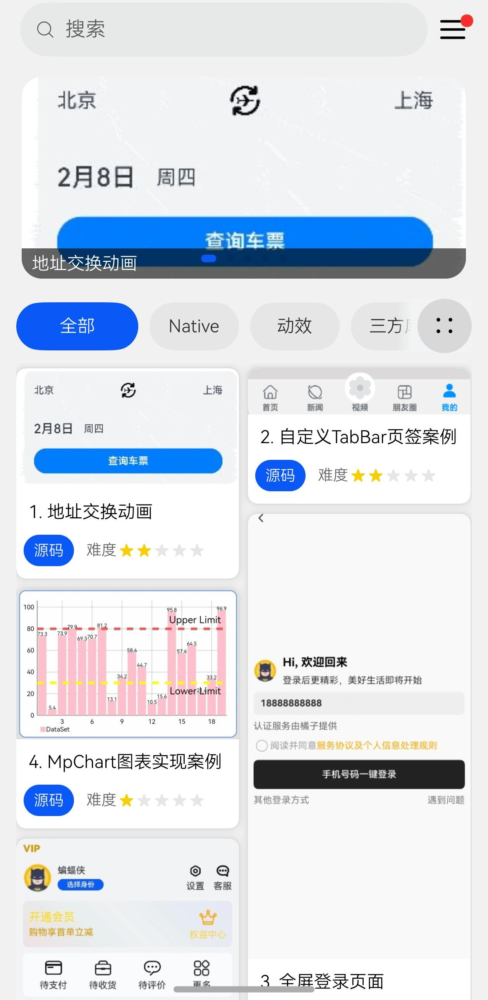
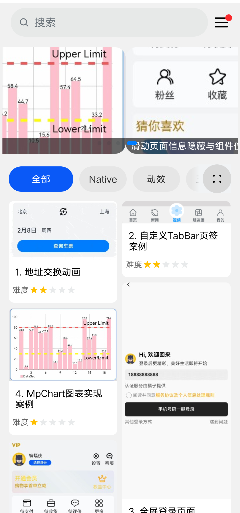
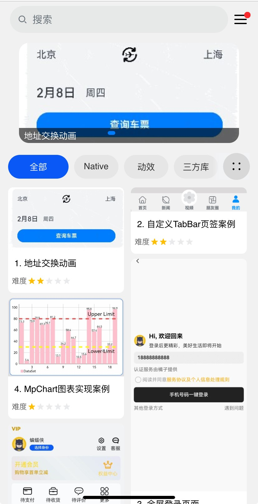
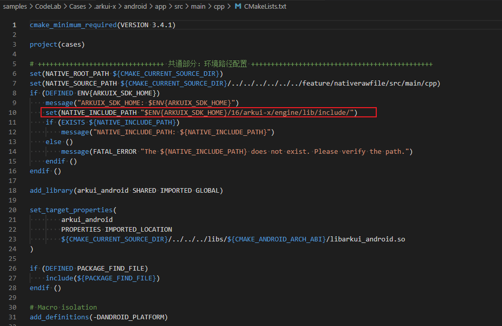

# 应用开发案例集

## 介绍

本篇文章将介绍一个应用通用架构的设计思路，以减少模块间的耦合、提升团队开发效率，为开发者呈现一个清晰且结构化的开发框架。<br>
本篇文章从分层架构设计和模块化设计的方面介绍应用的架构组成。<br>

**分层架构设计**：将应用划分为产品定制层、基础特性层和公共能力层，可以降低层间的依赖性，从而提升代码的可维护性。应用通用开发范例App分层架构如下：<br>

   ```
APP
|---AppScope
|---common    // 公共能力层，包括公共UI组件、数据管理、通信和工具库等
|---feature   // 基础特性层，包含独立的业务模块，如启动页、登录模块、导航栏等
|---libs      // 三方依赖库
|---product   // 产品定制层，作为不同设备或场景应用入口，例如phone等
   ```

**模块化设计**：应用被分解为多个功能模块，其中每个模块负责执行特定的功能。通过模块化设计提高了代码的可理解性和可复用性，使应用的扩展和维护变得更为简便，同时降低了系统各部分之间的耦合度。<br>

## 具体实现

### 产品定制层

产品定制层专注于满足不同设备或使用场景的个性化需求，包括UI设计、资源和配置，以及针对特定场景的交互逻辑和功能特性。<br>

产品定制层的功能模块独立运作，同时依赖基础特性层和公共能力层来实现具体功能。<br>

### 基础特性层

基础特性层位于公共能力层之上，用于存放基础特性集合，例如相对独立的功能UI和业务逻辑实现。该层的每个功能模块都具有高内聚、低耦合、可定制的特点，以支持产品的灵活部署。<br>

基础特性层为上层的产品定制层提供稳健且丰富的基础功能支持，包括UI组件、基础服务等。同时依赖于下层的公共能力层为其提供通用功能和服务。<br>

当前应用的开发案例集均以har模块存于基础特性层。<br>

首页以Navigation组件为基础，嵌套了搜索、精品案例轮播、案例瀑布流列表等模块，预览效果如下：<br>

| HarmonyOS Next平台                                                     | Android平台                                                | iOS平台                                                |
| ------------------------------------------------------------ | ---------------------------------------------------------- | ------------------------------------------------------ |
|  |  |  |

### 公共能力层

公共功能层用于存放公共基础能力，集中了例如公共UI组件、数据管理、外部交互以及工具库等的共享功能。<br>

公共能力层为上层的基础特性层和产品定制层提供稳定可靠的功能支持，确保整个应用的稳定性和可维护性。<br>

应用开发案例集App公共能力层包含以下模块：[**日志打印**](common/utils/src/main/ets/utils/Logger.ets)、[**功能介绍布局**](common/utils/src/main/ets/component/FunctionDescription.ets)等。<br>

## 使用说明

- 首页以瀑布流形式展示案例集合，可通过点击案例模块跳转至详情页面。<br>
- 首页可以通过搜索快速搜索进入案例。<br>

## 案例适配状况说明

目前以下案例部分功能，Android、iOS不支持：<br>

| 案例编号 | 案例名称（对应工程feature下目录名） | 案例描述                                   | 功能点说明          |
| -------- | ----------------------------------- | ------------------------------------------ | ------------------- |
| 17       | applicationexception                | 应用异常处理案例                           | 不支持 应用卡死事件 |
| 24       | vibrateeffect                       | 使用弹簧曲线实现抖动动画及手机振动效果案例 | 不支持 手机振动效果 |
| 41       | nativesavepictosandbox              | Native保存图片到应用沙箱                   | 不支持 保存网络图片 |
| 132      | calendarswitch                      | 日历切换案例                               | 不支持 配置日程     |
| 153      | patternlock                         | 图形锁屏案例                               | 不支持 手机振动效果 |
| 168      | clickanimation                      | 直播界面双击效果动画实现案例               | 不支持 手机振动效果 |

目前以下案例暂不支持：<br>

| 案例编号 | 案例名称（对应工程feature下目录名）     | 案例描述                                   | Android | iOS    |
| -------- | --------------------------------------- | ------------------------------------------ | ------- | ------ |
| 14       | akiusepractice                          | 使用AKI轻松实现跨语言调用                  | 不支持  | 不支持 |
| 16       | photopickandsave                        | 图片选择和下载保存案例                     | 不支持  | 不支持 |
| 23       | verifycode                              | 验证码布局                                 | 不支持  | 不支持 |
| 28       | mediafullscreen                         | 视频全屏切换案例                           | 不支持  | 不支持 |
| 29       | imagecomment                            | 发布图片评论                               | 不支持  | 不支持 |
| 30       | foldablescreencases                     | 折叠屏音乐播放器案例                       | 不支持  | 不支持 |
| 43       | sidebaranimation                        | SideBarContainer侧边栏淡入淡出动效实现案例 | 不支持  | 不支持 |
| 45       | imagecompression                        | 图片压缩方案                               | 不支持  | 不支持 |
| 49       | imageenableanalyzer                     | 图片拖拽AI抠图案例                         | 不支持  | 不支持 |
| 52       | webgetcameraimage                       | Web获取相机拍照图片案例                    | 不支持  | 不支持 |
| 60       | diggingholescreen                       | 适配挖孔屏案例                             | 不支持  | 不支持 |
| 64       | nativeembed                             | ArkWeb同层渲染                             | 不支持  | 不支持 |
| 70       | handwritingtoimage                      | 手写绘制及保存图片                         | 不支持  | 不支持 |
| 79       | webpdfviewer                            | Web组件预览PDF文件实现案例                 | 不支持  | 不支持 |
| 82       | customscan                              | 折叠屏扫描二维码方案                       | 不支持  | 不支持 |
| 84       | wordrecognition                         | 文字识别案例                               | 不支持  | 不支持 |
| 86       | videocache                              | 边缓存边播放案例                           | 不支持  | 不支持 |
| 91       | pageflip                                | 阅读翻页方式案例                           | 不支持  | 不支持 |
| 92       | webcustompressmenu                      | Web自定义长按菜单案例                      | 不支持  | 不支持 |
| 94       | danmakuplayer                           | 视频弹幕功能                               | 不支持  | 不支持 |
| 97       | xcomponentvsync                         | XComponent + Vsync 实现自定义动画          | 不支持  | 不支持 |
| 101      | webpagesnapshot                         | 页面长截图                                 | 不支持  | 不支持 |
| 102      | chatwithexpression                      | 表情聊天案例                               | 不支持  | 不支持 |
| 114      | watermark                               | 水印案例                                   | 不支持  | 不支持 |
| 121      | perfermance/highlyloadedcomponentrender | 合理处理高负载组件的渲染文章示例代码       | 不支持  | 不支持 |
| 124      | customkeyboardtoh5                      | H5页面调用自定义输入法案例                 | 不支持  | 不支持 |
| 126      | perfermance/operaterdbintaskpool        | TaskPool线程中操作关系型数据库实现案例     | 不支持  | 不支持 |
| 130      | palette                                 | 画笔调色板案例                             | 不支持  | 不支持 |
| 133      | eraser                                  | 橡皮擦案例                                 | 不支持  | 不支持 |
| 134      | bluetooth                               | 蓝牙实现服务端和客户端通讯                 | 不支持  | 不支持 |
| 137      | videolistautoplay                       | 滑动视频自动播放                           | 不支持  | 不支持 |
| 138      | videoscreendirectionswitching           | 视频横竖屏切换及进度条热区拖动             | 不支持  | 不支持 |
| 142      | verticalhorizontallinkage               | 纵向横向列表联动案例                       | 不支持  | 不支持 |
| 144      | addressrecognize                        | AI图片文字智能识别                         | 不支持  | 不支持 |
| 145      | h5cache                                 | H5页面资源离线缓存案例                     | 不支持  | 不支持 |
| 148      | decodeheifimage                         | HEIF软解码器案例                           | 不支持  | 不支持 |
| 150      | livedetectionandencryptiond             | 人脸识别与验证案例                           | 不支持  | 不支持 |
| 152      | keyboardavoid                           | 组件随软键盘弹出避让案例                   | 不支持  | 不支持 |
| 156      | immersive                               | 沉浸式适配案例                             | 不支持  | 不支持 |
| 157      | containernestedslide                    | Scroll容器嵌套多种组件事件处理案例         | 不支持  | 不支持 |
| 159      | shareimagepage                          | 图片分享案例                               | 不支持  | 不支持 |
| 160      | selecttextmenu                          | 文本选择菜单案例                           | 不支持  | 不支持 |
| 161      | pipwindow                               | 视频悬浮窗                                 | 不支持  | 不支持 |
| 162      | clockin                                 | 定位打卡案例                           | 不支持  | 不支持 |
| 167      | videocreategif                          | 视频截取gif图                              | 不支持  | 不支持 |
| 170      | networkstatusobserver                   | 网络状态监听案例                           | 不支持  | 不支持 |
| 173      | faceandfingerprintunlocking             | 人脸指纹解锁案例                           | 不支持  | 不支持 |
| 176      | dealstridesolution                      | 解决相机预览花屏案例                       | 不支持  | 不支持 |
| 177      | videotrimmer                            | 视频下载保存及剪辑压缩上传                 | 不支持  | 不支持 |
| 179      | smartfill                               | 智能填充案例                               | 不支持  | 不支持 |
| 180      | sharebutton                             | 二维码分享案例                             | 不支持  | 不支持 |

## 相关权限

[ohos.permission.INTERNET](https://gitee.com/openharmony/docs/blob/master/zh-cn/application-dev/security/AccessToken/permissions-for-all.md#ohospermissioninternet)<br>

[ohos.permission.GET_NETWORK_INFO](https://gitee.com/openharmony/docs/blob/master/zh-cn/application-dev/security/AccessToken/permissions-for-all.md#ohospermissionget_network_info)<br>

[ohos.permission.KEEP_BACKGROUND_RUNNING](https://gitee.com/openharmony/docs/blob/master/zh-cn/application-dev/security/AccessToken/permissions-for-all.md#ohospermissionkeep_background_running)<br>

[ohos.permission.ACCESS_BIOMETRIC](https://gitee.com/openharmony/docs/blob/master/zh-cn/application-dev/security/AccessToken/permissions-for-all.md#ohospermissionaccess_biometric)<br>

## 依赖

不涉及<br>

## 约束与限制

1. 本示例仅支持标准HarmonyOS Next、Android和iOS和设备系统上运行。<br>

2. 本示例已适配API version 16版本的ArkUI-X SDK。<br>

3. 本示例需要使用DevEco Studio 5.0.4 Release。<br>

4. 本示例在Android端运行需要使用Cmake编译；需要配置以下内容<br>

- 配置系统环境变量：<br>

  系统环境变量名：ARKUIX_SDK_HOME<br>

  系统环境变量值：该值为ArkUI-X SDK的环境路径<br>

- 配置ArkUI-X SDK的API版本：<br>

  找到工程的[CMakeLists.txt](.arkui-x/android/app/src/main/cpp/CMakeLists.txt)找到如下语句，修改其中的数字为实际编译使用的API版本<br>

  

5. 本示例需要修改使用的DevEco Studio相关SDK的配置项，详见[关于deveco-studio编译时报错问题解决](https://gitcode.com/arkui-x/docs/blob/master/zh-cn/application-dev/tutorial/how-to-use-arkuix-on-applicationRetrofit.md#五、关于deveco-studio编译时报错问题解决)。<br>

## 工程目录

```
App
├── AppScope
│   ├── app.json5
│   └── resources
├── build-profile.json5
├── common
│   ├── routermodule
│   │   ├── build-profile.json5
│   │   ├── consumer-rules.txt
│   │   ├── hvigorfile.ts
│   │   ├── Index.ets
│   │   ├── obfuscation-rules.txt
│   │   ├── oh-package.json5
│   │   └── src
│   │       └── main
│   │           ├── ets
│   │           │   ├── annotation
│   │           │   │   └── AppRouter.ets
│   │           │   ├── foldableRouter
│   │           │   │   └── FoldableRouter.ets
│   │           │   ├── interceptor
│   │           │   │   └── Interceptor.ets
│   │           │   ├── model
│   │           │   │   ├── AppRouterInfo.ets
│   │           │   │   └── RouterParam.ets
│   │           │   ├── router
│   │           │   │   └── DynamicsRouter.ets
│   │           │   └── util
│   │           │       └── RouterLoader.ets
│   │           └── module.json5
│   └── utils
│       ├── build-profile.json5
│       ├── consumer-rules.txt
│       ├── hvigorfile.ts
│       ├── Index.ets
│       ├── obfuscation-rules.txt
│       ├── oh-package.json5
│       └── src
│           └── main
│               ├── ets
│               │   ├── component
│               │   │   ├── FunctionDescription.ets
│               │   │   ├── GlobalStateDialog.ets
│               │   │   ├── LoadingView.ets
│               │   │   └── TopNavigationView.ets
│               │   └── utils
│               │       ├── BridgeUtil.ets
│               │       ├── Logger.ets
│               │       ├── NWebUtils.ets
│               │       ├── PlatformInfo.ets
│               │       └── PreferenceManager.ets
│               ├── module.json5
│               └── resources
├── feature
│   ├── addressexchange
│   ├── addressrecognize
│   ├── akiusepractice
│   └── ......
├── hvigor
│   └── hvigor-config.json5
├── hvigorfile.ts
├── libs
│   ├── arm64-v8a
│   │   └── libcurl.so
│   ├── autobuilddecoration-1.0.2.tgz
│   ├── autobuildrouter-1.0.2.tgz
│   ├── autobuildrouter-1.0.3.tgz
│   ├── autobuildrouter-1.0.4.tgz
│   └── autobuildrouter-1.0.5.tgz
├── local.properties
├── oh-package.json5
└── product
    └── phone
        ├── build-profile.json5
        ├── hvigorfile.ts
        ├── obfuscation-rules.txt
        ├── oh-package.json5
        └── src
            └── main
                ├── ets
                │   ├── abilityStage
                │   │   └── MyAbilityStage.ets
                │   ├── constants
                │   │   ├── BreakpointConstants.ets
                │   │   ├── CommonConstants.ets
                │   │   └── HelperConstants.ets
                │   ├── data
                │   │   ├── lottie
                │   │   │   ├── pageLoading.json
                │   │   │   └── politeChicky.json
                │   │   └── WaterFlowData.ets
                │   ├── model
                │   │   └── PanPositionModel.ets
                │   ├── pages
                │   │   ├── AdvertisingPage.ets
                │   │   └── EntryView.ets
                │   ├── phoneability
                │   │   └── PhoneAbility.ets
                │   ├── phoneformability
                │   │   └── PhoneFormAbility.ets
                │   ├── view
                │   │   ├── HelperView.ets
                │   │   ├── HomePageSwiper.ets
                │   │   ├── PrivacyAgreementDialog.ets
                │   │   └── PrivacyAgreementPage.ets
                │   └── widget
                │       ├── pages
                │       │   └── WidgetCard.ets
                │       └── utils
                │           └── CaseCardUtils.ets
                ├── module.json5
                └── resources
```

## 下载

如需单独下载本工程，执行如下命令：<br>

```
git init
git config core.sparsecheckout true
echo /CodeLab/Cases > .git/info/sparse-checkout
git remote add origin https://gitcode.com/arkui-x/samples.git
git pull origin master
```

