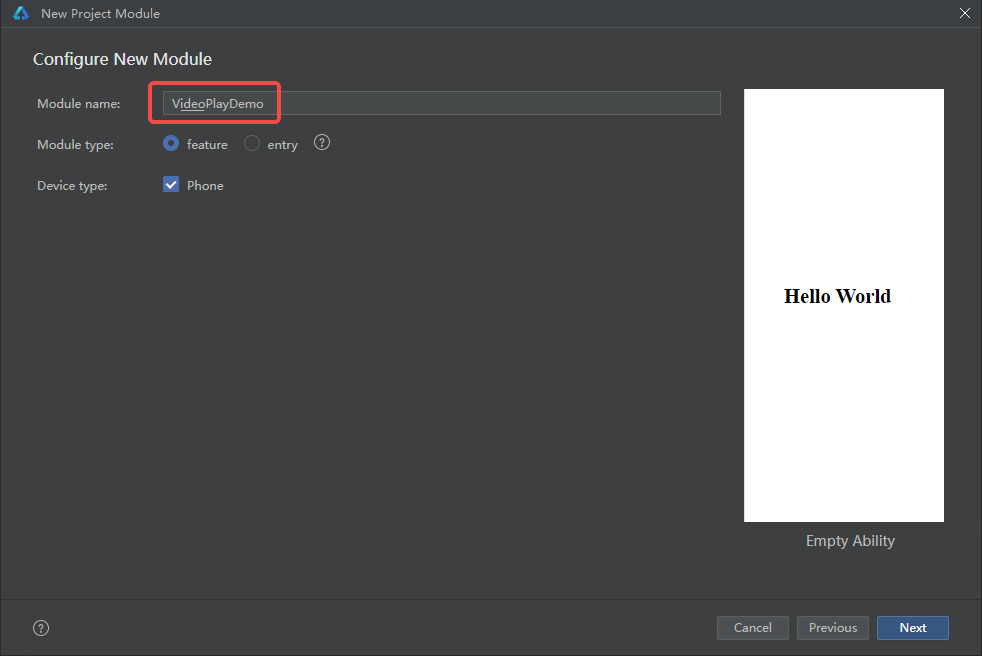
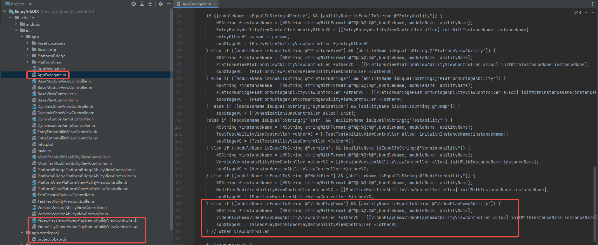

# EnjoyArkUIX

## 介绍

**EnjoyArkUIX** 是一个基于ArkUI-X跨平台框架能力构建的集自测试、演示为一体的工程，功能点涉及跨平台关键特性演示、ArkUI组件、子系统API验证等，后续将通过持续集成的方式补齐跨平台支持的特性功能点，用于看护ArkUI-X跨平台框架能力。`<br>`

应用效果预览

| 页面 | Android平台                                                 | iOS平台                                                 |
| ---- | ----------------------------------------------------------- | ------------------------------------------------------- |
| 演示 |  |  |

### 使用说明

- 点击**自测试**、**演示**、**版本**三个按钮或左右滑动切换不同视图。`<br>`
- 点击二级导航（如PlatformBridge、PlatformView等），若存在三级导航则展开三级导航；若不存在三级导航，则跳转至详情页面。`<br>`
- 若存在三级导航，点击跳转至详情页面。`<br>`

## 案例列表

应用案例列表及平台支持情况。`<br>`

| 案例名称       | 案例位置（应用界面案例入口） | Android | iOS    |
| -------------- | ---------------------------- | ------- | ------ |
| PlatformBridge | 演示  PlatformBridge         | 支持    | 支持   |
| PlatformView   | 演示  PlatformView           | 支持    | 支持   |
| Fragment       | 演示  Fragment               | 支持    | 不支持 |
| Dynamization   | 演示  Dynamization           | 支持    | 支持   |

## 具体实现

### 一、首页实现

本示例使用[Tabs容器组件](https://gitee.com/openharmony/docs/blob/master/zh-cn/application-dev/reference/apis-arkui/arkui-ts/ts-container-tabs.md)搭建整体应用框架，每个[TabContent内容视图](https://gitee.com/openharmony/docs/blob/master/zh-cn/application-dev/reference/apis-arkui/arkui-ts/ts-container-tabcontent.md)使用[List容器组件](https://gitee.com/openharmony/docs/blob/master/zh-cn/application-dev/reference/apis-arkui/arkui-ts/ts-container-list.md)布局，在每个[ListItem](https://gitee.com/openharmony/docs/blob/master/zh-cn/application-dev/reference/apis-arkui/arkui-ts/ts-container-listitem.md)中使用[循环渲染](https://gitee.com/openharmony/docs/blob/master/zh-cn/application-dev/ui/state-management/arkts-rendering-control-foreach.md)加载此分类下分类导航数据，底部导航菜单使用[TabContent中tabBar属性](https://gitee.com/openharmony/docs/blob/master/zh-cn/application-dev/reference/apis-arkui/arkui-ts/ts-container-tabcontent.md#%E5%B1%9E%E6%80%A7)设置自定义样式 。`<br>`

### 二、在当前框架添加新用例

创建module


选择[ArkUI-X] Empty Ability 工程


输入Module name



创建跨平台工程成功后，在Android工程中自动生成相应的Activity，通过setInstanceName()拉起跨平台工程入口


在 iOS 项目中，相应的文件将会自动生成，以确保跨平台功能的一致性和可用性

跨平台工程创建成功后，在 `entry`模块下 `data`目录中添加要跳转到的跨平台模块的数据

> - DemosData：首页演示项目工程数据源
> - SelfTestData：首页自测试项目工程数据源
> - VersionsData：首页版本项目工程数据源
> - HomeTabData：首页Tabs数据源


在项目演示中，通过配置 `image` 和 `title` 属性来指定页面的图标和标题。对于仅在 Android 平台上特有的功能，例如 `Fragment`，通过设置 `PlatformTypeEnum` 枚举值为 `PlatformTypeEnum.SUPPORT_ANDROID` 来处理。这样，当 iOS 设备尝试运行时，如果开发者点击了跳转到 `Fragment` 对应的按钮，系统会提示当前平台不支持该功能。

在跨平台导航栏的配置中，通过设置 `want` 对象的 `bundleName`、`moduleName` 和 `abilityName` 属性，可以指定目标模块的详细信息。这些属性分别代表目标模块的包名、模块名以及模块内特定功能的名称。完成这些设置后，主框架即可通过 `startAbility`跳转至对应的模块的首页。


在项目开发中，根据具体需求，可以选择多种不同的实现方法来展示首页导航栏，以实现多样化的视觉效果和交互体验。

| 下拉导航栏写法：                                                                | 效果展示：                              |
| ------------------------------------------------------------------------------- | --------------------------------------- |
| `` |  |

### 三、编译运行

#### Android编译运行

使用 `ace build hap` 编译出对应模块hap包


若出现以下命令，则编译 `hap`包成功


使用 `ace build apk` 构建 `apk`


若出现以下打印信息，则编译成功，使用 `ace install apk`安装到手机上


#### iOS编译运行(需在Mac上执行)

在Mac上安装运行，如若出现以下问题，则是缺少签名信息


解决方案，需要打开 `.arkui-x/ios/app.xcodeproj`，配置签名信息


配置完签名后，使用 `ace build hap` 编译出对应模块hap包，`ace build ios` 导入库文件


若出现以下命令，则编译成功，可以使用 `ace install ios`，或使用 `Xcode`运行安装到手机（iPhone）上


#### DevEco Studio编译时报错问题解决

若出现以下编译问题，参考[编译报错“Cannot find module XXX or its corresponding type declarations”](https://developer.huawei.com/consumer/cn/doc/harmonyos-faqs-V5/faqs-compiling-and-building-4-V5)，或执行命令 `ohpm install`，再重新执行 `ace build ios/apk`


## 相关权限

[ohos.permission.INTERNET](https://gitee.com/openharmony/docs/blob/master/zh-cn/application-dev/security/AccessToken/permissions-for-all.md#ohospermissioninternet)

- 本项目使用Web组件加载网页，请确保设备已连接网络`<br>`

## 依赖

不涉及

## 约束与限制

1.本示例仅支持在标准Android和iOS设备系统上运行。`<br>`

2.本示例已适配API version 16版本的ArkUI-X SDK。`<br>`

3.本示例需要使用DevEco Studio 5.0.4 Release。`<br>`

## 工程目录

```tsx
.	
├── .arkui-x
|    ├── android
|    │   ├── app
|    │   │   ├── build.gradle
|    │   │   ├── proguard-rules.pro
|    │   │   └── src
|    │   │       └── main
|    │   │           ├── AndroidManifest.xml
|    │   │           ├── assets
|    │   │           │   ├── doc
|    │   │           │   │   └── arkui-x
|    │   │           │   │       ├── dynamicHap
|    │   │           │   │       ├── dynamicHapOne
|    │   │           │   │       └── dynamicHapTwo
|    │   │           │   └── resh
|    │   │           │       └── arkui-x
|    │   │           │           ├── dynamicHap
|    │   │           │           ├── dynamicHapOne
|    │   │           │           └── dynamicHapTwo
|    │   │           ├── java
|    │   │           │   └── com
|    │   │           │       └── example
|    │   │           │           └── enjoyarkuix
|    │   │           │               ├── DynamizationJumpActivity.java
|    │   │           │               ├── EntryEntryAbilityActivity.java
|    │   │           │               ├── FragmentEntryActivity.java
|    │   │           │               ├── MyApplication.java
|    │   │           │               ├── platformbridge
|    │   │           │               │   └── Bridge.java
|    │   │           │               ├── PlatformBridgePlatformBridgeAbilityActivity.java
|    │   │           │               ├── platformview
|    │   │           │               │   ├── MyMapView.java
|    │   │           │               │   ├── MyPlatformViewFactory.java
|    │   │           │               │   ├── MyVideoView.java
|    │   │           │               │   └── MyWebView.java
|    │   │           │               ├── PlatformViewJumpActivity.java
|    │   │           │               ├── PlatformViewPlatformViewAbilityActivity.java
|    │   │           │               ├── stagedynamic
|    │   │           │               │   ├── DynamicHapAbility.java
|    │   │           │               │   ├── DynamicHapOneActivity.java
|    │   │           │               │   └── DynamicHapTwoActivity.java
|    │   │           │               └── stagefragment
|    │   │           │                   ├── ArkuiFragment.java
|    │   │           │                   ├── FragmentManagerActivity.java
|    │   │           │                   ├── NativeFragment.java
|    │   │           │                   ├── ViewFragment.java
|    │   │           │                   └── ViewPagerFragmentActivity.java
|    │   │           └── res
|    │   ├── build.gradle
|    │   ├── gradle
|    │   │   └── wrapper
|    │   │       ├── gradle-wrapper.jar
|    │   │       └── gradle-wrapper.properties
|    │   ├── gradle.properties
|    │   ├── gradlew
|    │   ├── gradlew.bat
|    │   ├── local.properties
|    │   └── settings.gradle
|    ├── arkui-x-config.json5
|    └── ios
|        ├── app
|        │   ├── AppDelegate.h
|        │   ├── AppDelegate.m
|        │   ├── Assets.xcassets
|        │   ├── Base.lproj
|        │   │   └── LaunchScreen.storyboard
|        │   ├── BaseModuleViewController.h
|        │   ├── BaseModuleViewController.m
|        │   ├── BaseViewController.h
|        │   ├── BaseViewController.m
|        │   ├── DynamicShowViewController.h
|        │   ├── DynamicShowViewController.m
|        │   ├── DynamizationJumpController.h
|        │   ├── DynamizationJumpController.m
|        │   ├── EntryEntryAbilityViewController.h
|        │   ├── EntryEntryAbilityViewController.m
|        │   ├── Info.plist
|        │   ├── main.m
|        │   ├── PlatformBridge
|        │   │   ├── BridgeClass.h
|        │   │   └── BridgeClass.m
|        │   ├── PlatformBridgePlatformBridgeAbilityViewController.h
|        │   ├── PlatformBridgePlatformBridgeAbilityViewController.m
|        │   ├── PlatformView
|        │   │   ├── MyMapView.h
|        │   │   ├── MyMapView.m
|        │   │   ├── MyPlatformViewFactory.h
|        │   │   ├── MyPlatformViewFactory.m
|        │   │   ├── MyVideoView.h
|        │   │   ├── MyVideoView.m
|        │   │   ├── MyWebview.h
|        │   │   └── MyWebview.m
|        │   ├── PlatformViewPlatformViewAbilityViewController.h
|        │   └── PlatformViewPlatformViewAbilityViewController.m
|        ├── app.xcodeproj
|        │   └── project.pbxproj
|        ├── doc
|        │   └── arkui-x
|        │       ├── dynamicHap
|        │       ├── dynamicHapOne
|        │       └── dynamicHapTwo
|        └── resh
|            └── arkui-x
|                ├── dynamicHap
|                ├── dynamicHapOne
|                └── dynamicHapTwo
├── AppScope
│   ├── app.json5
│   └── resources
│       └── base
│           ├── element
│           │   └── string.json
│           └── media
│               └── app_icon.png
├── build-profile.json5
├── code-linter.json5
├── demos										// 演示Sample目录
│   ├── dynamicHap									// Sample 动态化
│   ├── dynamicHapOne								// Sample 动态化
│   ├── dynamicHapTwo								// Sample 动态化
│   ├── Fragment									// Sample Android Fragment
│   ├── PlatformBridge								// Sample 平台桥接
│   └── PlatformView								// Sample 平台视图
├── deps										// 工程Sample依赖项目录
│   └── effectkit
├── entry										// 应用首页框架
│   ├── build-profile.json5
│   ├── hvigorfile.ts
│   ├── obfuscation-rules.txt
│   ├── oh-package.json5
│   └── src
│       └── main
│           ├── ets
│           │   ├── component
│           │   │   ├── FourthLevelNavigation.ets
│           │   │   ├── TabContentNavigation.ets
│           │   │   ├── ThirdLevelNavigation.ets
│           │   │   └── TitleBar.ets
│           │   ├── data
│           │   │   ├── DemosData.ets				// 首页演示数据源
│           │   │   ├── HomeTabData.ets				// 首页Tabs数据源
│           │   │   ├── SelfTestData.ets			// 首页自测试数据源
│           │   │   └── VersionsData.ets			// 首页版本数据源
│           │   ├── entryability
│           │   │   └── EntryAbility.ets
│           │   ├── model
│           │   │   └── CategoricalDataType.ets
│           │   ├── pages
│           │   │   └── EnterPage.ets				// 应用首页
│           │   └── util
│           │       └── Logger.ets
│           ├── module.json5
│           └── resources
├── hvigor
│   └── hvigor-config.json5
├── hvigorfile.ts
├── local.properties
└── oh-package.json5
```

## 下载

如需单独下载本工程，执行如下命令：

```
git init
git config core.sparsecheckout true
echo /CodeLab/EnjoyArkUIX > .git/info/sparse-checkout
git remote add origin https://gitcode.com/arkui-x/samples.git
git pull origin master
```
