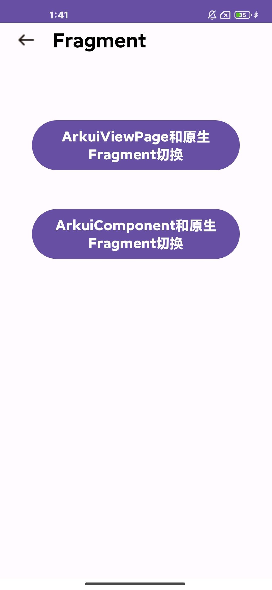
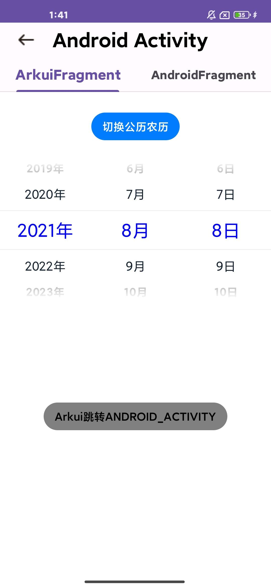
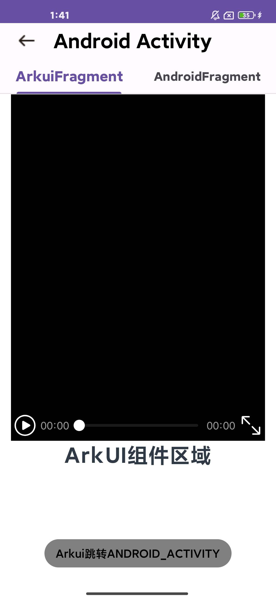

# Fragment应用示例
## 介绍

本示例将ArkUI框架的UIAbility跨平台部署至Android平台Fragment的使用说明

## 效果预览

| Android平台                                                  |                                                              |                                                              |
| ------------------------------------------------------------ | ------------------------------------------------------------ | ------------------------------------------------------------ |
| 主页面展示效果                                               | 点击 “Arkuiviewpage和原生Fragment“ 按钮展示效果              | 点击 “ArkuiComponent和原生Fragment” 按钮展示效果             |
|  |  |  |


### 使用说明

1.打开app，主页面显示 “Arkuiviewpage和原生Fragment“ 按钮和“ArkuiComponent和原生Fragment” 按钮。

2.点击“Arkuiviewpage和原生Fragment“ 按钮，页面跳转到ArkuiFragment和AndroidFragment的tab页面，ArkuiFragment页面展示视频页面，点击Arkui跳转ANDROID_ACTIVITY按钮，可以实现ArkuiFragment跳到AndroidFragment生页面，AndroidFragment展示Android原生页面

3.点击“ArkuiComponent和原生Fragment“ 按钮，页面跳转到ArkuiComponent和AndroidFragment的tab页面，ArkuiComponent页面展示arkui组件，点击Arkui跳转ANDROID_ACTIVITY按钮，可以实现ArkuiFragment跳到AndroidFragment生页面，AndroidFragment展示Android原生页面

## 具体实现

* Fragment开发指南参考[Fragment跨平台开发指南参考](https://gitcode.com/arkui-x/docs/blob/master/zh-cn/application-dev/tutorial/how-to-use-fragment-on-android.md)
* 将ArkUI框架的UIAbility跨平台部署至Android平台Fragment，实现Android原生Fragment和ArkUI跨平台Fragment的混合开发

## 工程目录

```
.arkui-x
|---android/app/src/main/java/com/example/enjoyarkuix
|-FragmentEntryActivity.java	   
|---stagefragment
|   |---ArkuiFragment.java																			
|   |---FragmentManagerActivity.java	
|   |---NativeFragment.java	
|   |---ViewFragment.java	
|   |---ViewPagerFragmentActivity.java	
demos/Fragment/src/main/ets
|---fragmentability
|   |---FragmentAbility.ets  
|---ViewFragmentability
|   |---ViewFragmentAbility.ets  
|---pages
|   |---index.ets                          			
|   |---CommonItemSelect.ets	
|   |---subpages
|   |   |---ViewFragmentPage.ets                          			
```

## 相关权限

不涉及

## 依赖

不涉及。

## 约束与限制

1.本示例仅支持标准Android和iOS和设备系统上运行。

2.本示例已适配API version 22及以上版本的ArkUI-X SDK。

3.本示例需要使用DevEco Studio 6.0.0 Release及以上版本才可编译运行。

## 下载

如需单独下载本工程，执行如下命令：

```
    git init
    git config core.sparsecheckout true
    echo /CodeLab/EnjoyArkUIX > .git/info/sparse-checkout
    git remote add origin https://gitcode.com/arkui-x/samples.git
    git pull origin master
```

