# 动态化应用示例
## 介绍

本示例根据动态化功能，提供动态加载沙箱中不同样式hap页面

## 效果预览

| Android平台                                                  |                                                              |                                                              |                                                              |
| ------------------------------------------------------------ | ------------------------------------------------------------ | ------------------------------------------------------------ | ------------------------------------------------------------ |
| 主页面展示效果                                               | 点击 “加载沙箱页面” 按钮展示效果                             | 点击 “加载沙箱页面1” 按钮展示效果                            | 点击 “加载沙箱页面2” 按钮展示效果                            |
| 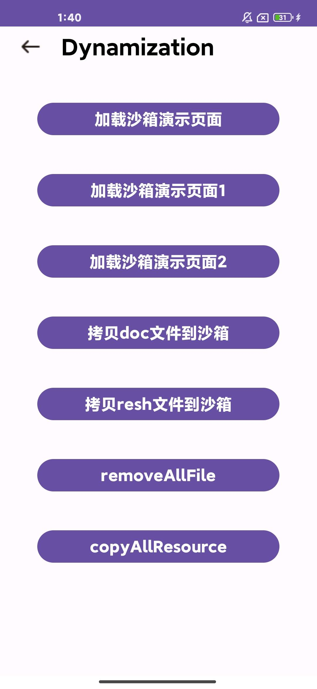 | 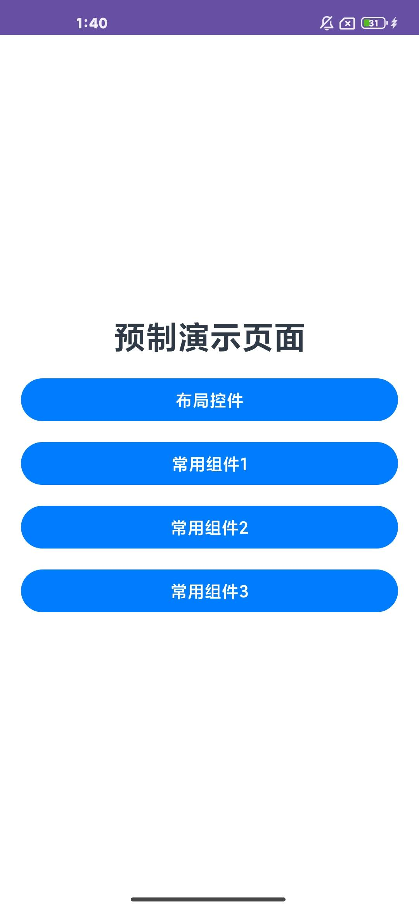 | 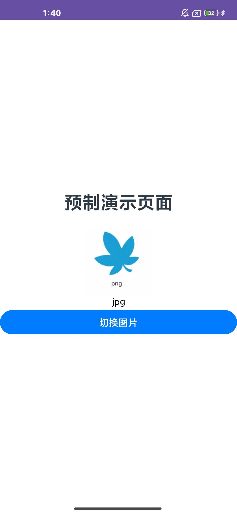 | 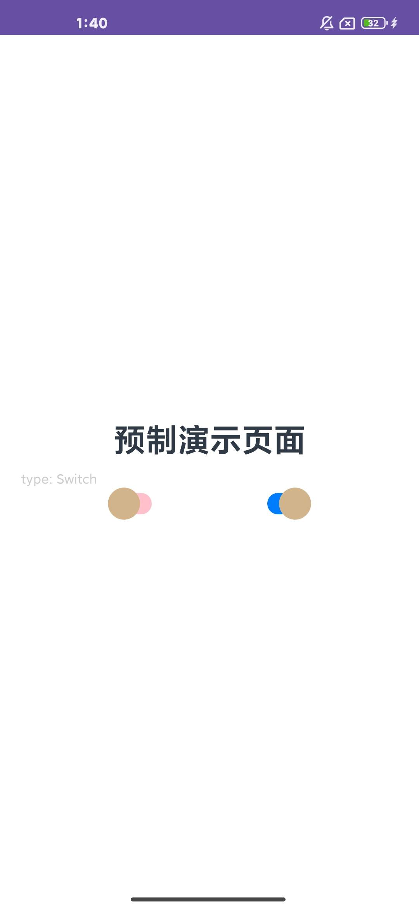 |
| 主页面点击“拷贝doc文件到沙箱”                                | 点击 “加载沙箱页面” 按钮展示效果                             | 点击 “加载沙箱页面1” 按钮展示效果                            | 点击 “加载沙箱页面2” 按钮展示效果                            |
|  | 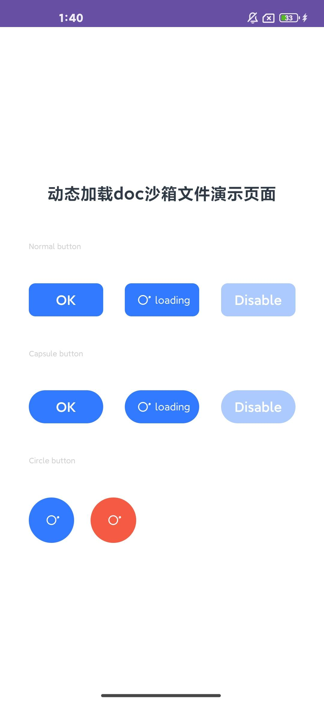 | 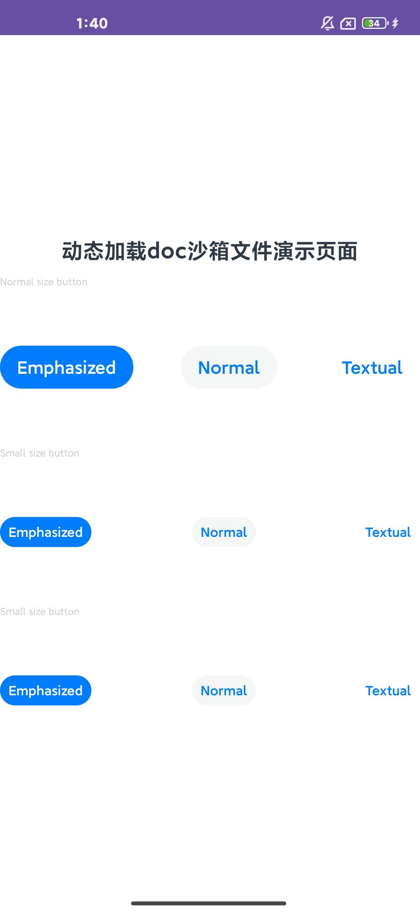 | 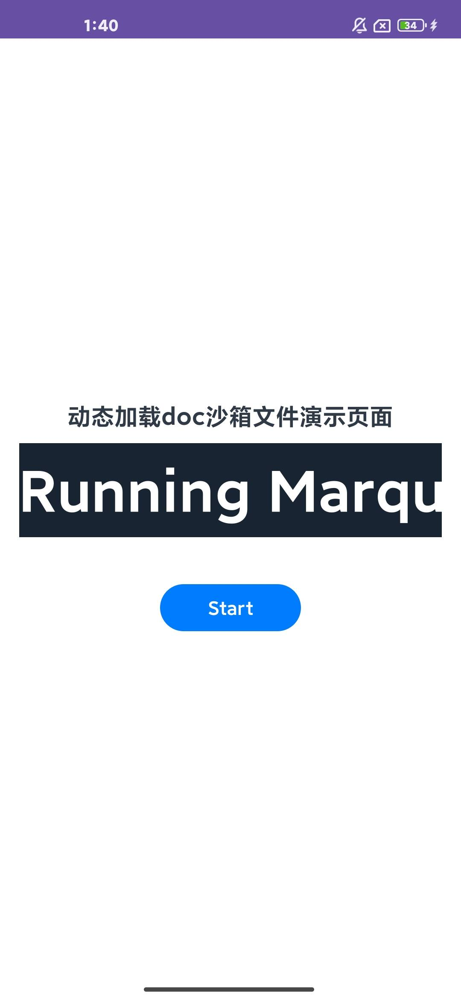 |
| 主页面点击“拷贝resh文件到沙箱”                               | 点击 “加载沙箱页面” 按钮展示效果                             | 点击 “加载沙箱页面2” 按钮展示效果                            | 点击 “加载沙箱页面3” 按钮展示效果                            |
|  | 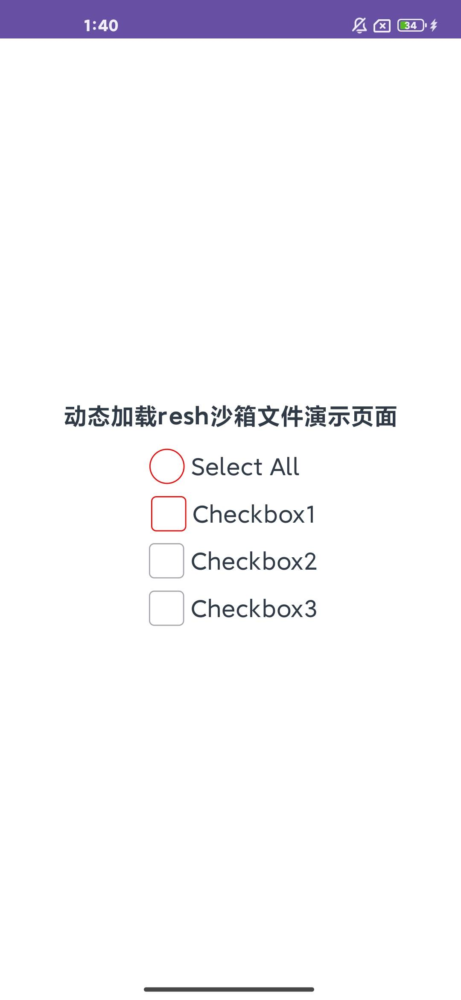 | 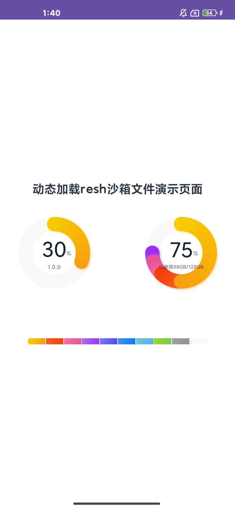 | 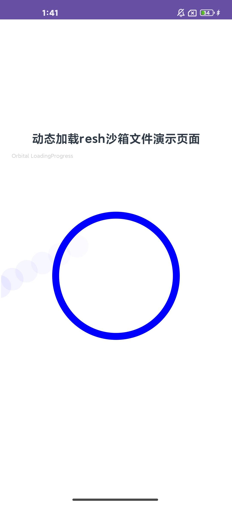 |
|                                                              |                                                              |                                                              |                                                              |
| **IOS平台**                                                  |                                                              |                                                              |                                                              |
| 主页面展示效果                                               | 点击 “加载沙箱页面” 按钮展示效果                             | 点击 “加载沙箱页面1” 按钮展示效果                            | 点击 “加载沙箱页面2” 按钮展示效果                            |
| 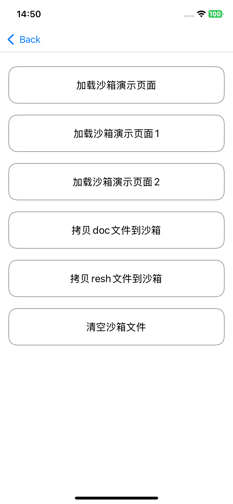   | 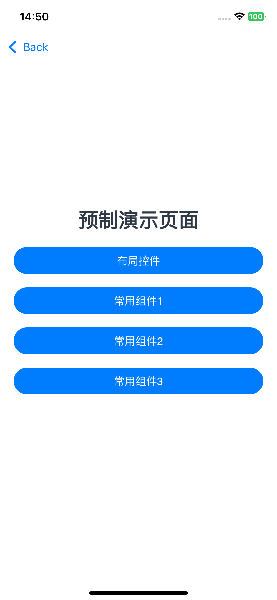   | 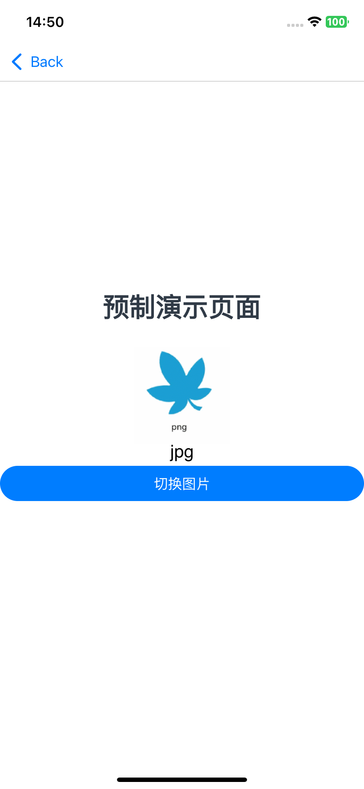   | 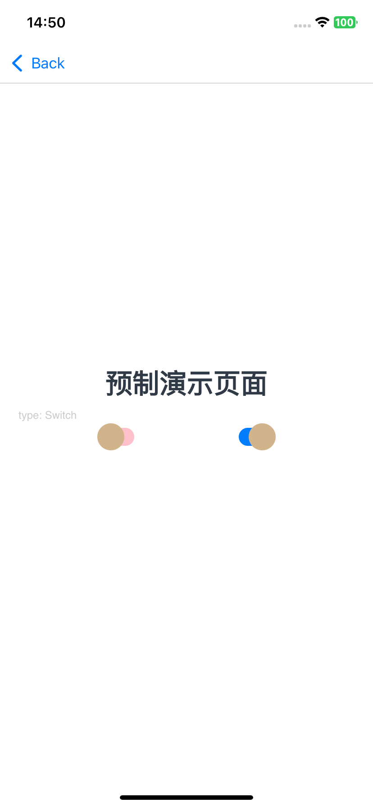   |
| 主页面点击“拷贝doc文件到沙箱”                                | 点击 “加载沙箱页面” 按钮展示效果                             | 点击 “加载沙箱页面1” 按钮展示效果                            | 点击 “加载沙箱页面2” 按钮展示效果                            |
|    | 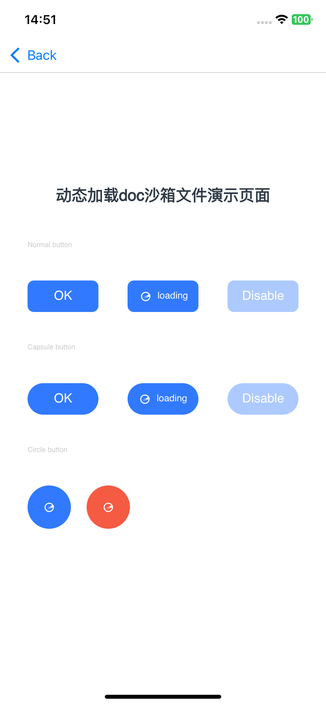  | 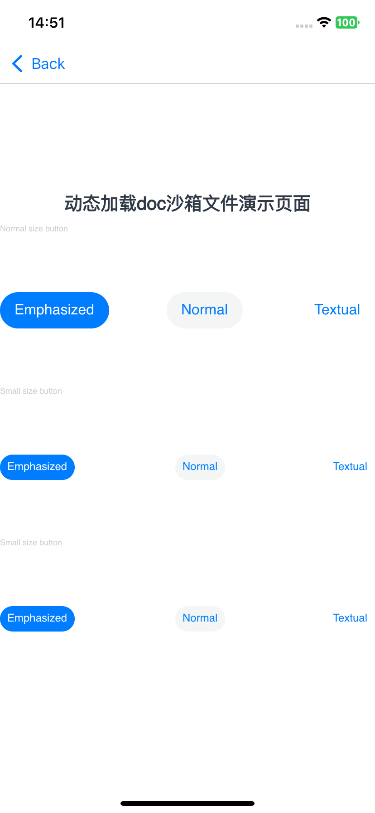  | 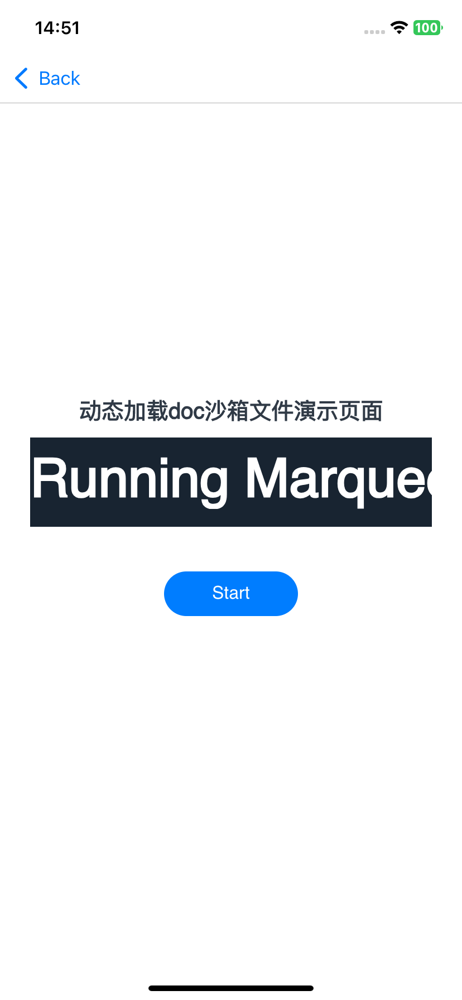  |
| 主页面点击“拷贝resh文件到沙箱”                               | 点击 “加载沙箱页面” 按钮展示效果                             | 点击 “加载沙箱页面1” 按钮展示效果                            | 点击 “加载沙箱页面2” 按钮展示效果                            |
|    | 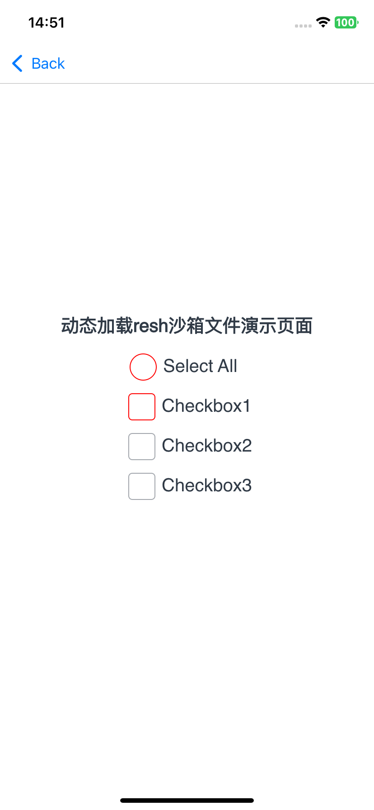 | 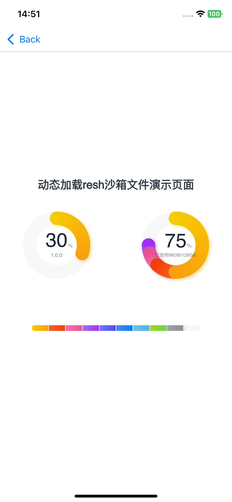 | 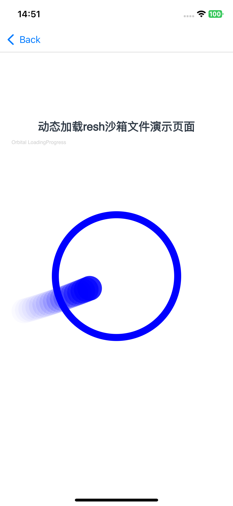 |
|                                                              |                                                              |                                                              |                                                              |

### 使用说明

1.打开app，''点击加载沙箱页面 1 2'按钮，页面显示预制加载显示的hap包。

2.点击''拷贝doc文件到沙箱按''钮，通过动态拷贝，将doc文件夹里的hap包拷贝到沙箱，将预制hap包替换成doc文件里的hap包。

3.点击''拷贝resh文件到沙箱''按钮，通过动态拷贝，将resh文件夹里的hap包拷贝到沙箱，将预制hap包替换成doc文件里的hap包。

## 工程目录

```
.arkui-x
|---android/app/src/main/java/com/example/enjoyarkuix
|--DynamizationJumpActivity.java	   			
|---stagedynamic
|   |---DynamicHapAbility.java	
|   |---DynamicHapOneActivity.java		
|   |---DynamicHapTwoActivity.java		
|---/ios/app
|   |---DynamizationJumpController.m	         										         								
demos/dynamicHap/src/main/ets
|---dynamicHapability
|---pages
|   |---index.ets                          			
demos/dynamicHapOne/src/main/ets
|---dynamicHapOneability
|---pages
|   |---index.ets                          			
demos/dynamicHapTwo/src/main/ets
|---dynamicHapTwoability
|---pages
|   |---index.ets                          			
```


## 具体实现

* 动态化开发指南参考：[Android](https://gitcode.com/arkui-x/docs/blob/master/zh-cn/application-dev/tutorial/how-to-use-dynamic-on-android.md)，[iOS](https://gitcode.com/arkui-x/docs/blob/master/zh-cn/application-dev/tutorial/how-to-use-dynamic-on-ios.md)

## 相关权限

不涉及

## 约束与限制

1.本示例仅支持标准Android和iOS和设备系统上运行。

2.本示例已适配API version 22及以上版本的ArkUI-X SDK。

3.本示例需要使用DevEco Studio 6.0.0 Release及以上版本才可编译运行。

## 下载

如需单独下载本工程，执行如下命令：

```
git init
git config core.sparsecheckout true
echo /CodeLab/EnjoyArkUIX > .git/info/sparse-checkout
git remote add origin https://gitcode.com/arkui-x/samples.git
git pull origin master
```

