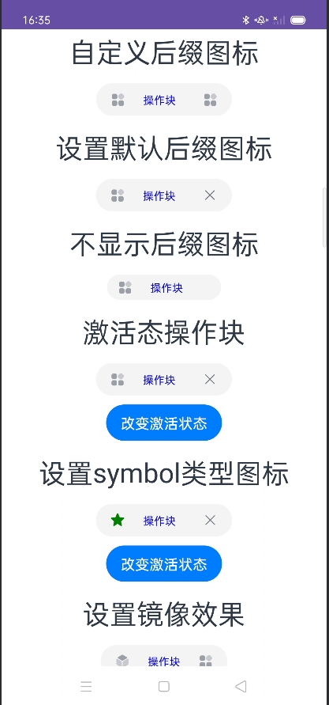
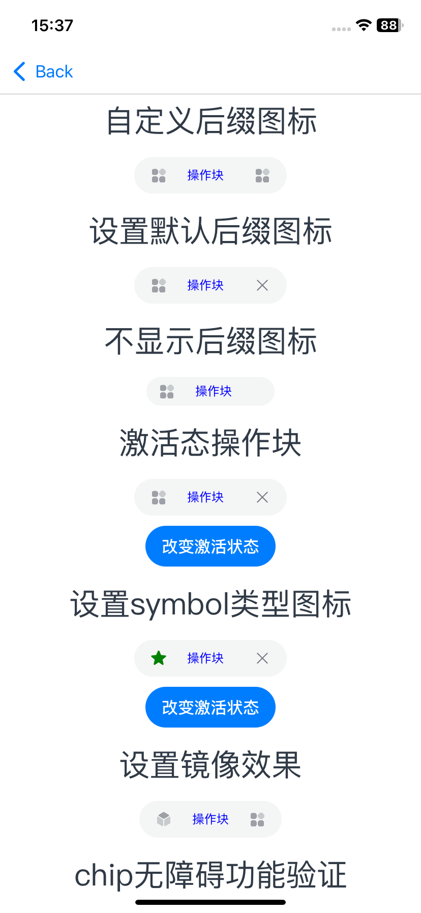
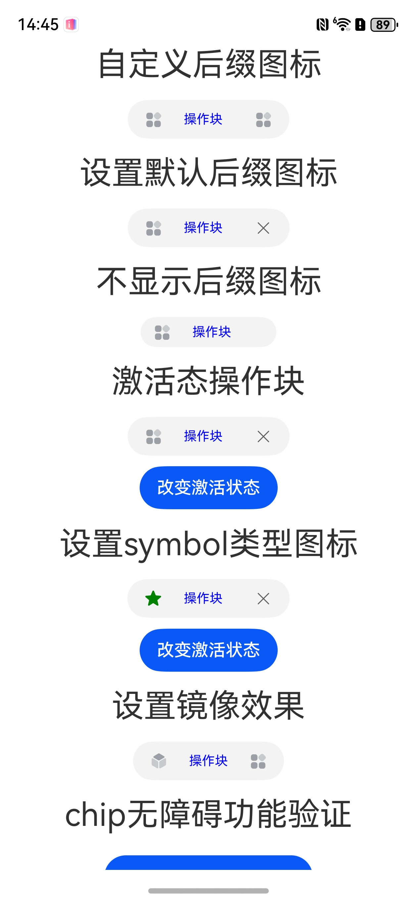

# Chip应用示例

## 介绍

此工程为ArkUI高级组件Chip的自测试。

Chip用于搜索框历史记录、邮件发送列表等场景。

## 效果预览

**应用初始**

| Android平台                                                  | iOS平台                                                      | 鸿蒙平台                                                     |
| ------------------------------------------------------------ | ------------------------------------------------------------ | ------------------------------------------------------------ |
|  |  |  |


### 使用说明

应用界面中展示了如何进行验证chip组件的操作块以及图标显示等。

1.验证设置默认后缀图标，页面显示chip组件操作块按钮，按钮里，中间位置显示操作块文字，左边设置为自定义图标，右边不设置图标，默认是个X图标。
2.点击右边X图标，按钮会被删除。

## 工程目录

```
src/main
│  │  module.json5
│  │
│  ├─ets
│  │  ├─chipdemoability
│  │  │      ChipDemoAbility.ets
│  │  │
│  │  └─pages
│  │          Index.ets
│  │          test1.ets
│  │          test2.ets
│  │          test3.ets
│  │          title.ets
│  │
│  └─resources
│      ├─base
│      │  ├─element
│      │  │      color.json
│      │  │      string.json
│      │  │
│      │  ├─media
│      │  │      back.svg
│      │  │      dynamization.png
│      │  │      fragment.png
│      │  │      icon.png
│      │  │      ic_back.svg
│      │  │      ic_down_arrow.png
│      │  │      ic_right_arrow.png
│      │  │      ic_select_animation.png
│      │  │      ic_select_component.png
│      │  │      ic_select_universal.png
│      │  │      ic_unselect_animation.png
│      │  │      ic_unselect_component.png
│      │  │      ic_unselect_universal.png
│      │  │
│      │  └─profile
│      │          main_pages.json
│      │
│      └─rawfile
├─mock
│      mock-config.json5
│
├─ohosTest
│  │  module.json5
│  │
│  └─ets
│      └─test
│              Ability.test.ets
│              List.test.ets
│
└─test
        List.test.ets
        LocalUnit.test.ets
```


## 具体实现

* **核心布局结构**
  - 外层`Row`容器占满全屏高度（`height: '100%'`）
  - 内嵌`Scroll`容器支持内容滚动，适配长内容场景
  - 内部`Column`容器设置10vp垂直间距（`space: 10`），包含多个功能区块
* **特殊效果实现**
  - **双态图标切换**：通过`activatedFillColor`和`activatedFontColor`实现激活态样式变化
  - **动态Symbol图标**：通过`SymbolGlyphModifier`实现正常态/激活态图标差异化配置
  - **镜像布局**：通过`Direction.Rtl`实现从右至左的内容布局
  - **响应式边距**：使用`LengthMetrics.vp()`实现视口单位边距配置

## 相关权限

不涉及。

## 依赖

不涉及。

## 约束与限制

1.本示例仅支持在标准Android和iOS设备系统上运行。<br>

2.本示例已适配API version 22及以上版本的ArkUI-X SDK。<br>

3.本示例需要使用DevEco Studio 6.0.0 Release及以上版本才可编译运行。<br>

## 下载

如需单独下载本工程，执行如下命令：

```
git init
git config core.sparsecheckout true
echo /CodeLab/EnjoyArkUIX > .git/info/sparse-checkout
git remote add origin https://gitcode.com/arkui-x/samples.git
git pull origin master
```

