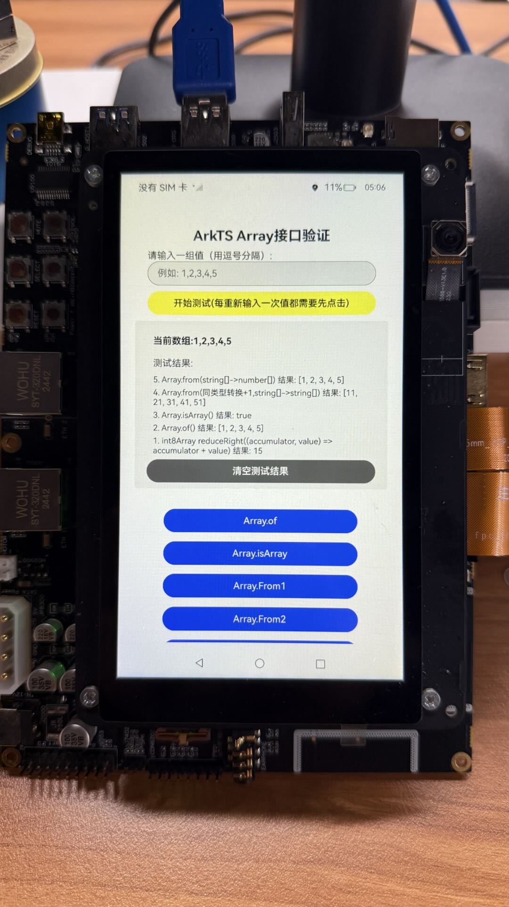

# collections (ArkTS容器集)

### 介绍
这是一个用于验证 ArkTS 集合框架中 Array 和 TypedArray 相关接口功能的测试应用程序。

本示例用到了collections相关功能[@arkts.collections (ArkTS容器集)](https://gitee.com/openharmony/docs/blob/master/zh-cn/application-dev/reference/apis-arkts/arkts-apis-arkts-collections.md)

### 功能概述

该 Demo 提供了对以下集合类型的测试：

**基础 Array 接口**

    Array.of() - 从参数创建数组

    Array.isArray() - 检查是否为数组

    Array.from() - 从可迭代对象创建数组（支持类型转换）

    Array.reverse() - 反转数组

    Array.copyWithin() - 复制数组元素
    
    Array.lastIndexOf() - 查找元素最后出现的位置
    
    Array.every() - 测试所有元素是否满足条件
    
    Array.some() - 测试是否有元素满足条件
    
    Array.toString() - 转换为字符串
    
    Array.toLocaleString() - 转换为本地化字符串
    
    Array.reduceRight() - 从右向左归并（带/不带初始值）

**类型化数组 (TypedArray)**

    Int8Array - 8位有符号整数数组
    
    Uint8Array - 8位无符号整数数组
    
    Uint8ClampedArray - 8位无符号整型 clamped 数组
    
    Int16Array - 16位有符号整数数组
    
    Uint16Array - 16位无符号整数数组
    
    Int32Array - 32位有符号整数数组
    
    Uint32Array - 32位无符号整数数组
    
    Float32Array - 32位浮点数数组

**位向量 (BitVector)**

    push() / pop() - 添加/删除位
    
    has() - 检查范围内是否存在特定位
    
    setBitsByRange() - 设置范围内的位
    
    setAllBits() - 设置所有位
    
    getBitsByRange() - 获取范围内的位
    
    resize() - 调整位向量大小
    
    getBitCountByRange() - 统计范围内特定位的数量
    
    getIndexOf() / getLastIndexOf() - 查找位的索引
    
    flipBitByIndex() / flipBitsByRange() - 翻转位
    
    values() - 获取位向量的迭代器

### 效果预览
| 主页                                                         |
|------------------------------------------------------------|
|  |

### 使用方法
**1. 输入数据**
   
* 在输入框中输入以逗号分隔的值（例如：1,2,3,4,5），点击**开始测试**按钮初始化测试数组。

**2. 执行测试**

* 界面下方展示了所有可用的测试按钮，点击任意按钮执行对应的接口测试，测试结果会实时显示在结果区域。

**3. 查看结果**

* 结果区域显示当前数组状态和测试日志，最新的测试结果显示在最上方（可使用**清空测试结果**按钮清除历史记录）

### 注意事项

* **数字验证:** 对于 TypedArray 测试，输入值必须是有效的数字

* **范围限制:** 某些 TypedArray 有特定的数值范围限制

* **位向量:** BitVector 只接受 0 和 1 作为有效值

* **性能:** 大量测试时结果会自动限制在最近30条

* **编译:** 本示例需要手动添加标签后再编译，后续待标签合入后方可正常编译。