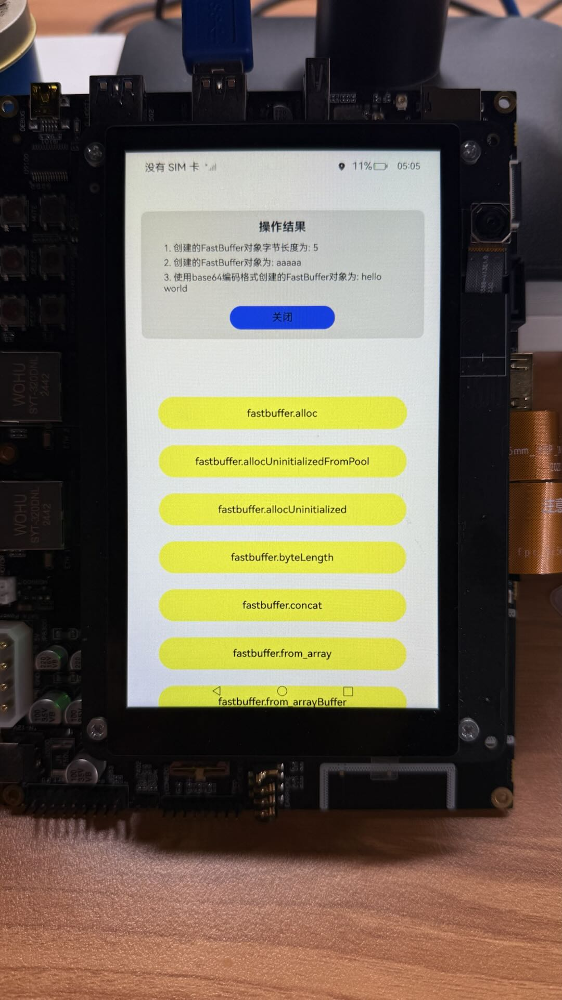

# fastbuffer

## 介绍

这是一个用于验证 ArkTS 集合框架中 FastBuffer 相关接口功能的测试应用程序。

本示例用到了fastbuffer相关功能[@ohos.fastbuffer (FastBuffer)](https://gitee.com/openharmony/docs/blob/master/zh-cn/application-dev/reference/apis-arkts/js-apis-fastbuffer.md)

## 功能概述
该 Demo 提供了对 @kit.ArkTS 中 fastbuffer 模块的测试，包括静态方法和实例方法：

### 静态方法测试

**内存分配**

    alloc() - 分配并初始化缓冲区

    allocUninitializedFromPool() - 从内存池分配未初始化缓冲区

    allocUninitialized() - 分配未初始化缓冲区

**工具方法**

    byteLength() - 计算字符串的字节长度
    
    concat() - 连接多个缓冲区
    
    from() - 从不同数据源创建缓冲区（数组、ArrayBuffer、字符串等）
    
    isBuffer() - 检查对象是否为 FastBuffer
    
    isEncoding() - 检查编码格式是否支持
    
    compare() - 比较两个缓冲区
    
    transcode() - 转换缓冲区编码

### FastBuffer 实例方法测试

**基础操作**

    fill() - 填充缓冲区
    
    compare() - 比较缓冲区内容
    
    copy() - 复制缓冲区数据
    
    equals() - 检查缓冲区是否相等
    
    includes() - 检查是否包含特定内容
    
    indexOf() / lastIndexOf() - 查找内容位置

**迭代器方法**

    keys() / values() - 获取键/值迭代器
    
    entries() - 获取键值对迭代器

**数据读取**

    readBigInt64BE() / readBigInt64LE() - 读取大端/小端 64位有符号整数
    
    readBigUInt64BE() / readBigUInt64LE() - 读取大端/小端 64位无符号整数
    
    readDoubleBE() / readDoubleLE() - 读取大端/小端双精度浮点数
    
    readFloatBE() / readFloatLE() - 读取大端/小端单精度浮点数
    
    readInt8() / readInt16BE() / readInt32BE() 等 - 读取各种整数类型
    
    readUInt8() / readUInt16BE() / readUInt32BE() 等 - 读取各种无符号整数类型

**数据操作**

    subarray() - 创建子数组视图
    
    swap16() / swap32() / swap64() - 交换字节顺序
    
    toJSON() / toString() - 转换为 JSON 或字符串

**数据写入**

    write() - 写入字符串
    
    writeBigInt64BE() / writeBigInt64LE() 等 - 写入各种大整数类型
    
    writeDoubleBE() / writeDoubleLE() 等 - 写入各种浮点数类型
    
    writeInt8() / writeInt16BE() 等 - 写入各种整数类型
    
    writeUInt8() / writeUInt16BE() 等 - 写入各种无符号整数类型

## 效果预览
| 主页                                                        |
|-----------------------------------------------------------|
|  |

## 使用方法

**1. 运行测试**
   
* 应用程序启动后显示所有可用的测试按钮，点击任意按钮执行对应的接口测试 ，测试结果会以弹窗形式显示在界面顶部。

**2. 查看结果**

* 每个测试都会显示详细的操作结果和输出值，结果区域支持滚动查看所有输出信息，使用"关闭"按钮可以隐藏结果区域。

**3. 测试说明**

* 每个测试用例都包含完整的输入和预期输出，结果中包含了方法返回值、缓冲区内容转换等详细信息。

## 编码支持

**FastBuffer 支持多种编码格式：**

* 'utf-8' / 'utf8' - UTF-8 编码

* 'ascii' - ASCII 编码

* 'hex' - 十六进制编码

* 'base64' - Base64 编码
