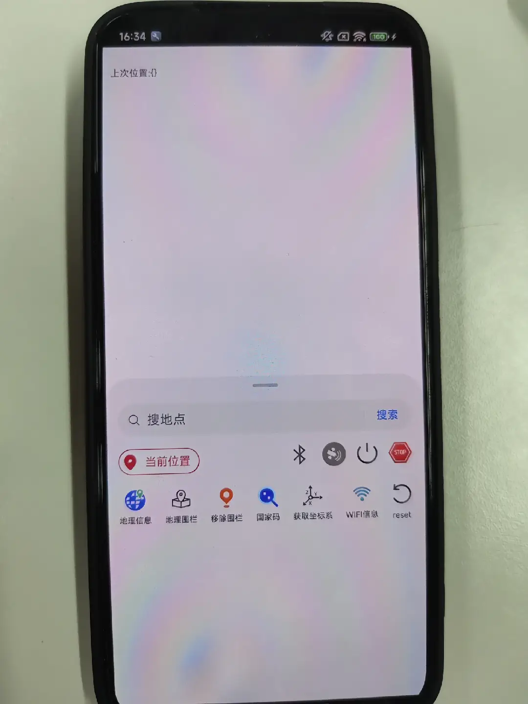

# geoLocationManager (位置服务)

## 介绍

这是一个完整位置服务测试应用程序，展示了如何使用 @kit.LocationKit 中的 geoLocationManager 模块来实现各种位置相关功能。

本示例用到了geoLocationManager相关功能[@ohos.geoLocationManager (位置服务)](https://gitee.com/openharmony/docs/blob/master/zh-cn/application-dev/reference/apis-location-kit/js-apis-geoLocationManager.md)

## 效果预览
| 主页                                                                |
|-------------------------------------------------------------------|
|  |

## 功能概述

📍 **核心位置服务**

* 实时定位：获取当前设备位置信息

* 持续定位：订阅位置变化，实时更新位置

* 最后位置：获取上一次已知的位置信息

* 位置开关状态：监听和管理定位服务开关状态

🛰️ **卫星与信号**

* GNSS 卫星状态：订阅卫星数量、信号强度等信息

* NMEA 数据：获取原始 GNSS NMEA 协议数据

* Wi-Fi 定位：获取当前连接的 Wi-Fi BSSID 信息

* 蓝牙扫描：订阅蓝牙设备扫描结果用于定位

🗺️ **地理编码服务**

* 地理编码：将地址描述转换为地理坐标

* 逆地理编码：将坐标转换为详细地址信息

* 国家码查询：获取当前所在国家/地区代码

⭕ **地理围栏功能**

* 创建围栏：在指定位置设置圆形地理围栏

* 围栏事件：监听进入/离开围栏事件

* 围栏通知：围栏事件触发系统通知

* 围栏管理：移除已创建的围栏

## 权限要求

应用需要以下权限才能正常工作：

    'ohos.permission.LOCATION',
    'ohos.permission.APPROXIMATELY_LOCATION',
    'ohos.permission.ACCESS_BLUETOOTH'
    'ohos.permission.GET_NETWORK_INFO'
    'ohos.permission.KEEP_BACKGROUND_RUNNING'
    'ohos.permission.LOCATION_IN_BACKGROUND'

## 使用方法

**1. 基础定位**

* 确保定位权限已授权

* 点击定位图标获取当前位置

* 查看逆地理编码得到的地址信息

**2. 持续定位**

* 点击"开始定位"按钮启动持续定位

* 实时位置信息会显示在界面下方

* 点击"停止定位"结束位置更新

**3. 地理围栏**

* 先获取当前位置（创建围栏的中心点）

* 点击"地理围栏"图标创建围栏

* 设备进入/离开围栏区域时会收到系统通知

* 点击"移除围栏"删除围栏

**4. 卫星与信号**

* 开启卫星开关监听GNSS卫星状态

* 开启蓝牙开关进行蓝牙设备扫描

* 查看Wi-Fi信息获取定位辅助数据

## 注意事项

* 权限要求：应用需要位置相关权限，使用会弹出权限申请

* 设备要求：部分功能需要设备支持GNSS、蓝牙等硬件

* 电量消耗：持续定位和卫星监听会显著增加电量消耗

* 精度差异：不同环境下的定位精度会有差异

* 网络依赖：地理编码服务需要网络连接

* 编译事项：本示例需要手动添加标签后再编译，后续待标签合入后方可正常编译