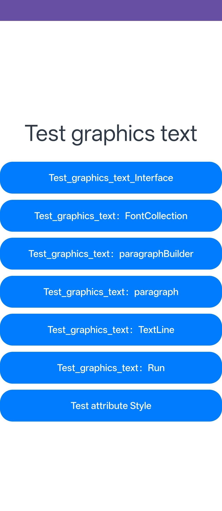

# GraphicsTextDemo

### 介绍
本示例用于验证图形文本相关接口能力，覆盖 FontCollection、Paragraph、ParagraphBuilder、Run、TextLine 以及样式属性等典型场景。

参考文档：[@ohos.graphics.text](https://developer.huawei.com/consumer/cn/doc/harmonyos-references/js-apis-graphics-text#textsettexthighcontrast20)

### 功能概述
本示例主要包含以下测试模块：

1. graphics_text 基础接口测试
2. FontCollection 测试
3. ParagraphBuilder 测试
4. Paragraph 系列测试（含 paint 相关测试）
5. Run 系列测试
6. TextLine 系列测试（含 paint 相关测试）
7. Style 属性测试

### 效果预览


### 使用说明
1. 启动应用后，在首页依次点击以下入口：
   - Test_graphics_text_Interface
   - Test_graphics_text：FontCollection
   - Test_graphics_text：paragraphBuilder
   - Test_graphics_text：paragraph
   - Test_graphics_text：TextLine
   - Test_graphics_text：Run
   - Test attribute Style

2. 各入口会跳转到对应测试页面，页面中继续细分多个子测试用例，可逐项查看渲染效果。

3. 建议先执行基础接口与 FontCollection，再执行 Paragraph/Run/TextLine 进阶场景，便于对比差异。

### 工程目录
```
src/main/
|---ets/
|   |---graphicstextdemoability/
|   |   |---GraphicsTextDemoAbility.ets
|   |---pages/
|   |   |---Index.ets
|   |   |---Test_graphics_text_Interface.ets
|   |   |---Test_FontCollection.ets
|   |   |---Test_paragraphBuilder.ets
|   |   |---paragraph/
|   |   |---Run/
|   |   |---TextLine/
|---resources/
|   |---base/
|   |---rawfile/
|---module.json5
```

### 具体实现
- 首页统一分发到不同图形文本能力测试页，覆盖从基础到进阶的文本排版链路。
- Paragraph、Run、TextLine 分别提供独立子目录，便于按能力域回归验证。
- rawfile 中提供字体资源文件，用于字体与排版相关测试。

### 相关权限
不涉及。

### 依赖
- 图形文本相关接口能力（graphics.text 相关 API）
