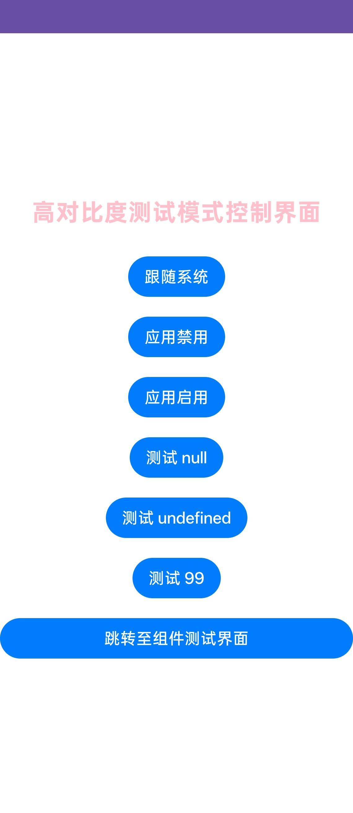
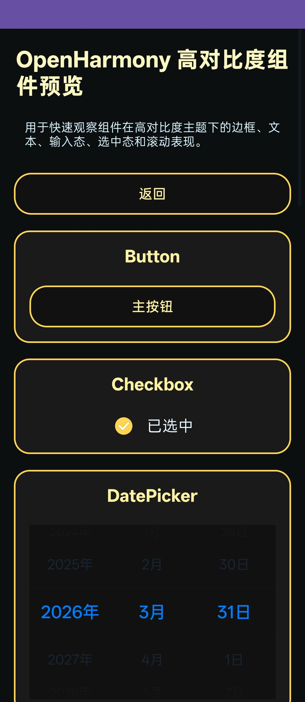

# HighContrastDemo

### 介绍
本示例用于验证文本高对比度（Text High Contrast）能力，覆盖跟随系统、应用禁用、应用启用三种模式及异常参数场景。

参考文档：[@ohos.graphics.text](https://developer.huawei.com/consumer/cn/doc/harmonyos-references/js-apis-graphics-text#textsettexthighcontrast20)

### 功能概述
本示例主要包含两个页面：

1. 模式控制页（Index）
   - 跟随系统
   - 应用禁用
   - 应用启用
   - 异常参数测试（null / undefined / 99）

2. 组件测试页（textHighContrast）
   - 在具体组件场景中观察高对比度模式生效情况

### 效果预览



### 使用说明
1. 启动应用后进入模式控制页。
2. 依次点击“跟随系统 / 应用禁用 / 应用启用”，观察文本显示变化。
3. 点击“跳转至组件测试界面”，在实际组件中验证高对比度模式效果。
4. 可执行 null、undefined、99 的异常参数测试，观察接口容错行为。

### 工程目录
```
src/main/
|---ets/
|   |---highcontrastdemoability/
|   |   |---HighContrastDemoAbility.ets
|   |---pages/
|   |   |---Index.ets
|   |   |---textHighContrast.ets
|---resources/
|   |---base/
|   |   |---profile/
|   |   |   |---main_pages.json
|---module.json5
```

### 具体实现
- 通过 text.setTextHighContrast 动态切换高对比度模式。
- 在模式切换后刷新页面状态，保证 UI 及时体现设置结果。
- 单独提供组件测试页，验证模式在真实组件中的表现。

### 相关权限
不涉及。

### 依赖
- @kit.ArkGraphics2D（text 高对比度接口）
