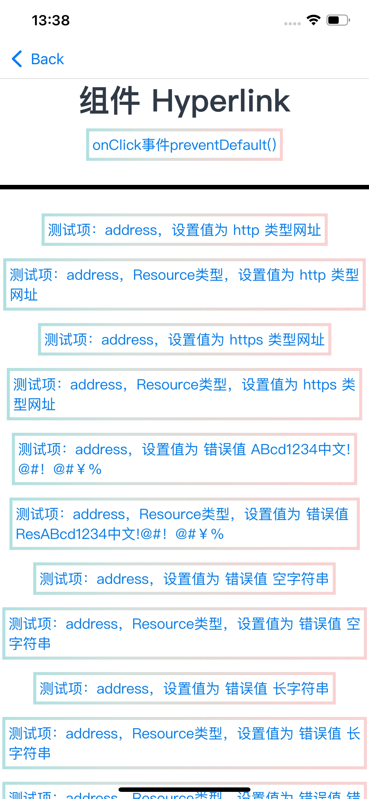

# HyperlinkDemo

### 介绍
本示例用于验证 Hyperlink 组件在不同入参与交互场景下的行为，包括 address 合法值/非法值、content 展示、事件拦截等。

参考文档：[@ohos.Hyperlink](https://developer.huawei.com/consumer/cn/doc/harmonyos-references/ts-container-hyperlink)

### 功能概述
本示例在单页中集中覆盖以下测试点：

1. address 参数测试
   - http/https 合法地址
   - Resource 类型地址
   - 非法地址（空字符串、长字符串、异常字符、系统资源等）
   - null/undefined 异常入参

2. content 参数测试
   - 不设置 content
   - 普通字符串 content
   - Resource 类型 content

3. 事件测试
   - onClick 事件
   - preventDefault() 拦截默认跳转行为

4. 样式展示
   - borderImage 与 padding 组合样式示例

### 效果预览


### 使用说明
1. 启动应用后进入 Index 页面。
2. 按页面顺序逐项点击 Hyperlink 组件，观察不同 address/content 入参下的行为。
3. 对 onClick + preventDefault 场景，确认点击后不会执行默认跳转。

### 工程目录
```
src/main/
|---ets/
|   |---hyperlinkdemoability/
|   |   |---HyperlinkDemoAbility.ets
|   |---pages/
|   |   |---Index.ets
|---resources/
|   |---base/
|   |   |---element/
|   |   |---media/
|   |   |---profile/
|---module.json5
```

### 具体实现
- 在单一页面通过大量分组用例覆盖 Hyperlink 组件核心参数与边界输入。
- 使用 Divider 将不同测试区域隔离，便于人工回归。
- 通过组件 id 标记关键测试项，方便自动化定位。

### 相关权限
不涉及。

### 依赖
- Hyperlink 组件能力（ArkUI 容器组件）
