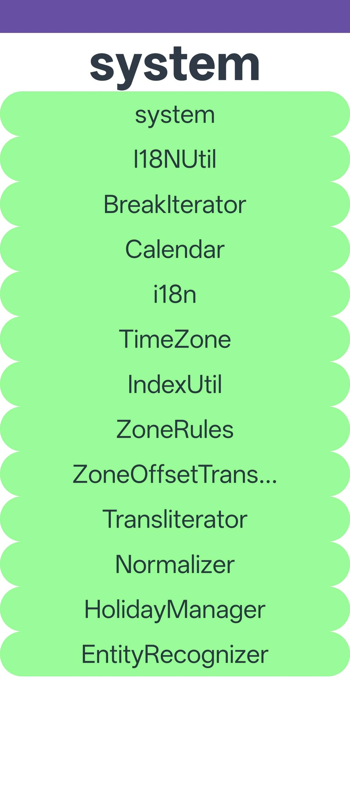

# I18nDemo

### 介绍
本示例用于验证国际化（i18n）相关接口能力，覆盖系统信息、本地化工具、日历、分词、时区、文本转换、数字与日期格式化等场景。

参考文档：[@ohos.i18n](https://developer.huawei.com/consumer/cn/doc/harmonyos-references/js-apis-i18n)

### 功能概述
本示例按能力域划分为 3 组页面：

1. 基础 i18n 能力（pages）
   - system
   - I18NUtil
   - Calendar
   - BreakIterator
   - i18n
   - PhoneNumberFormat

2. 扩展 i18n 能力（pages2）
   - TimeZone
   - IndexUtil
   - ZoneRules
   - ZoneOffsetTransition
   - Transliterator
   - Normalizer
   - HolidayManager

3. 格式化与识别能力（pages3）
   - EntityRecognizer
   - SimpleDateTimeFormat
   - SimpleNumberFormat
   - StyledNumberFormat

### 效果预览


### 使用说明
1. 启动应用后进入首页。
2. 点击不同按钮进入对应测试页，按页面提示触发接口调用。
3. 建议按“基础能力 -> 扩展能力 -> 格式化能力”的顺序验证，便于定位问题来源。

### 工程目录
```
src/main/
|---ets/
|   |---i18ndemoability/
|   |   |---I18nDemoAbility.ets
|   |---pages/
|   |---pages2/
|   |---pages3/
|   |---entrybackupability/
|   |---entryformability/
|---resources/
|   |---base/
|   |   |---profile/
|   |   |   |---main_pages.json
|   |---rawfile/
|---module.json5
```

### 具体实现
- 通过多目录分层组织 i18n 场景，降低单页复杂度。
- 覆盖了时区规则、文本标准化/转写、日期数字格式化等常用国际化能力。
- 模块同时包含 backup 与 form 扩展能力配置，方便验证场景扩展。

### 相关权限
不涉及。

### 依赖
- 国际化相关接口能力（i18n 相关 API）
