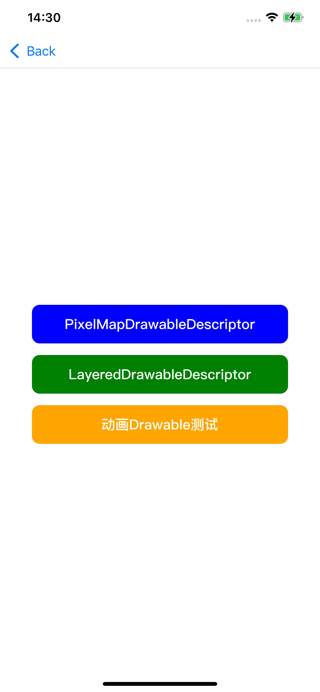
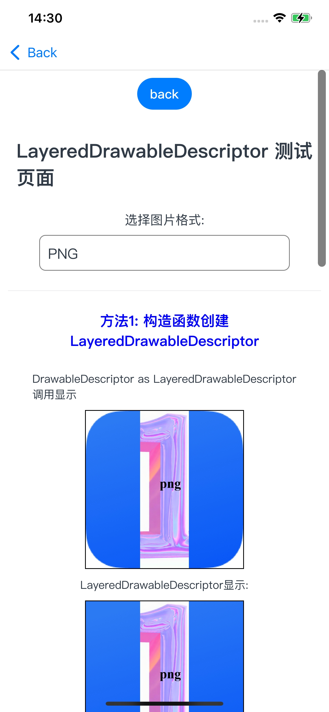
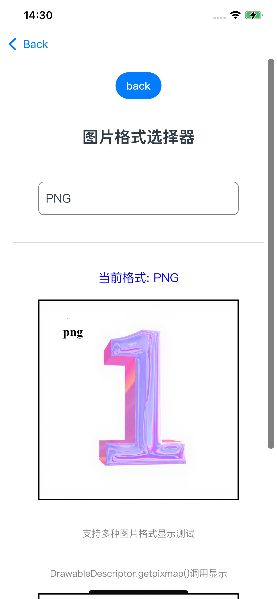
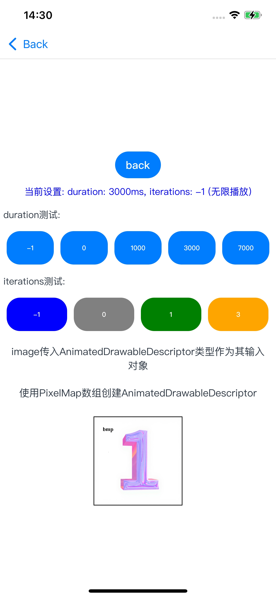
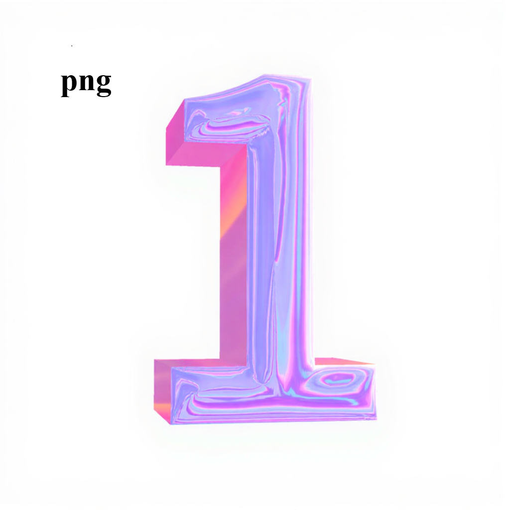
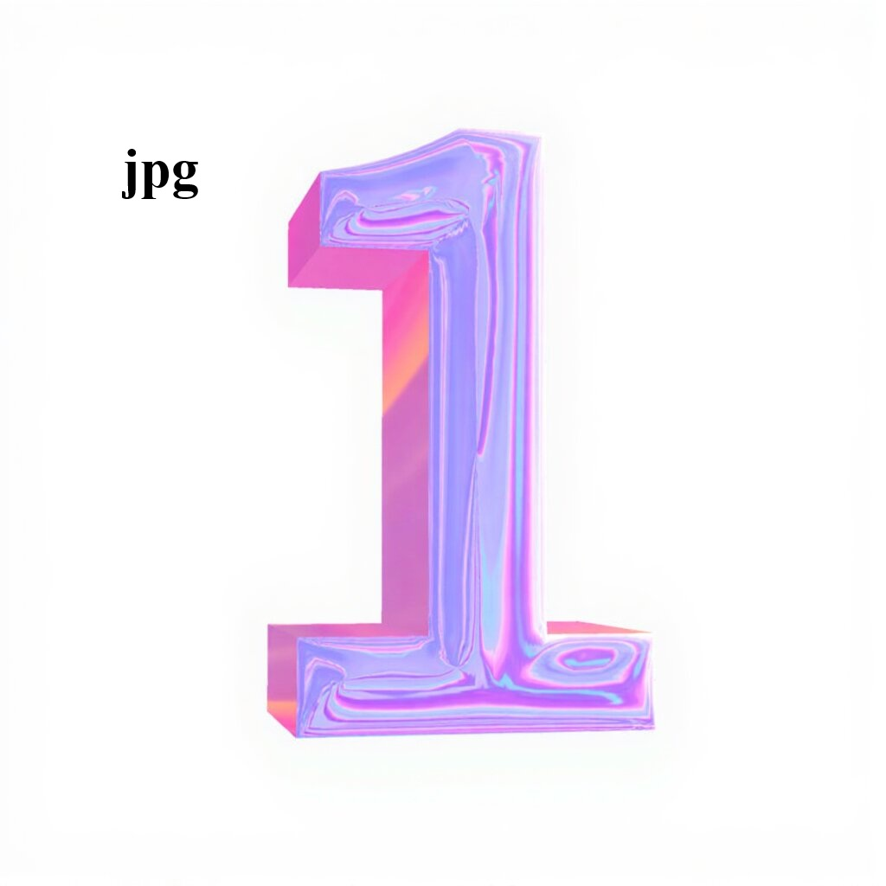
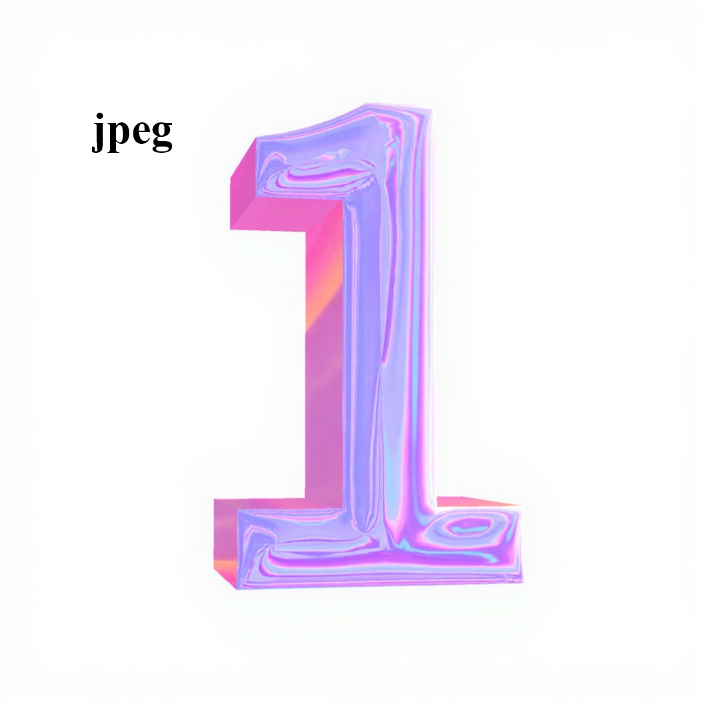
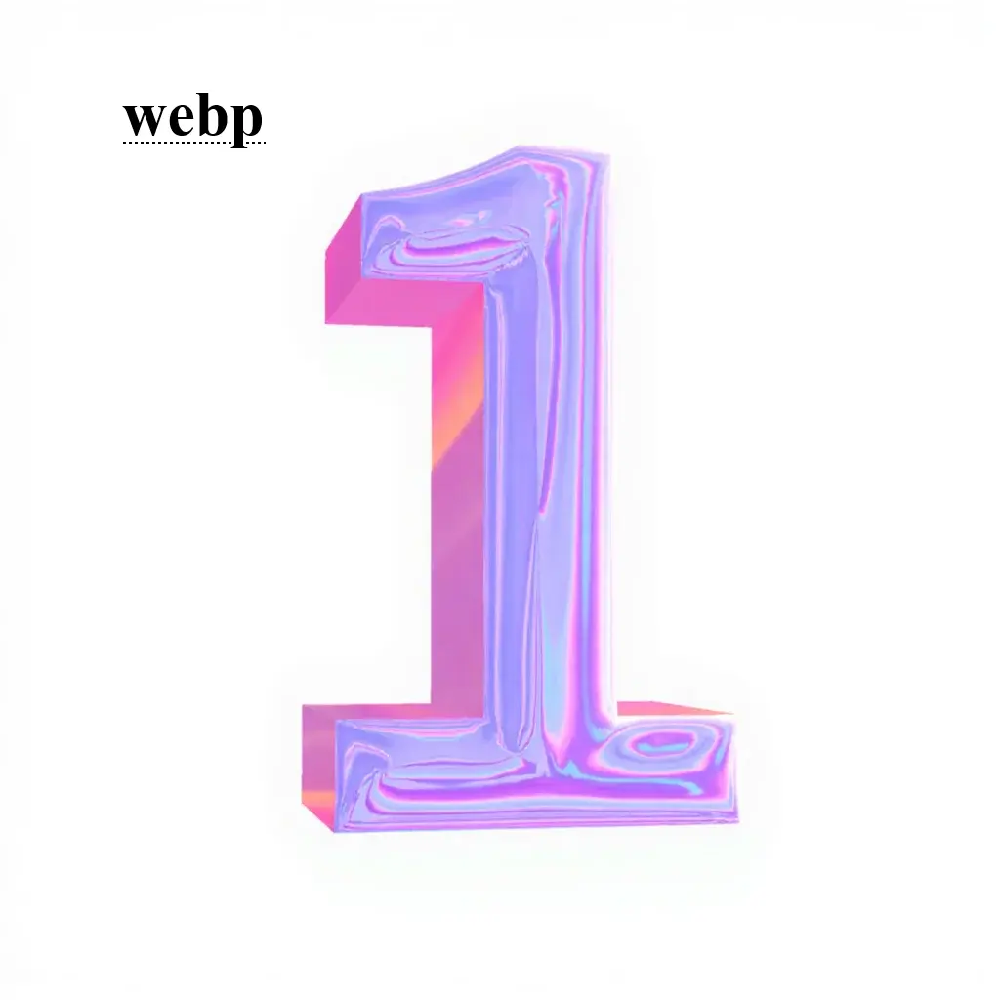

# Image 组件（ImageDemo）

### 介绍
本示例用于验证 ArkUI-X 中 Image 组件与 DrawableDescriptor 相关能力，覆盖以下输入类型和构建方式：

- PixelMap
- ResourceStr（资源）
- DrawableDescriptor
  - PixelMapDrawableDescriptor
  - LayeredDrawableDescriptor
  - AnimatedDrawableDescriptor

参考文档：[@ohos.Image（Image 组件）](https://gitcode.com/arkui-x/docs/blob/master/zh-cn/application-dev/reference/arkui-ts/ts-basic-components-image.md)

### 功能概述
本示例包含 3 个测试页面：

1. PixelMapDrawableDescriptor 页面
   - 支持 PNG/JPG/JPEG/BMP/SVG/WEBP/GIF 格式切换。
   - 验证 Image(drawable) 与 DrawableDescriptor.getPixelMap() 两种显示路径。

2. LayeredDrawableDescriptor 页面
   - 支持按格式切换分层资源。
   - 验证两种构建方式：
     - 构造函数直接创建。
     - 通过 json 资源反序列化创建。
   - 验证 getForeground()/getBackground()/getMask() 取值结果。

3. AnimatedDrawableDescriptor 页面
   - 基于 PixelMap 数组创建动画 Drawable。
   - 支持动态测试 duration（-1/0/1000/3000/7000）与 iterations（-1/0/1/3）参数。

### 效果预览
| 首页 | PixelMapDrawableDescriptor 页面 |
|---|---|
|  |  |

| LayeredDrawableDescriptor 页面 | AnimatedDrawableDescriptor 页面 |
|---|---|
|  |  |

### 资源预览
下列资源位于 src/main/resources/base/media/，用于多格式与分层测试：

| PNG | JPG | JPEG | WEBP |
|---|---|---|---|
|  |  |  |  |

### 使用说明
1. 启动应用后，在首页可进入 3 个测试入口：
   - PixelMapDrawableDescriptor
   - LayeredDrawableDescriptor
   - 动画Drawable测试

2. PixelMapDrawableDescriptor 页面：
   - 点击格式选择框切换图片格式。
   - 上方区域显示 Image(this.currentImageDrawable)。
   - 下方区域显示 Image(this.currentImageDrawable?.getPixelMap())。

3. LayeredDrawableDescriptor 页面：
   - 选择格式后，页面会重新加载对应的 foreground/background/mask 资源。
   - 可观察构造函数方式与 json 方式的渲染一致性。
   - 可分别查看 getForeground/getBackground/getMask 的输出图片。

4. AnimatedDrawableDescriptor 页面：
   - 先选择 duration 参数，再选择 iterations 参数（顺序不限）。
   - 每次参数变化都会重建 AnimatedDrawableDescriptor。
   - 页面顶部文本会同步显示当前参数含义（例如无限播放、不播放等）。

### 工程目录
```
src/main/
|---ets/
|   |---imagedemoability/
|   |   |---ImageDemoAbility.ets               // UIAbility 入口
|   |---pages/
|   |   |---Index.ets                          // 首页与路由入口
|   |   |---PixelMapDrawableDescriptor_1.ets   // 像素图 DrawableDescriptor 示例
|   |   |---LayeredDrawableDescriptor_2.ets    // 分层 DrawableDescriptor 示例
|   |   |---AnimatedDrawableDescriptor_3.ets   // 动画 DrawableDescriptor 示例
|---resources/
|   |---base/
|   |   |---media/                             // 多格式图片与 layered json 资源
|   |   |---profile/
|   |   |   |---main_pages.json                // 页面路由配置
|---module.json5                               // 模块配置
```

### 具体实现
- PixelMap 创建流程
  - 通过 resourceManager.getMediaContent() 获取资源字节。
  - 通过 image.createImageSource() 创建图片源。
  - 调用 createPixelMap() 解码为 PixelMap。

- DrawableDescriptor 使用流程
  - PixelMapDrawableDescriptor：使用 PixelMap 构造并直接传给 Image。
  - LayeredDrawableDescriptor：组合 foreground/background/mask 创建分层图片。
  - AnimatedDrawableDescriptor：将 PixelMap 数组与动画参数组合，生成可播放图像。

- JSON 分层资源
  - 通过 resourceManager.getDrawableDescriptor(jsonResource.id) 读取 json 定义的 LayeredDrawableDescriptor。
  - 通过类型判断确保返回对象可用于 LayeredDrawableDescriptor 相关接口。

### 相关权限
不涉及。

说明：
- 当前示例均使用本地媒体资源。
- 如果扩展网络图片，请申请 ohos.permission.INTERNET 权限。

### 依赖
- @kit.ImageKit
- @ohos.arkui.drawableDescriptor
