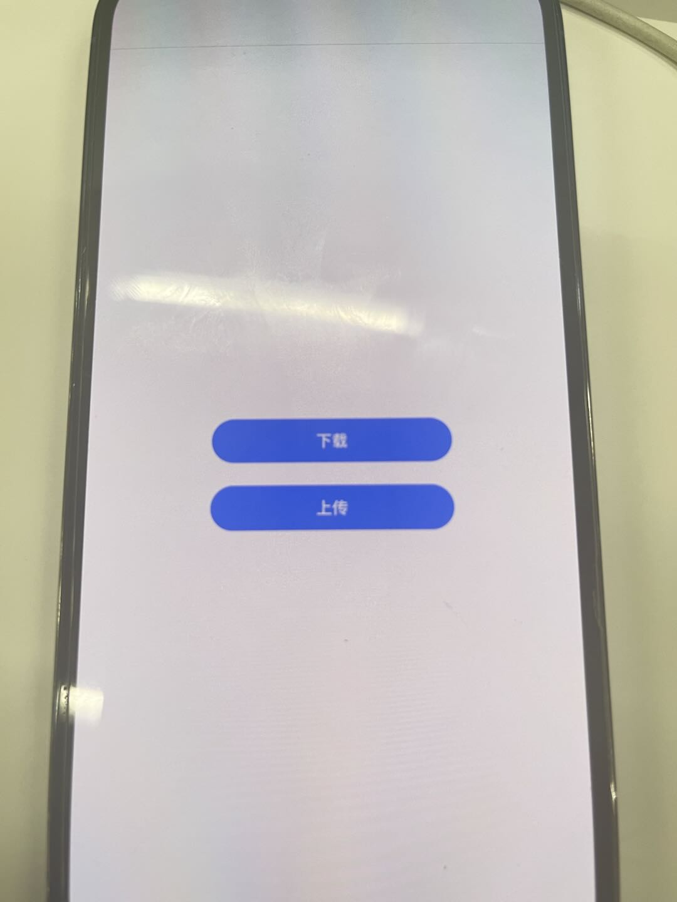
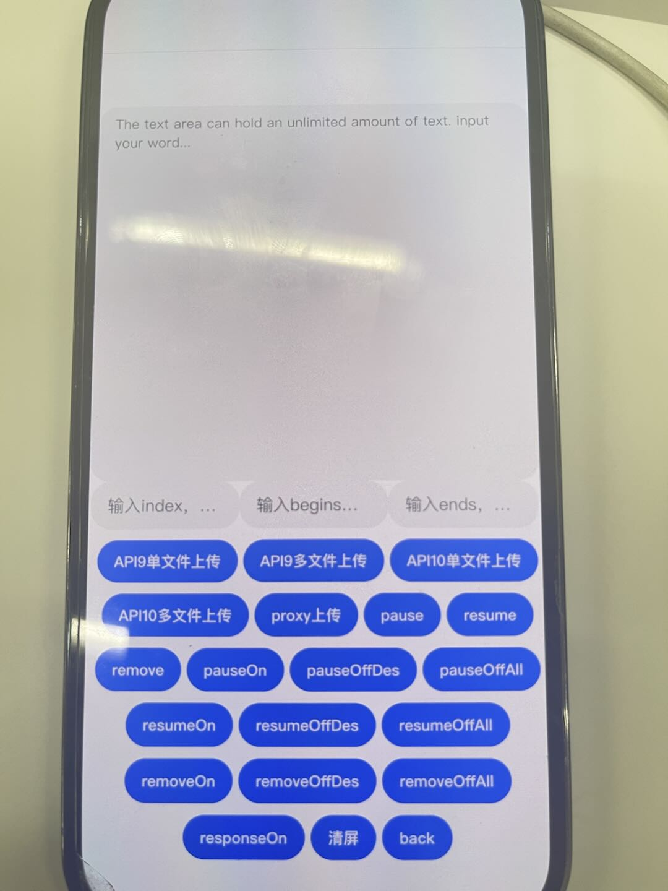
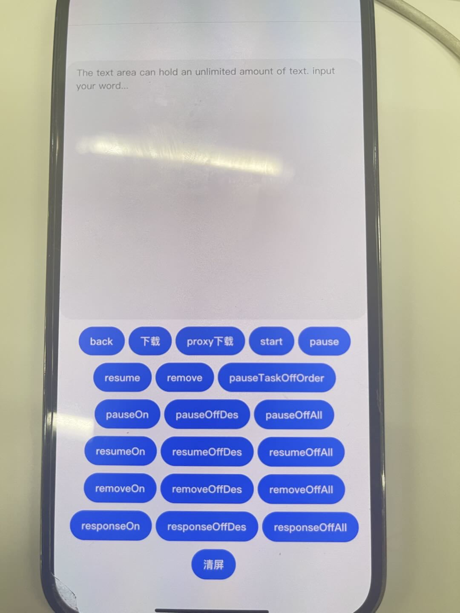
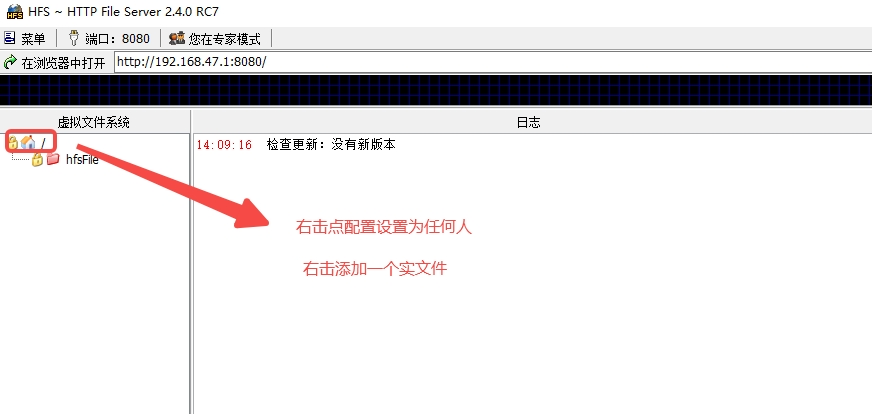
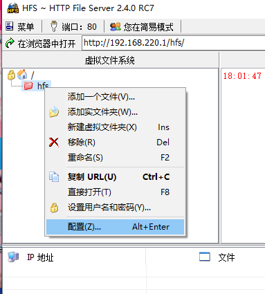
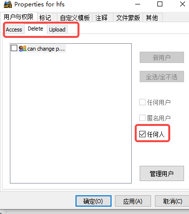
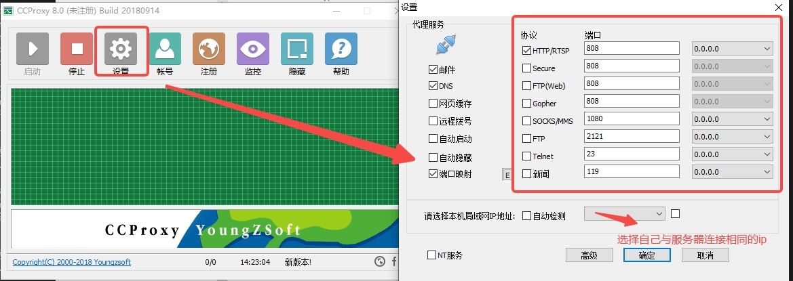
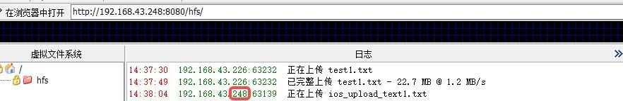
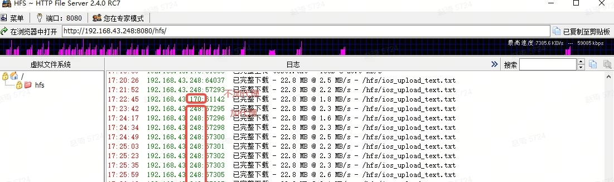

# RequestDemo自测试用例

应用效果预览：

| 页面                                                      |
|---------------------------------------------------------|
|  |
|  | 
|  |

### 使用说明

- 服务器可以使用httpserver服务器，代理服务器可以使用CCproxy代理服务器。 
- 服务器httpserve。 
- 
- 
- 
- 代理服务器CCproxy。 
- 

- 修改requestDemo/src/main/ets/pages/upload.ets文件下的url和urlProxy，使用正常工作的服务器与服务器代理，然后生成demo。 
- 点击**上传**按钮切换到上传界面，点击back按钮跳转初始界面。 
- 点击对应的按钮并输入index begens ends（首次不输入默认undefined，输入过后如果还需要undefined则需要手动输入undefined），查看显示内容及服务器中内容。 
- 如果只需要上传则只点上传的按钮；如需暂停，则需先点击上传按钮；如需恢复，则需要先点击上传，再点击暂停，然后是恢复按钮，查看显示界面是否成功；其他功能按钮需要再点击上传按钮后执行；（on和off类的按钮也是先on按钮再off按钮）。 
- 使用proxy时，需要设备与服务连接同一网络，然后点击proxy上传，在服务器上查看ip是否改变。 
- 
- 显示过多时，可以点击清屏按钮。 

修改requestDemo/src/main/ets/pages/download.ets文件下的url和urlProxy，使用正常工作的服务器与服务器代理，然后生成demo。 
- 点击**下载**按钮切换到下载界面，点击back按钮跳转初始界面。 
- 点击对应的按钮,查看显示内容。 
- 如果只需要下载，则先点击下载的按钮，再点start按钮；如需暂停，则需则先点击下载的按钮，再点start按钮，然后点击暂停按钮；如需恢复，则需则先点击下载的按钮，再点start按钮，然后点击暂停按钮，然后是恢复按钮，查看显示界面是否成功；其它按钮也需要先点击下载的按钮，再点start按钮后执行；（on和off类的按钮也是先on按钮再off按钮）。 
- 使用proxy时，需要设备与服务连接同一网络，点击proxy下载，再点击start按钮，在服务器上查看ip是否改变。（目前安卓下载不支持proxy） 
- 
- 显示过多时，可以点击清屏按钮。 
