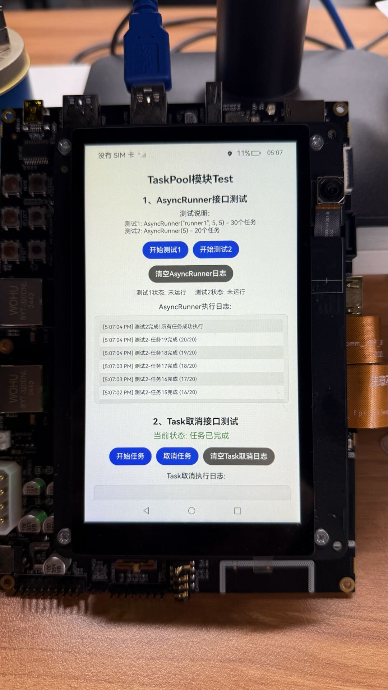
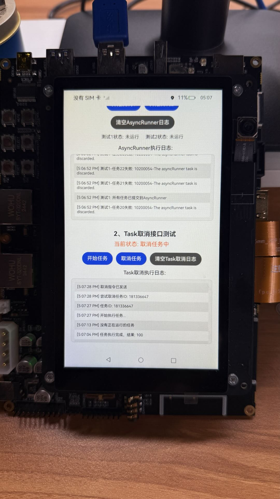

# Taskpool任务池

### 介绍

这是一个 **TaskPool** 并发任务测试应用程序，展示了如何使用 @kit.ArkTS 中的 taskpool 模块来实现多线程任务管理和取消功能。

本示例用到了Taskpool相关功能[@ohos.taskpool（启动任务池)](https://gitee.com/openharmony/docs/blob/master/zh-cn/application-dev/reference/apis-arkts/js-apis-taskpool.md)

### 效果预览

| 主页1                                                      | 主页2                                                      |
|----------------------------------------------------------|----------------------------------------------------------|
|  |  |

### 功能概述

🔄 **AsyncRunner 接口测试**

* 带配置的 AsyncRunner：创建具有名称和线程池配置的异步运行器

* 简单 AsyncRunner：使用默认配置创建异步运行器

* 批量任务管理：同时管理多个并发任务的执行

* 任务状态监控：实时监控任务执行进度和状态

⏹️ **Task 取消接口测试**

* 任务执行控制：启动长时间运行的任务

* 任务取消机制：在任务执行过程中取消任务

* 取消状态检测：任务内部检测取消状态并优雅退出

* 任务生命周期管理：完整管理任务的创建、执行和取消

### 使用方法

**1. AsyncRunner 测试**

**测试1：点击"开始测试1"按钮**

* 创建名为"runner1"的AsyncRunner

* 线程池配置：5个线程

* 执行30个延迟任务

* 观察任务完成进度

**测试2：点击"开始测试2"按钮**

* 创建简单AsyncRunner（5个线程）

* 执行20个延迟任务

* 对比两种配置的性能差异

**2. Task 取消测试**

* 启动任务：点击"开始任务"按钮

* 创建并执行一个5秒的长时间任务

* 显示任务ID和执行状态

* 取消任务：在任务执行过程中点击"取消任务"按钮

* 发送取消指令到任务

* 任务检测到取消状态后优雅退出

* 显示取消结果和任务返回值