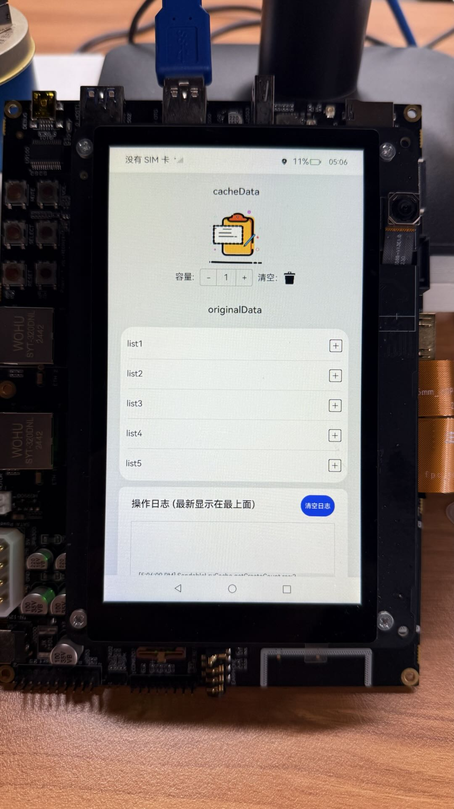

# ArkTSUtils

### 介绍

这是一个工具类测试应用程序，展示了如何使用 @kit.ArkTS 中的 ArkTSUtils 模块，特别是条件变量和可发送 LRU 缓存的功能。

本示例用到了ArkTSUtils.locks相关功能[ArkTSUtils.locks](https://gitee.com/openharmony/docs/blob/master/zh-cn/application-dev/reference/apis-arkts/arkts-apis-arkts-utils-locks.md)
SendableLruCache<K, V>相关功能[SendableLruCache<K, V>](https://gitee.com/openharmony/docs/blob/master/zh-cn/application-dev/reference/apis-arkts/arkts-apis-arkts-utils-SendableLruCache.md)

### 效果预览
| 主页                                                   |
|------------------------------------------------------|
|  |

### 功能概述

🔄 **条件变量 (ConditionVariable)**

* 线程同步机制：实现任务间的等待和通知机制

* 多任务协调：支持多个任务同时等待同一个条件变量

* 超时等待：提供带超时的等待功能，避免永久阻塞

* 批量通知：支持通知单个任务或所有等待任务

💾 **可发送 LRU 缓存 (SendableLruCache)**

* 线程安全缓存：支持在并发环境中安全使用的缓存

* LRU 淘汰策略：自动淘汰最近最少使用的条目

* 容量动态调整：运行时动态调整缓存容量

* 统计信息：提供丰富的缓存操作统计

* 迭代器支持：支持遍历缓存键值对

### 使用方法

**1. 缓存基本操作**

* 添加数据：点击原始数据项旁的"+"图标

* 查询数据：直接点击原始数据项

* 删除数据：点击缓存数据项的"删除"图标

* 调整容量：使用计数器增加或减少缓存容量

**2. 条件变量测试**

* 启动等待任务：应用启动时自动创建等待任务

* 触发通知：点击"清空"按钮时会触发通知任务

* 观察日志：查看任务间的同步通信过程

**3. 监控统计信息**

* 查看命中率：通过日志观察缓存命中情况

* 容量变化：调整容量时观察缓存淘汰行为

* 性能统计：监控各种操作的计数统计

### 注意事项

**本示例需要手动添加标签后再编译，后续待标签合入后方可正常编译。**