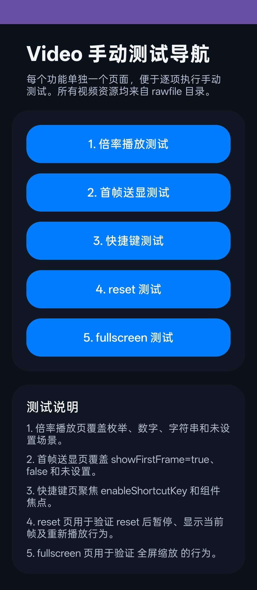
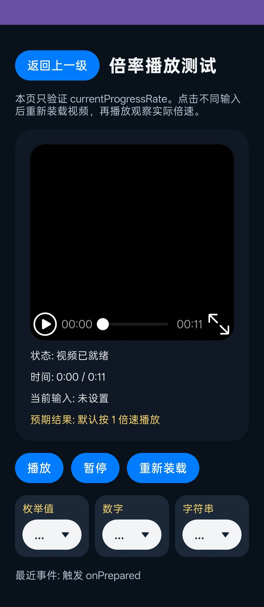
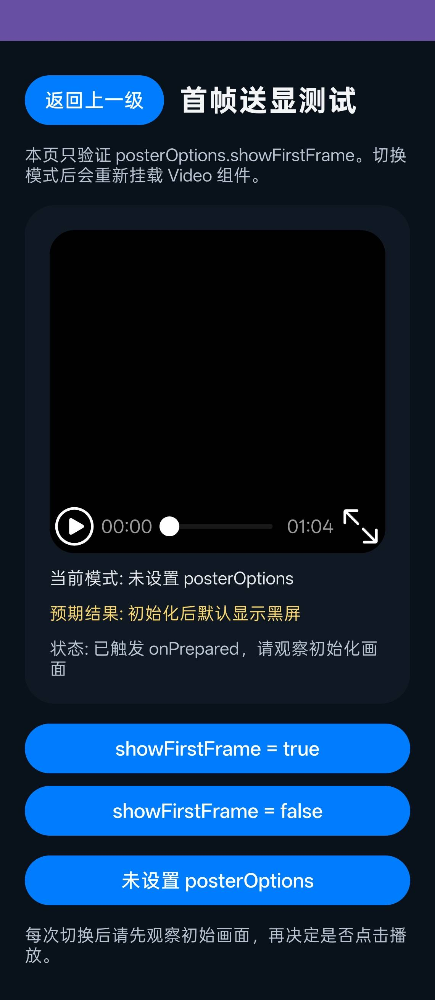
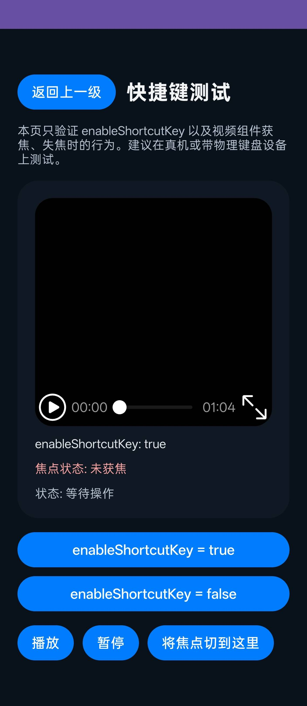
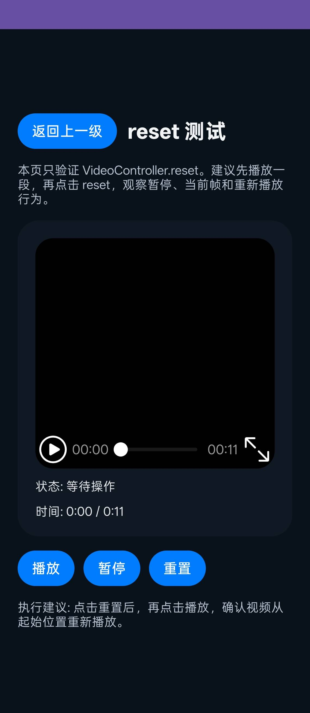

# VidoDemo

### 介绍
本示例用于验证 Video 组件在手动测试场景下的关键能力，包含播放倍率、首帧送显、快捷键、reset 和全屏等功能。

### 功能概述
本示例包含以下测试页面：

1. PlaybackRateTest（倍率播放测试）
2. PosterOptionsTest（首帧送显测试）
3. ShortcutKeyTest（快捷键测试）
4. ResetTest（reset 行为测试）
5. FullScreenTest（全屏测试）

### 效果预览







### 使用说明
1. 启动应用后进入“Video 手动测试导航”首页。
2. 按编号依次进入 5 个测试页面，逐项执行验证。
3. 建议优先执行倍率与首帧送显测试，再执行快捷键、reset、全屏测试。
4. 测试数据依赖 rawfile 目录中的视频资源。

### 工程目录
```
src/main/
|---ets/
|   |---vidodemoability/
|   |   |---VidoDemoAbility.ets
|   |---pages/
|   |   |---Index.ets
|   |   |---PlaybackRateTest.ets
|   |   |---PosterOptionsTest.ets
|   |   |---ShortcutKeyTest.ets
|   |   |---ResetTest.ets
|   |   |---FullScreenTest.ets
|---resources/
|   |---base/
|   |   |---profile/
|   |   |   |---main_pages.json
|   |---rawfile/
|---module.json5
```

### 具体实现
- 首页集中提供测试导航，降低多场景切换成本。
- 各测试能力拆分为单独页面，便于定位单点问题。
- 页面文案给出测试关注点，支持按步骤执行手动回归。

### 相关权限
不涉及。

### 依赖
- ArkUI Video 组件相关能力
