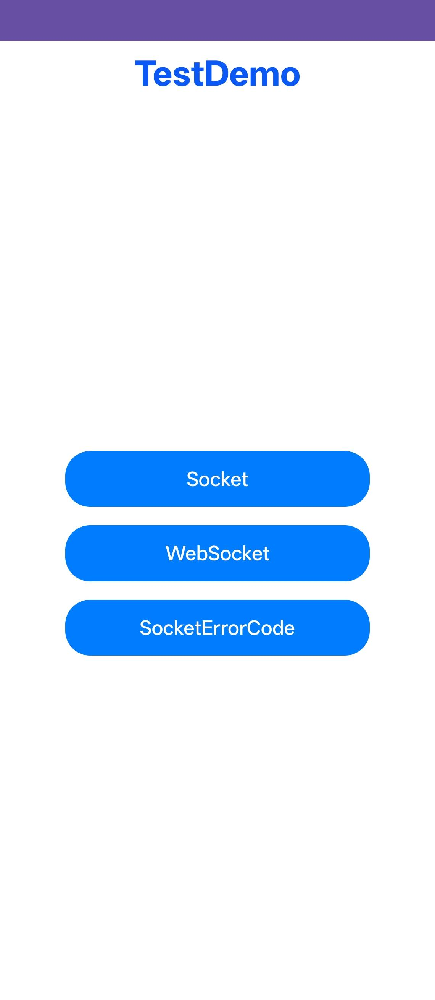

# WebSocketDemo

### 介绍
本示例用于验证网络通信相关接口能力，包含 WebSocket、Socket、TCP、TLS、UDP、本地 Socket 以及 WebSocketServer 相关测试场景。

参考文档：[@ohos.net.webSocket](https://developer.huawei.com/consumer/cn/doc/harmonyos-references/js-apis-websocket)

### 功能概述
本示例主要覆盖以下能力：

1. Socket/WebSocket 基础测试
   - Socket
   - WebSocket
   - WebSocket 连接与 headerReceive

2. WebSocketServer 测试
   - Start/Stop
   - listAllConnections
   - Send/Close
   - on_connect/on_messageReceive/on_error/on_close

3. 传输层能力测试
   - UDP（含 MulticastSocket）
   - TCP Socket / TCP SocketConnection / TCP SocketServer
   - TLS Socket / TLS SocketConnection / TLS SocketServer

4. 本地通信能力测试
   - LocalSocket
   - LocalSocketConnection
   - LocalSocketServer

5. 错误码测试
   - 各类 Socket/TLS/UDP/LocalSocket 错误码页面

### 效果预览


### 使用说明
1. 启动应用后进入首页，先点击以下一级入口：
   - Socket
   - WebSocket
   - SocketErrorCode

2. 在 WebSocket 与 Socket 相关页面中，按测试项逐个触发接口调用，观察连接状态、事件回调与日志。

3. 需要服务端能力验证时，进入 WebSocketServer 相关页面执行 Start、Send、Close、Stop 等流程。

4. 错误码页面用于验证异常路径返回值，可结合异常入参与网络状态切换测试。

### 工程目录
```
src/main/
|---ets/
|   |---websocketdemoability/
|   |   |---WebSocketDemoAbility.ets
|   |---pages/
|   |   |---Index.ets
|   |   |---WebSocket*.ets
|   |   |---Socket*.ets
|   |   |---TCPSocket*.ets
|   |   |---TLSSocket*.ets
|   |   |---UDPsocket*.ets
|   |   |---LocalSocket*.ets
|   |   |---ErrorCode/
|---resources/
|   |---base/
|   |   |---profile/
|   |   |   |---main_pages.json
|---module.json5
```

### 具体实现
- 按协议类型和对象类型拆分页面，覆盖连接、收发、关闭、状态、证书等接口。
- 将错误码能力独立到 ErrorCode 目录，便于异常流程专项回归。
- 首页聚合主入口，降低大规模测试集合的导航成本。

### 相关权限
模块中声明了以下权限：

- ohos.permission.INTERNET
- ohos.permission.GET_NETWORK_INFO
- ohos.permission.ACCESS_CERT_MANAGER
- ohos.permission.SET_NETWORK_INFO

同时定义了示例中的自定义权限：

- ohos.permission.CREATE_SERVER

### 依赖
- 网络通信相关接口能力（WebSocket/Socket/TCP/TLS/UDP）
