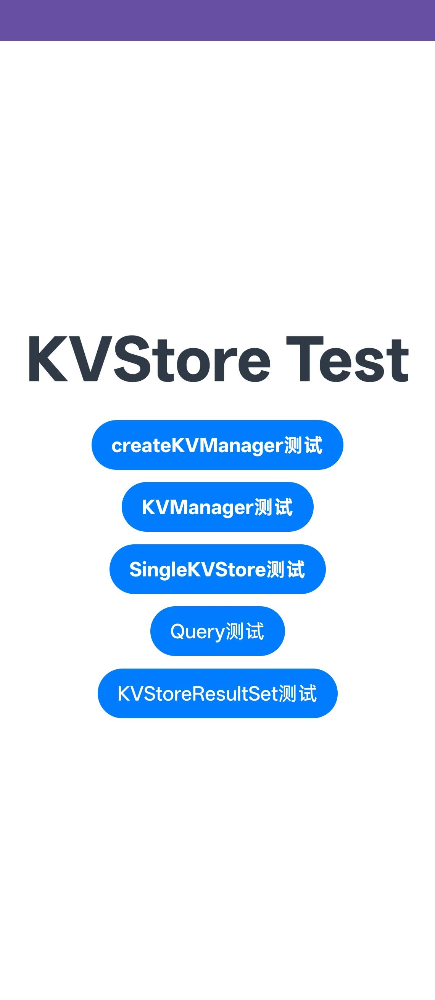

# distributedKVStoreDemo

### 介绍
本示例用于验证分布式键值数据库相关接口能力，覆盖 KVManager、SingleKVStore、Query 与 KVStoreResultSet 的常见调用路径。

参考文档：[@ohos.data.distributedKVStore](https://developer.huawei.com/consumer/cn/doc/harmonyos-references/js-apis-distributedkvstore)

### 功能概述
本示例主要包含以下测试模块：

1. createKVManager 测试
   - 创建 KVManager 实例。

2. KVManager 测试
   - getKVStore
   - closeKVStore
   - deleteKVStore
   - 字段节点相关能力验证

3. SingleKVStore 测试
   - backup
   - 插入与删除
   - get 查询
   - 事务操作

4. Query 测试
   - equalTo / notEqualTo
   - greaterThan / lessThan
   - in / notIn（number 与 string）
   - like / unlike
   - and / or / beginGroup / endGroup
   - orderByAsc / orderByDesc
   - isNull / isNotNull
   - prefixKey / setSuggestIndex / limit
   - getSqlLike

5. KVStoreResultSet 测试
   - moveToNext / moveToPrevious / move / moveToPosition
   - isFirst / isLast / isBeforeFirst / isAfterLast
   - getPosition / maxLimitResultSet

### 效果预览


### 使用说明
1. 启动应用后进入首页，依次点击以下入口执行测试：
   - createKVManager测试
   - KVManager测试
   - SingleKVStore测试
   - Query测试
   - KVStoreResultSet测试

2. 在各子页面按按钮触发接口调用，观察页面展示结果与日志输出。

3. Query 与 ResultSet 页面建议按“先写入数据，再筛选/游标移动”的顺序验证，以便更直观地查看结果变化。

### 工程目录
```
src/main/
|---ets/
|   |---distributedkvstoredemoability/
|   |   |---DistributedKVStoreDemoAbility.ets
|   |---pages/
|   |   |---Index.ets
|   |   |---CreateKVManagerTest.ets
|   |   |---KVManagerTest/
|   |   |---SingleKVStoreTest/
|   |   |---Query/
|   |   |---KVStoreResultSet/
|---resources/
|   |---base/
|   |   |---profile/
|   |   |   |---main_pages.json
|---module.json5
```

### 具体实现
- 通过首页路由将分布式 KVStore 接口拆分为多个独立测试页面，便于逐项验证。
- Query 页面重点验证组合过滤、排序、范围、模糊匹配与分页限制。
- KVStoreResultSet 页面重点验证游标位置变更与边界状态判断。

### 相关权限
当前模块未在 module.json5 中声明额外请求权限，示例以接口能力验证为主。

### 依赖
- 分布式数据管理基础能力（distributedKVStore 相关接口）
