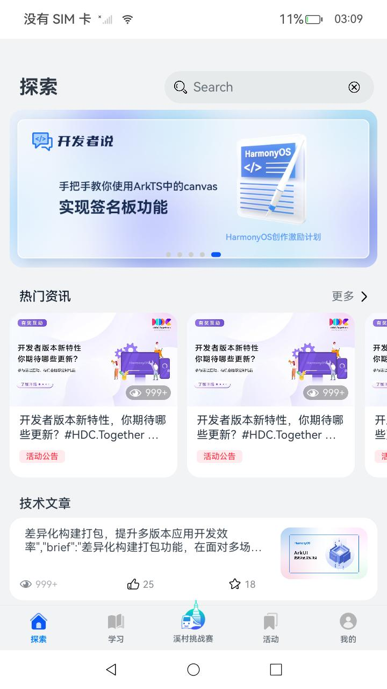
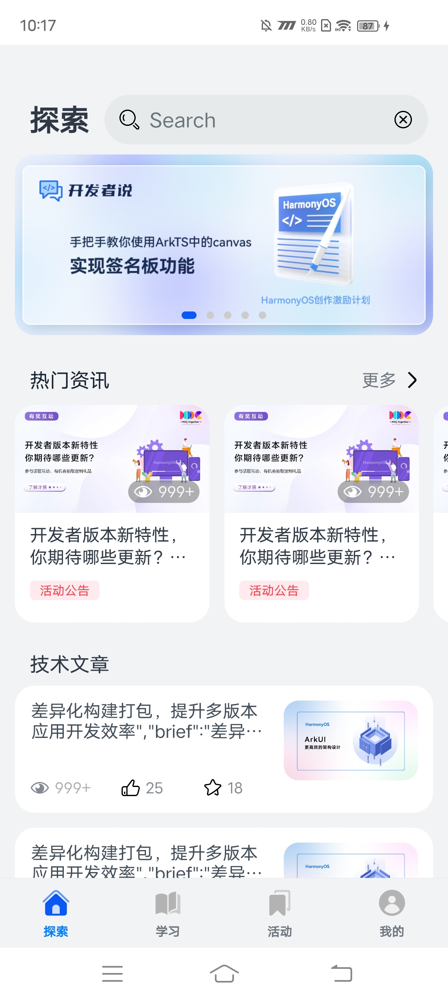
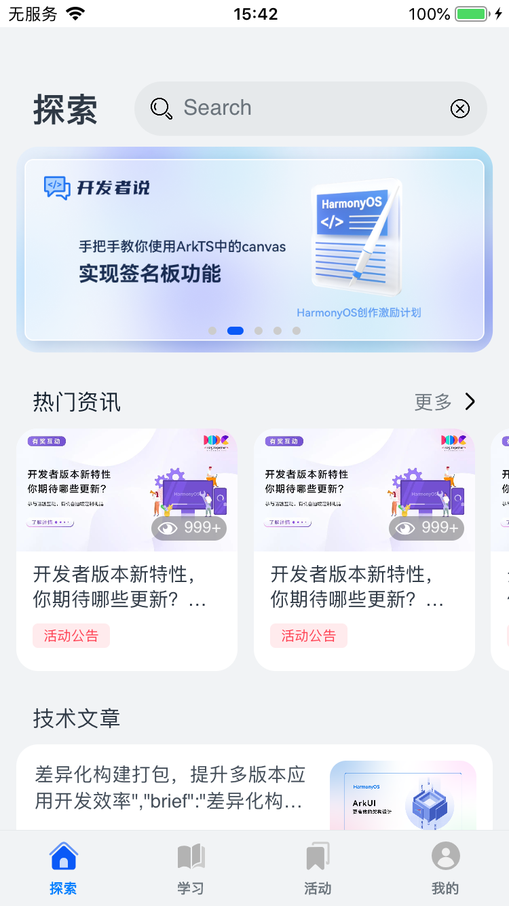
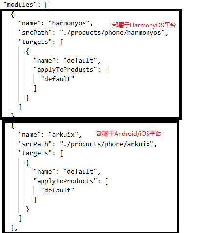

# HMOS世界

## 介绍

运行部署本示例前，请先参阅[跨平台应用改造指南](https://gitcode.com/arkui-x/docs/blob/master/zh-cn/application-dev/tutorial/how-to-use-arkuix-on-applicationRetrofit.md)以熟悉相关概念。

基于分层架构和模块化设计的最佳实践。呈现ArkUI-X框架的基本能力。<br>

## 效果预览
| 鸿蒙平台                                                     | Android平台                                                | iOS平台                                                |
| ------------------------------------------------------------ | ---------------------------------------------------------- | ------------------------------------------------------ |
|  |  |  |
|                                                              |                                                            |                                                        |

### 使用说明
- 本示例运行安装时随意修改本示例的bundleName可能会导致网络请求失败。<br>

- 本示例用到了地图和华为快捷登录功能，如果想体验这两个功能，需要用本示例build-profile.json5文件中配置的签名信息安装运行。<br>

- 本示例存在两个module，分别命名为arkuix和harmonyos，其中arkuix经编译后部署于Android/iOS平台；harmonyos经编译后部署于HarmonyOS平台。因此在运行时，需要根据目标部署平台来确定参与编译的module。具体实现方法为：工程[build-profile.json5](build-profile.json5)文件中，确定参与编译的module保持不变即可，使用注释方法将另一个module进行注释，禁止其参与编译。最终确定编译时仅与目标平台对应的module参与编译，另一个module不参与编译。

  

1. 分别在Android、iOS、HarmonyOSNext安装并打开应用。应用启动后进入用户隐私确认页，确认后进入启动页，展示启动动画。<br>
2. 启动动画结束后进入登录页面，可直接点击登录按钮进入。仅HarmonyOSNext设备支持华为快捷登录功能。<br>
3. 进入主题定制页面，勾选文章、资讯的内容后，可点击完成按钮。<br>
4. 进入应用首页，Android、iOS平台应用下部Tabs页共计4个，分别为“探索页”、“学习页”、“活动页”、“我的页”。HarmonyOSNext平台应用下部Tabs页共计5个，分别为“探索页”、“学习页”、“溪村挑战赛页”、“活动页”、“我的页”。<br>
5. 应用探索页：热门资讯、技术文章可点击进入，展示具体web页面。<br>
6. 应用探索页可点击点赞按钮、收藏按钮，展示动画效果。<br>
7. 应用学习页各子项可点击进入，展示具体web页面。web页面加载完成后停留5秒钟以上退回至学习页，可弹出弹窗。<br>
8. 应用活动页展示具体web页面。<br>
9. 应用我的页上方按钮点击可分别进入主题定制页面、设置页面。<br>
10. 应用我的页点击头像后可进入头像页面，可更换头像显示。<br>
11. 应用我的页下方收藏和浏览栏子项可点击进入，展示具体web页面。<br>
12. 应用我的页成就子项可点击进入，展示徽章。徽章默认是灰色，于学习页操作后可得对应徽章。获得徽章后亮色展示，可点击查看动画效果。<br>
13. 其他按钮无实际点击事件或功能。<br>

## 工程目录
```
HMOSWorld
├── .arkui-x
│   ├── android					//Android 工程
│   ├── ios						//iOS 工程
│   └── arkui-x-config.json5
├── AppScope
│   ├── app.json5
│   └── resources
├── build-profile.json5
├── commons
│   ├── aspect
│   │   ├── build-profile.json5
│   │   ├── hvigorfile.ts
│   │   ├── Index.ets
│   │   ├── obfuscation-rules.txt
│   │   ├── oh-package.json5
│   │   └── src
│   │       └── main
│   │           ├── ets
│   │           │   ├── service
│   │           │   │   └── AspectNetFunc.ets
│   │           │   └── utils
│   │           │       ├── AspectUtil
│   │           │       │   ├── AspectUtilArkUIX.ets
│   │           │       │   ├── AspectUtil.ets
│   │           │       │   └── AspectUtilLocal.ets
│   │           │       ├── AudioPlayerAspect.ets
│   │           │       ├── DiscoverAspect.ets
│   │           │       ├── IndexAspect.ets
│   │           │       ├── interface
│   │           │       │   └── AspectUtilInterface.ets
│   │           │       ├── LearningAspect.ets
│   │           │       ├── LoginAspect.ets
│   │           │       ├── MineAspect.ets
│   │           │       ├── TopicAspect.ets
│   │           │       └── WebAspect.ets
│   │           ├── module.json5
│   │           └── resources
│   ├── audioplayer
│   │   ├── build-profile.json5
│   │   ├── hvigorfile.ts
│   │   ├── Index.ets
│   │   ├── obfuscation-rules.txt
│   │   ├── oh-package.json5
│   │   └── src
│   │       └── main
│   │           ├── ets
│   │           │   ├── common
│   │           │   │   └── CommonData.ets
│   │           │   └── service
│   │           │       ├── AudioPlayerService.ets
│   │           │       ├── AudioRenderService.ets
│   │           │       └── SpeechPlayerService.ets
│   │           ├── module.json5
│   │           └── resources
│   ├── authentication
│   │   ├── build-profile.json5
│   │   ├── hvigorfile.ts
│   │   ├── Index.ets
│   │   ├── obfuscation-rules.txt
│   │   ├── oh-package.json5
│   │   └── src
│   │       └── main
│   │           ├── ets
│   │           │   ├── interface
│   │           │   │   └── AuthenticationInterface.ets
│   │           │   └── utils
│   │           │       ├── AuthenticationArkUIX.ets
│   │           │       ├── Authentication.ets
│   │           │       └── AuthenticationLocal.ets
│   │           ├── module.json5
│   │           └── resources
│   ├── datastore
│   │   ├── build-profile.json5
│   │   ├── hvigorfile.ts
│   │   ├── Index.ets
│   │   ├── obfuscation-rules.txt
│   │   ├── oh-package.json5
│   │   └── src
│   │       └── main
│   │           ├── ets
│   │           │   └── datasource
│   │           │       └── datastore
│   │           │           └── PreferenceManager.ets
│   │           ├── module.json5
│   │           └── resources
│   ├── network
│   │   ├── build-profile.json5
│   │   ├── hvigorfile.ts
│   │   ├── Index.ets
│   │   ├── obfuscation-rules.txt
│   │   ├── oh-package.json5
│   │   └── src
│   │       └── main
│   │           ├── ets
│   │           │   ├── agc
│   │           │   │   └── Request.ets
│   │           │   └── constants
│   │           │       ├── ErrorCodeConstants.ets
│   │           │       └── RequestTrigger.ets
│   │           ├── module.json5
│   │           └── resources
│   ├── photomanager
│   │   ├── build-profile.json5
│   │   ├── hvigorfile.ts
│   │   ├── Index.ets
│   │   ├── obfuscation-rules.txt
│   │   ├── oh-package.json5
│   │   └── src
│   │       └── main
│   │           ├── ets
│   │           │   ├── common
│   │           │   │   ├── ErrorCodeConstants.ets
│   │           │   │   └── ProfileConstants.ets
│   │           │   ├── interface
│   │           │   │   └── PhotoManagerInterface.ets
│   │           │   └── utils
│   │           │       ├── PhotoManagerArkUIX.ets
│   │           │       ├── PhotoManager.ets
│   │           │       └── PhotoManagerLocal.ets
│   │           ├── module.json5
│   │           └── resources
│   ├── uicomponents
│   │   ├── build-profile.json5
│   │   ├── hvigorfile.ts
│   │   ├── Index.ets
│   │   ├── obfuscation-rules.txt
│   │   ├── oh-package.json5
│   │   └── src
│   │       └── main
│   │           ├── ets
│   │           │   ├── common
│   │           │   │   └── Constants.ets
│   │           │   ├── components
│   │           │   │   ├── ArticleCardButtonView.ets
│   │           │   │   ├── EyeCountComponent.ets
│   │           │   │   ├── InteractiveAreaView.ets
│   │           │   │   ├── LoadingMore.ets
│   │           │   │   ├── NoMore.ets
│   │           │   │   ├── SearchInput.ets
│   │           │   │   ├── skeleton
│   │           │   │   │   ├── ArticleLoadingSkeleton.ets
│   │           │   │   │   └── FeedLoadingSkeleton.ets
│   │           │   │   ├── TagLabelCard.ets
│   │           │   │   └── TopNavigationView.ets
│   │           │   ├── views
│   │           │   │   ├── LoadingFailedView.ets
│   │           │   │   ├── LoadingView.ets
│   │           │   │   └── NoneContentView.ets
│   │           │   └── web
│   │           │       ├── WebViewArkUIX.ets
│   │           │       └── WebViewLocal.ets
│   │           ├── module.json5
│   │           └── resources
│   └── utils
│       ├── BuildProfile.ets
│       ├── build-profile.json5
│       ├── hvigorfile.ts
│       ├── Index.ets
│       ├── obfuscation-rules.txt
│       ├── oh-package.json5
│       └── src
│           └── main
│               ├── ets
│               │   ├── common
│               │   │   ├── CommonConstants.ets
│               │   │   ├── CommonEnums.ets
│               │   │   ├── ContinueModel.ets
│               │   │   ├── DarkModeData.ets
│               │   │   ├── RankColorMap.ets
│               │   │   └── ResponseData.ets
│               │   ├── model
│               │   │   ├── Achieve.ets
│               │   │   ├── AspectParams.ets
│               │   │   ├── DiscoverParams.ets
│               │   │   ├── HomeResource.ets
│               │   │   ├── LearningParams.ets
│               │   │   ├── LearningResource.ets
│               │   │   ├── Topic.ets
│               │   │   ├── TopicParams.ets
│               │   │   ├── UserAccount.ets
│               │   │   ├── UserIdParams.ets
│               │   │   └── UserParams.ets
│               │   └── utils
│               │       ├── BackgroundTaskManager
│               │       │   ├── BackgroundTaskManagerArkUIX.ets
│               │       │   ├── BackgroundTaskManager.ets
│               │       │   └── BackgroundTaskManagerLocal.ets
│               │       ├── BreakpointSystem.ets
│               │       ├── CheckEmptyUtil.ets
│               │       ├── CommonUtil.ets
│               │       ├── DarkModeUtil
│               │       │   ├── DarkModeUtilArkUIX.ets
│               │       │   ├── DarkModeUtil.ets
│               │       │   └── DarkModeUtilLocal.ets
│               │       ├── FileUtil.ets
│               │       ├── GlobalContext.ets
│               │       ├── ImageUtil.ets
│               │       ├── interface
│               │       │   ├── BackgroundTaskManagerInterface.ets
│               │       │   ├── DarkModeUtilInterface.ets
│               │       │   ├── PermissionUtilInterface.ets
│               │       │   └── WindowUtilInterface.ets
│               │       ├── JsonUtil.ets
│               │       ├── LazyDataSource.ets
│               │       ├── Logger.ets
│               │       ├── LottieUtil.ets
│               │       ├── ObservedArray.ets
│               │       ├── PermissionUtil
│               │       │   ├── PermissionUtilArkUIX.ets
│               │       │   ├── PermissionUtil.ets
│               │       │   └── PermissionUtilLocal.ets
│               │       ├── PlatformInfo.ets
│               │       ├── ResourceUtil.ets
│               │       ├── SubWindowUtil.ets
│               │       ├── WebUtil.ets
│               │       └── WindowUtil
│               │           ├── WindowUtilArkUIX.ets
│               │           ├── WindowUtil.ets
│               │           └── WindowUtilLocal.ets
│               ├── module.json5
│               └── resources
├── features
│   ├── challenge
│   │   ├── build-profile.json5
│   │   ├── hvigorfile.ts
│   │   ├── Index.ets
│   │   ├── oh-package.json5
│   │   └── src
│   │       └── main
│   │           ├── ets
│   │           │   ├── components
│   │           │   │   ├── BuildListItem.ets
│   │           │   │   ├── ChallengeItem.ets
│   │           │   │   ├── DesignStyleSwiper.ets
│   │           │   │   ├── ImageSaveDialog.ets
│   │           │   │   ├── ImageViewDialog.ets
│   │           │   │   ├── LocationItem.ets
│   │           │   │   ├── RoutesSheet.ets
│   │           │   │   ├── SpeakPlayerButton.ets
│   │           │   │   ├── StyleListItem.ets
│   │           │   │   ├── SubTitleItem.ets
│   │           │   │   ├── SwiperListItem.ets
│   │           │   │   └── ZoneDetailModal.ets
│   │           │   ├── constants
│   │           │   │   └── ChallengeConstants.ets
│   │           │   ├── model
│   │           │   │   ├── IconSubtitleData.ets
│   │           │   │   ├── MapData.ets
│   │           │   │   ├── ZonesItem.ets
│   │           │   │   └── ZonesModel.ets
│   │           │   └── views
│   │           │       ├── ChallengeDetailView.ets
│   │           │       ├── MapView.ets
│   │           │       └── ZoneDetailView.ets
│   │           ├── module.json5
│   │           └── resources
│   ├── conference
│   │   ├── build-profile.json5
│   │   ├── hvigorfile.ts
│   │   ├── Index.ets
│   │   ├── oh-package.json5
│   │   └── src
│   │       └── main
│   │           ├── ets
│   │           │   └── view
│   │           │       └── ConferenceView.ets
│   │           ├── module.json5
│   │           └── resources
│   ├── discover
│   │   ├── build-profile.json5
│   │   ├── hvigorfile.ts
│   │   ├── Index.ets
│   │   ├── oh-package.json5
│   │   └── src
│   │       └── main
│   │           ├── ets
│   │           │   ├── components
│   │           │   │   ├── ArticleCardView.ets
│   │           │   │   ├── FeedFlowItem.ets
│   │           │   │   ├── SearchBar.ets
│   │           │   │   └── SearchHistory.ets
│   │           │   ├── model
│   │           │   │   └── DiscoverModel.ets
│   │           │   ├── service
│   │           │   │   └── DiscoverNetFunc.ets
│   │           │   └── views
│   │           │       ├── DiscoverSkeletonView.ets
│   │           │       ├── DiscoverView.ets
│   │           │       ├── FeedWaterFlowView.ets
│   │           │       ├── SearchResultView.ets
│   │           │       └── SearchView.ets
│   │           ├── module.json5
│   │           └── resources
│   ├── learning
│   │   ├── build-profile.json5
│   │   ├── hvigorfile.ts
│   │   ├── Index.ets
│   │   ├── oh-package.json5
│   │   └── src
│   │       └── main
│   │           ├── ets
│   │           │   ├── components
│   │           │   │   ├── AchievementDialog.ets
│   │           │   │   ├── CommentItem.ets
│   │           │   │   └── LearningItem.ets
│   │           │   ├── constants
│   │           │   │   └── LearningConstants.ets
│   │           │   ├── model
│   │           │   │   ├── LearningComment.ets
│   │           │   │   ├── LearningModel.ets
│   │           │   │   └── LearningPath.ets
│   │           │   ├── service
│   │           │   │   └── LearningNetFunc.ets
│   │           │   └── views
│   │           │       ├── LearningDetailView.ets
│   │           │       └── LearningView.ets
│   │           ├── module.json5
│   │           └── resources
│   ├── login
│   │   ├── build-profile.json5
│   │   ├── hvigorfile.ts
│   │   ├── Index.ets
│   │   ├── oh-package.json5
│   │   └── src
│   │       └── main
│   │           ├── ets
│   │           │   ├── components
│   │           │   │   ├── AccountSelectView.ets
│   │           │   │   └── InputAreaView.ets
│   │           │   ├── constants
│   │           │   │   └── LoginConstants.ets
│   │           │   ├── model
│   │           │   │   └── AccountModel.ets
│   │           │   ├── pages
│   │           │   │   └── LoginPage.ets
│   │           │   └── service
│   │           │       └── LoginNetFunc.ets
│   │           ├── module.json5
│   │           └── resources
│   ├── main
│   │   ├── build-profile.json5
│   │   ├── consumer-rules.txt
│   │   ├── hvigorfile.ts
│   │   ├── Index.ets
│   │   ├── obfuscation-rules.txt
│   │   ├── oh-package.json5
│   │   └── src
│   │       └── main
│   │           ├── ets
│   │           │   ├── constants
│   │           │   │   ├── AppConstants.ets
│   │           │   │   └── SplashConstants.ets
│   │           │   ├── model
│   │           │   │   ├── SplashModel.ets
│   │           │   │   └── SplashSource.ets
│   │           │   └── pages
│   │           │       ├── PrivacyPage.ets
│   │           │       ├── SafePage.ets
│   │           │       └── ThemeSettingPage.ets
│   │           ├── module.json5
│   │           └── resources
│   ├── mine
│   │   ├── build-profile.json5
│   │   ├── hvigorfile.ts
│   │   ├── Index.ets
│   │   ├── oh-package.json5
│   │   └── src
│   │       └── main
│   │           ├── ets
│   │           │   ├── components
│   │           │   │   ├── AchievesView.ets
│   │           │   │   ├── ArticleCardView.ets
│   │           │   │   ├── CollectedResourcesView.ets
│   │           │   │   ├── FeedCardView.ets
│   │           │   │   ├── ResourceListView.ets
│   │           │   │   ├── TimeSelectDialog.ets
│   │           │   │   ├── UserHeadComponent.ets
│   │           │   │   └── ViewedResourceView.ets
│   │           │   ├── constants
│   │           │   │   └── Constants.ets
│   │           │   ├── model
│   │           │   │   ├── AchievementModel.ets
│   │           │   │   ├── ActionEventData.ets
│   │           │   │   ├── UserData.ets
│   │           │   │   └── UserModel.ets
│   │           │   ├── service
│   │           │   │   └── UserNetFunc.ets
│   │           │   └── views
│   │           │       ├── ConfirmView.ets
│   │           │       ├── DiscoverArticleDetailView.ets
│   │           │       ├── LoadingView.ets
│   │           │       ├── MineView.ets
│   │           │       ├── PhotoView.ets
│   │           │       ├── SettingView.ets
│   │           │       ├── ThemeConfigView.ets
│   │           │       └── UserAccountView.ets
│   │           ├── module.json5
│   │           └── resources
│   └── topic
│       ├── build-profile.json5
│       ├── hvigorfile.ts
│       ├── Index.ets
│       ├── oh-package.json5
│       └── src
│           └── main
│               ├── ets
│               │   ├── components
│               │   │   └── TopicItemView.ets
│               │   ├── constants
│               │   │   ├── TagColorMap.ets
│               │   │   └── ThemeConstants.ets
│               │   ├── model
│               │   │   └── TopicModel.ets
│               │   └── service
│               │       └── TopicNetFunc.ets
│               ├── module.json5
│               └── resources
├── hvigor
│   ├── hvigor-config.json5
│   └── hvigor-wrapper.js
├── hvigorfile.ts
├── oh-package.json5
├── products
│   └── phone
│       ├── arkuix
│       │   ├── build-profile.json5
│       │   ├── hvigorfile.ts
│       │   ├── oh-package.json5
│       │   └── src
│       │       └── main
│       │           ├── ets
│       │           │   ├── common
│       │           │   │   ├── components
│       │           │   │   │   └── CustomTabBar.ets
│       │           │   │   ├── lottie
│       │           │   │   │   ├── cancel_collect_lottie.json
│       │           │   │   │   ├── cancel_liked_lottie.json
│       │           │   │   │   ├── collected_lottie.json
│       │           │   │   │   ├── learning_path_1_lottie.json
│       │           │   │   │   ├── learning_path_2_lottie.json
│       │           │   │   │   ├── learning_path_3_lottie.json
│       │           │   │   │   ├── learning_path_4_lottie.json
│       │           │   │   │   ├── learning_path_5_lottie.json
│       │           │   │   │   ├── learning_path_6_lottie.json
│       │           │   │   │   ├── learning_path_7_lottie.json
│       │           │   │   │   ├── learning_path_8_lottie.json
│       │           │   │   │   └── liked_lottie.json
│       │           │   │   └── model
│       │           │   │       └── TabBarModel.ets
│       │           │   ├── entryability
│       │           │   │   └── EntryAbility.ets
│       │           │   └── pages
│       │           │       ├── MainPage.ets
│       │           │       └── SplashPage.ets
│       │           ├── module.json5
│       │           └── resources
│       └── harmonyos
│           ├── build-profile.json5
│           ├── hvigorfile.ts
│           ├── oh-package.json5
│           ├── phone.ap
│           └── src
│               └── main
│                   ├── ets
│                   │   ├── common
│                   │   │   ├── components
│                   │   │   │   └── CustomTabBar.ets
│                   │   │   ├── lottie
│                   │   │   │   ├── cancel_collect_lottie.json
│                   │   │   │   ├── cancel_liked_lottie.json
│                   │   │   │   ├── collected_lottie.json
│                   │   │   │   ├── learning_path_1_lottie.json
│                   │   │   │   ├── learning_path_2_lottie.json
│                   │   │   │   ├── learning_path_3_lottie.json
│                   │   │   │   ├── learning_path_4_lottie.json
│                   │   │   │   ├── learning_path_5_lottie.json
│                   │   │   │   ├── learning_path_6_lottie.json
│                   │   │   │   ├── learning_path_7_lottie.json
│                   │   │   │   ├── learning_path_8_lottie.json
│                   │   │   │   └── liked_lottie.json
│                   │   │   └── model
│                   │   │       ├── CardModel.ets
│                   │   │       └── TabBarModel.ets
│                   │   ├── entryability
│                   │   │   └── EntryAbility.ets
│                   │   ├── entryformability
│                   │   │   └── EntryFormAbility.ets
│                   │   ├── pages
│                   │   │   ├── MainPage.ets
│                   │   │   └── SplashPage.ets
│                   │   └── widget
│                   │       └── pages
│                   │           └── WidgetCard.ets
│                   ├── module.json5
│                   └── resources
├── screenshots
├── README.md
└── signature
```

## 具体实现

应用整体结构分为3层，commons为公共能力层，features为功能模块层，products则为产品层。

- [隐私与安全页](features/main/src/main/ets/pages/PrivacyPage.ets)
  - 使用web组件加载本地html页面。
- [应用启动页](products/phone/arkuix/src/main/ets/pages/SplashPage.ets)
  - 在工程pages目录中，选中Index.ets，点击鼠标右键 > Refactor > Rename，改名为SplashPage.ets。改名后，修改工程entryability目录下EntryAbility.ets文件中windowStage.loadContent方法第一个参数为pages/SplashPage。
  - 应用启动后根据[AppStorage](https://developer.huawei.com/consumer/cn/doc/harmonyos-guides-V13/arkts-appstorage-V13)数据判断进入页面，如隐私与安全页、登录页面。
  - 使用[组件内转场 (transition)-动画](https://developer.huawei.com/consumer/cn/doc/harmonyos-references-V13/ts-transition-animation-component-V13)实现动画效果。
- [应用首页](products/phone/arkuix/src/main/ets/pages/MainPage.ets)
  - 主页由Tabs容器组件和TabContent子组件组成。
  - 页面路由跳转使用[@ohos.router (页面路由)](https://developer.huawei.com/consumer/cn/doc/harmonyos-references-V13/js-apis-router-V13)实现。

## 相关权限

[ohos.permission.INTERNET](https://gitee.com/openharmony/docs/blob/master/zh-cn/application-dev/security/AccessToken/permissions-for-all.md#ohospermissioninternet)

- 本项目使用Web组件加载网页，请确保设备已连接网络

[ ohos.permission.GET_NETWORK_INFO](https://gitee.com/openharmony/docs/blob/master/zh-cn/application-dev/security/AccessToken/permissions-for-all.md#ohospermissionget_network_info)

- 本项目使用网络，请确保设备已连接网络

## 依赖

不涉及


## 约束与限制

1.本示例仅支持标准Android/iOS/鸿蒙系统上运行。<br>

2.本示例已适配API version 16版本的ArkUI-X SDK。<br>

3.本示例需要使用DevEco Studio 5.0.4 Release。<br>

4.本示例需要修改使用的DevEco Studio相关SDK的配置项，详见[关于deveco-studio编译时报错问题解决](https://gitcode.com/arkui-x/docs/blob/master/zh-cn/application-dev/tutorial/how-to-use-arkuix-on-applicationRetrofit.md#五、关于deveco-studio编译时报错问题解决)。<br>

## 下载
如需单独下载本工程，执行如下命令：

```
git init
git config core.sparsecheckout true
echo /CodeLab/HMOSWorld > .git/info/sparse-checkout
git remote add origin https://gitcode.com/arkui-x/samples.git
git pull origin master
```