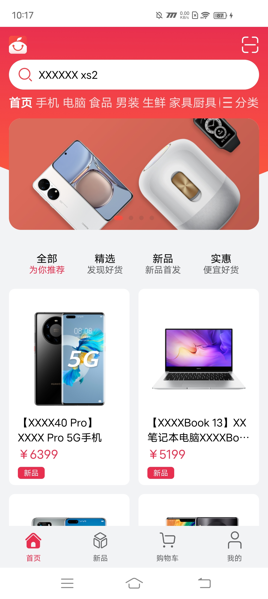

# 购物应用

## 介绍
基于HarmonyOS Next的[购物应用](https://gitee.com/harmonyos_codelabs/MultiShopping)进行跨平台改造适配，主要用于呈现ArkUI-X框架的基本能力。基于自适应和响应式布局，实现一次开发，多端部署的购物应用。<br>

## 效果预览
| 鸿蒙平台                                                     | Android平台                                                  | iOS平台                                                  |
| ------------------------------------------------------------ | ------------------------------------------------------------ | -------------------------------------------------------- |
|  |  |  |
|                                                              |                                                              |                                                          |

### 使用说明
- 分别在Android、iOS、HarmonyOSNext安装并打开应用。应用启动后进入启动页，之后进入应用首页。<br>
- 点击底部首页、新品、购物车、我的图片文字按钮，切换显示对应的标签页，默认显示首页标签页。<br>
- 点击首页标签页或购物车标签页的商品列表，跳转到商品详情页。<br>
- 点击商品详情页的立即购买按钮，跳转到订单确认页。<br>
- 点击订单确认页的提交订单，跳转到订单支付页。<br>
- 点击我的标签页的我的订单栏的按钮，跳转到订单列表页。<br>
- 其他按钮无实际点击事件或功能。<br>
## 工程目录
```tsx
MultiShopping
├── .arkui-x
│   ├── android					//Android 工程
│   ├── ios						//iOS 工程
│   └── arkui-x-config.json5
├── AppScope
│   ├── app.json5
│   └── resources
├── build-profile.json5
├── commons						// 公共能力层
│   └── utils
│       ├── build-profile.json5
│       ├── hvigorfile.ts
│       ├── index.ets
│       ├── oh-package.json5
│       └── src
│           └── main
│               ├── ets
│               │   ├── components
│               │   │   ├── CommodityList.ets	
│               │   │   ├── CounterProduct.ets	
│               │   │   └── EmptyComponent.ets	
│               │   ├── constants
│               │   │   ├── BreakpointConstants.ets  
│               │   │   ├── GridConstants.ets		
│               │   │   ├── PageConstants.ets
│               │   │   └── StyleConstants.ets
│               │   ├── utils
│               │   │   ├── BreakpointSystem.ets
│               │   │   ├── CommonDataSource.ets
│               │   │   ├── LocalDataManager.ets
│               │   │   ├── Logger.ets
│               │   │   ├── PlatformInfo.ets			//平台区分能力
│               │   │   └── Utils.ets
│               │   └── viewmodel
│               │       ├── CommodityModel.ets
│               │       ├── MainPageData.ets
│               │       ├── OrderModel.ets
│               │       ├── ProductModel.ets
│               │       └── ShopData.ets
│               ├── module.json5
│               └── resources
├── features
│   ├── home
│   │   ├── build-profile.json5
│   │   ├── hvigorfile.ts
│   │   ├── index.ets
│   │   ├── oh-package.json5
│   │   └── src
│   │       └── main
│   │           ├── ets
│   │           │   ├── components
│   │           │   │   └── Home.ets
│   │           │   └── viewmodel
│   │           │       └── HomeData.ets
│   │           ├── module.json5
│   │           └── resources
│   ├── newproduct
│   │   ├── build-profile.json5
│   │   ├── hvigorfile.ts
│   │   ├── index.ets
│   │   ├── oh-package.json5
│   │   └── src
│   │       └── main
│   │           ├── ets
│   │           │   ├── components
│   │           │   │   └── NewProduct.ets
│   │           │   └── viewmodel
│   │           │       └── NewProductData.ets
│   │           ├── module.json5
│   ├── orderdetail
│   │   ├── build-profile.json5
│   │   ├── hvigorfile.ts
│   │   ├── index.ets
│   │   ├── oh-package.json5
│   │   └── src
│   │       └── main
│   │           ├── ets
│   │           │   ├── components
│   │           │   │   ├── AddressInfo.ets
│   │           │   │   ├── CapsuleGroupButton.ets
│   │           │   │   ├── CommodityDetail.ets
│   │           │   │   ├── CommodityOrderItem.ets
│   │           │   │   ├── CommodityOrderList.ets
│   │           │   │   ├── ConfirmOrder.ets
│   │           │   │   ├── HeaderBar.ets
│   │           │   │   ├── OrderDetailList.ets
│   │           │   │   ├── OrderListContent.ets
│   │           │   │   ├── PayOrder.ets
│   │           │   │   └── SpecificationDialog.ets
│   │           │   ├── constants
│   │           │   │   ├── CommodityConstants.ets
│   │           │   │   └── OrderDetailConstants.ets
│   │           │   ├── viewmodel
│   │           │   │   ├── CommodityDetailData.ets
│   │           │   │   ├── OrderData.ets
│   │           │   │   └── TypeModel.ets
│   │           │   └── views
│   │           │       ├── CommodityDetailPage.ets
│   │           │       ├── ConfirmOrderPage.ets
│   │           │       ├── OrderDetailListPage.ets
│   │           │       └── PayOrderPage.ets
│   │           ├── module.json5
│   │           └── resources
│   ├── personal
│   │   ├── build-profile.json5
│   │   ├── hvigorfile.ts
│   │   ├── index.ets
│   │   ├── oh-package.json5
│   │   └── src
│   │       └── main
│   │           ├── ets
│   │           │   ├── components
│   │           │   │   ├── IconButton.ets
│   │           │   │   ├── LiveList.ets
│   │           │   │   └── Personal.ets
│   │           │   ├── constants
│   │           │   │   └── PersonalConstants.ets
│   │           │   └── viewmodel
│   │           │       ├── IconButtonModel.ets
│   │           │       └── PersonalData.ets
│   │           ├── module.json5
│   │           └── resources
│   └── shopcart
│       ├── build-profile.json5
│       ├── hvigorfile.ts
│       ├── index.ets
│       ├── oh-package.json5
│       └── src
│           └── main
│               ├── ets
│               │   ├── components
│               │   │   └── ShopCart.ets
│               │   └── constants
│               │       └── ShopCartConstants.ets
│               ├── module.json5
│               └── resources
├── hvigor
│   ├── hvigor-config.json5
│   └── hvigor-wrapper.js
├── hvigorfile.ts
├── oh-package.json5
├── products
│   └── phone
│       ├── build-profile.json5
│       ├── hvigorfile.ts
│       ├── obfuscation-rules.txt
│       ├── oh-package.json5
│       └── src
│           └── main
│               ├── ets
│               │   ├── entryability
│               │   │   └── EntryAbility.ets
│               │   └── pages
│               │       ├── MainPage.ets			 // 主页
│               │       └── SplashPage.ets			 // 启动过渡页
│               ├── module.json5
│               └── resources
├── README.md
└── screenshots
```

## 具体实现

应用整体结构分为3层，commons为公共能力层，features为功能模块层，products则为产品层。<br>

* 应用启动后首先进入**启动页**，然后进入应用**主页<br>**
    * **启动页**[SplashPage.ets](products/phone/src/main/ets/pages/SplashPage.ets)<br>
        * 在工程pages目录中，选中Index.ets，点击鼠标右键 > Refactor > Rename，改名为SplashPage.ets。<br>
        * 改名后，修改工程entryability目录下EntryAbility.ets文件中windowStage.loadContent方法第一个参数为pages/SplashPage。<br>
        * 在该页面的周期函数aboutToAppear里添加一个2秒的定时任务跳转到主页实现。<br>
    * **主页**[MainPage.ets](products/phone/src/main/ets/pages/MainPage.ets)
        * 主页由Tabs容器组件和四个TabContent子组件组成，四个TabContent页签的内容视图分别为首页（Home）、新品（NewProduct）、购物车（ShopCart）、我的（Personal）。<br>
        * 根据用户使用场景，通过响应式布局的媒体查询，监听应用窗口宽度变化，获取当前应用所处的断点值。<br>
    * [首页标签页](features/home/src/main/ets/components/Home.ets)通过自适应布局的均分、拉伸等能力实现搜索框、分类等布局，通过响应式布局的媒体查询、断点能力设置轮播图数、商品列表数。<br>
    * [购物车标签页](features/shopcart/src/main/ets/components/ShopCart.ets)，由购物车列表和商品列表组成，商品列表实现逻辑同主页的商品列表，购物车列表使用自适应布局的均分能力实现。<br>
    * [我的标签页](features/personal/src/main/ets/components/Personal.ets)主要由个人信息、我的订单、文字图片按钮、直播列表组成，直播列表实现方案同主页商品列表，其他则使用自适应布局的均分能力，Flex布局设置主轴上的对齐方式为FlexAlign.SpaceAround。<br>

## 相关权限

不涉及。

## 依赖

不涉及


## 约束与限制

1.本示例仅支持标准Android/iOS/鸿蒙系统上运行。<br>

2.本示例已适配API version 12版本的ArkUI-X SDK，版本号：2.0.0.27及以上。<br>

3.本示例需要使用DevEco Studio 5.0 Beta1 (Build Version: 5.0.3.403, built on June 21, 2024)及以上版本才可编译运行。<br>

## 下载
如需单独下载本工程，执行如下命令：

```
git init
git config core.sparsecheckout true
echo /CodeLab/MultiShopping > .git/info/sparse-checkout
git remote add origin https://gitcode.com/arkui-x/samples.git
git pull origin master
```