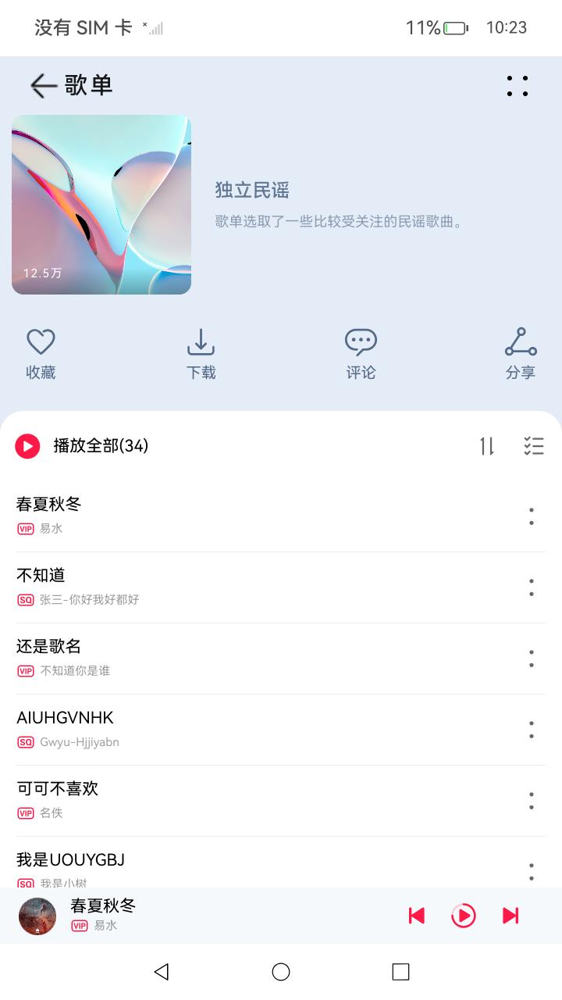
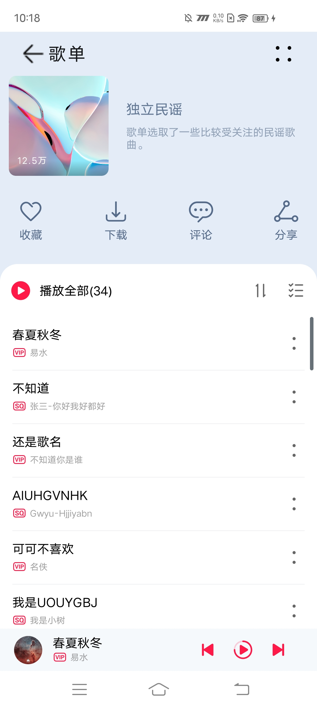
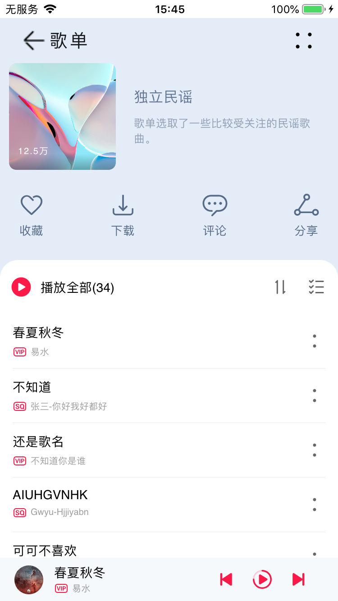

# 音乐专辑

## 介绍

运行部署本示例前，请先参阅[跨平台应用改造指南](https://gitcode.com/arkui-x/docs/blob/master/zh-cn/application-dev/tutorial/how-to-use-arkuix-on-applicationRetrofit.md)以熟悉相关概念。

基于HarmonyOS Next的[音乐专辑](https://gitee.com/harmonyos_codelabs/MusicHome)进行跨平台改造适配，主要用于呈现ArkUI-X框架的基本能力和媒体播放音频能力。<br>

## 效果预览

| HarmonyOS Next                                               | Android                                                    | iOS                                                    |
| ------------------------------------------------------------ | ---------------------------------------------------------- | ------------------------------------------------------ |
|  |  |  |
|                                                              |                                                            |                                                        |

### 使用说明
- 分别在Android、iOS、HarmonyOSNext安装并打开应用。应用启动后进入应用首页，再次进入音频播放页。<br>
- 点击界面上播放/暂停、上一首、下一首图标控制音乐播放功能。<br>
- 点击界面上播放控制区空白处或列表歌曲跳转到播放页面。<br>
- 点击界面上评论按钮跳转到对应的评论页面。<br>
- 其他按钮无实际点击事件或功能。<br>
## 工程目录
```
MusicHome
├── .arkui-x
│   ├── android					//Android 工程
│   ├── ios						//iOS 工程
│   └── arkui-x-config.json5
├── AppScope
│   ├── app.json5
│   └── resources
├── build-profile.json5
├── common
│   ├── constantsCommon
│   │   ├── build-profile.json5
│   │   ├── hvigorfile.ts
│   │   ├── index.ets
│   │   ├── oh-package.json5
│   │   └── src
│   │       └── main
│   │           ├── ets
│   │           │   └── constants
│   │           │       ├── BreakpointConstants.ets
│   │           │       ├── GridConstants.ets
│   │           │       ├── HomeConstants.ets
│   │           │       ├── RouterUrlConstants.ets
│   │           │       ├── SongConstants.ets
│   │           │       └── StyleConstants.ets
│   │           ├── module.json5
│   │           └── resources
│   └── mediaCommon
│       ├── build-profile.json5
│       ├── hvigorfile.ts
│       ├── index.ets
│       ├── oh-package.json5
│       └── src
│           └── main
│               ├── ets
│               │   ├── utils
│               │   │   ├── Abilities
│               │   │   │   ├── AbilitiesArkUIX.ets
│               │   │   │   ├── Abilities.ets
│               │   │   │   └── AbilitiesLocal.ets
│               │   │   ├── BackgroundTaskManager
│               │   │   │   ├── BackgroundTaskManagerArkUIX.ets
│               │   │   │   ├── BackgroundTaskManager.ets
│               │   │   │   └── BackgroundTaskManagerLocal.ets
│               │   │   ├── BreakpointSystem.ets
│               │   │   ├── ColorConversion.ets
│               │   │   ├── DisplaySync
│               │   │   │   ├── DisplaySyncArkUIX.ets
│               │   │   │   ├── DisplaySync.ets
│               │   │   │   └── DisplaySyncLocal.ets
│               │   │   ├── IndexViewModel.ets
│               │   │   ├── Interface
│               │   │   │   ├── AbilitiesInterface.ets
│               │   │   │   ├── BackgroundTaskManagerInterface.ets
│               │   │   │   └── DisplaySyncInterface.ets
│               │   │   ├── Logger.ets
│               │   │   ├── MediaService.ets
│               │   │   ├── MediaTools.ets
│               │   │   ├── PlatformInfo.ets
│               │   │   ├── PreferencesUtil.ets
│               │   │   └── SongItemBuilder.ets
│               │   └── viewmodel
│               │       ├── CardData.ets
│               │       ├── IndexItemData.ets
│               │       ├── MenuData.ets
│               │       ├── MusicData.ets
│               │       └── SongData.ets
│               ├── module.json5
│               └── resources
├── features
│   ├── live
│   │   ├── build-profile.json5
│   │   ├── hvigorfile.ts
│   │   ├── Index.ets
│   │   ├── oh-package.json5
│   │   └── src
│   │       └── main
│   │           ├── ets
│   │           │   ├── constants
│   │           │   │   └── LiveConstants.ets
│   │           │   ├── view
│   │           │   │   ├── Header.ets
│   │           │   │   ├── LiveList.ets
│   │           │   │   └── LivePage.ets
│   │           │   └── viewmodel
│   │           │       ├── LiveStream.ets
│   │           │       └── LiveStreamViewModel.ets
│   │           ├── module.json5
│   │           └── resources
│   ├── musicComment
│   │   ├── build-profile.json5
│   │   ├── hvigorfile.ts
│   │   ├── Index.ets
│   │   ├── oh-package.json5
│   │   └── src
│   │       └── main
│   │           ├── ets
│   │           │   ├── constants
│   │           │   │   └── CommonConstants.ets
│   │           │   ├── view
│   │           │   │   ├── HeadComponent.ets
│   │           │   │   ├── ListItemComponent.ets
│   │           │   │   ├── MusicCommentPage.ets
│   │           │   │   └── MusicInfoComponent.ets
│   │           │   └── viewmodel
│   │           │       ├── Comment.ets
│   │           │       └── CommentViewModel.ets
│   │           ├── module.json5
│   │           └── resources
│   └── musicList
│       ├── build-profile.json5
│       ├── hvigorfile.ts
│       ├── Index.ets
│       ├── oh-package.json5
│       └── src
│           └── main
│               ├── ets
│               │   ├── components
│               │   │   ├── AlbumComponent.ets
│               │   │   ├── AlbumCover.ets
│               │   │   ├── ControlAreaComponent.ets
│               │   │   ├── Header.ets
│               │   │   ├── ListContent.ets
│               │   │   ├── LyricsComponent.ets
│               │   │   ├── MusicControlComponent.ets
│               │   │   ├── MusicInfoComponent.ets
│               │   │   ├── Player.ets
│               │   │   ├── PlayList.ets
│               │   │   └── TopAreaComponent.ets
│               │   ├── constants
│               │   │   ├── ContentConstants.ets
│               │   │   ├── HeaderConstants.ets
│               │   │   └── PlayerConstants.ets
│               │   ├── lyric
│               │   │   ├── LrcEntry.ets
│               │   │   ├── LrcUtils.ets
│               │   │   ├── LrcView.ets
│               │   │   └── LyricConst.ets
│               │   ├── view
│               │   │   └── MusicListPage.ets
│               │   └── viewmodel
│               │       ├── SongDataSource.ets
│               │       └── SongListData.ets
│               ├── module.json5
│               └── resources
├── hvigor
│   ├── hvigor-config.json5
│   └── hvigor-wrapper.js
├── hvigorfile.ts
├── oh-package.json5
├── products
│   └── phone
│       ├── build-profile.json5
│       ├── hvigorfile.ts
│       ├── obfuscation-rules.txt
│       ├── oh-package.json5
│       └── src
│           └── main
│               ├── ets
│               │   ├── entryability
│               │   │   └── EntryAbility.ets
│               │   └── pages
│               │       └── MainPage.ets		// 主页
│               ├── module.json5
│               └── resources
├── README.md
└── screenshots
```

## 具体实现

应用整体结构分为3层，commons为公共能力层，features为功能模块层，products则为产品层。<br>

- [音乐列表页](features/musicList/src/main/ets/view/MusicListPage.ets)<br>
  - 在音乐列表页中，音乐列表页由标题栏、专辑封面、歌曲列表和播放控制区四部分组成。<br>
  - 改名后，修改工程entryability目录下EntryAbility.ets文件中windowStage.loadContent方法第一个参数为pages/SplashPage。<br>
  - 启动页会在aboutToAppear生命周期内初始化轮播图片资源及定时任务，会展示5秒溪村的优美风景，用户可以点击右上角的跳过直接进入应用主页，也可以等5秒结束自动进入应用主页；5秒倒计时结束、用户主动点击跳过或启动页面销毁时都会取消定时器任务。<br>
- [音乐播放页](features/musicList/src/main/ets/components/MusicControlComponent.ets)<br>
  - 在音乐播放页中，音乐播放页面由歌曲页面和歌词页面两部分组成。<br>
- [音乐评论页](features/musicComment/src/main/ets/view/MusicCommentPage.ets)<br>
  - 在音乐评论页中，音乐评论页由标题、歌曲信息、精彩评论和最新评论四部分组成。<br>
- 音频播放能力<br>
  - 使用[媒体服务](https://gitcode.com/arkui-x/docs/blob/master/zh-cn/application-dev/reference/apis/js-apis-media.md)能力完成。<br>


## 相关权限
不涉及

## 依赖

不涉及


## 约束与限制

1.本示例仅支持标准Android/iOS/鸿蒙系统上运行。<br>

2.本示例已适配API version 16版本的ArkUI-X SDK。<br>

3.本示例需要使用DevEco Studio 5.0.4 Release。<br>

4.本示例需要修改使用的DevEco Studio相关SDK的配置项，详见[关于deveco-studio编译时报错问题解决](https://gitcode.com/arkui-x/docs/blob/master/zh-cn/application-dev/tutorial/how-to-use-arkuix-on-applicationRetrofit.md#五、关于deveco-studio编译时报错问题解决)。<br>

## 下载
如需单独下载本工程，执行如下命令：

```
git init
git config core.sparsecheckout true
echo /CodeLab/MusicHome > .git/info/sparse-checkout
git remote add origin https://gitcode.com/arkui-x/samples.git
git pull origin master
```