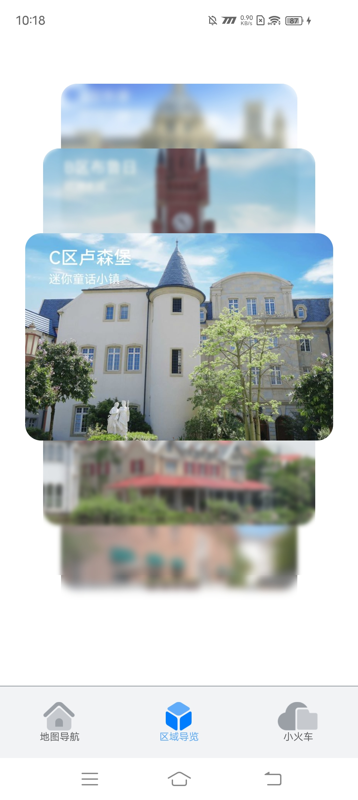

# 溪村小镇

## 介绍

运行部署本示例前，请先参阅[跨平台应用改造指南](https://gitcode.com/arkui-x/docs/blob/master/zh-cn/application-dev/tutorial/how-to-use-arkuix-on-applicationRetrofit.md)以熟悉相关概念。

基于HarmonyOS Next的[溪村小镇](https://gitee.com/harmonyos_codelabs/OxHornCampus)进行跨平台改造适配，主要用于呈现ArkUI-X框架的基本能力。<br>

## 效果预览
| 鸿蒙平台                                                     | Android平台                                                  | iOS平台                                                  |
| ------------------------------------------------------------ | ------------------------------------------------------------ | -------------------------------------------------------- |
|  |  |  |
|                                                              |                                                              |                                                          |

### 使用说明

- 本示例存在两个module，分别命名为arkuix和harmonyos，其中arkuix经编译后部署于Android/iOS平台；harmonyos经编译后部署于HarmonyOS平台。因此在运行时，需要根据目标部署平台来确定参与编译的module。具体实现方法为：工程[build-profile.json5](build-profile.json5)文件中，确定参与编译的module保持不变即可，使用注释方法将另一个module进行注释，禁止其参与编译。最终确定编译时仅与目标平台对应的module参与编译，另一个module不参与编译。

  
- 分别在Android、iOS、HarmonyOSNext安装并打开应用。应用启动后进入启动页，之后进入应用首页。<br>

- 在应用首页的“区域导览”标签页，可以上下滑动查看溪村小镇不同区域的卡片，点击卡片可以进入对应的区域详情页并查看区域的详细介绍和高清建筑风景图。<br>

- 在首页的“地图浏览”标签页，可以拖动和缩放查看地图，并查找相应地标建筑。<br>

- 在首页的“小火车”标签页，可以查看溪村小火车的运行路线图。<br>

  
## 工程目录
```tsx
OxHornCampus
├── .arkui-x
│   ├── android					//Android 工程
│   ├── ios						//iOS 工程
│   └── arkui-x-config.json5
├── AppScope
│   ├── app.json5
│   └── resources
│       └── base
│           ├── element
│           │   └── string.json
│           └── media
│               └── app_icon.png
├── build-profile.json5
├── commons
│   └── utils
│       ├── build-profile.json5
│       ├── hvigorfile.ts
│       ├── Index.ets
│       ├── obfuscation-rules.txt
│       ├── oh-package.json5
│       └── src
│           └── main
│               ├── ets
│               │   ├── common
│               │   │   ├── BreakpointConstants.ets
│               │   │   ├── CommonConstants.ets
│               │   │   └── CommonModel.ets
│               │   └── utils
│               │       ├── BreakpointSystem.ets
│               │       ├── DeviceScreen.ets
│               │       ├── Geography.ets
│               │       ├── Logger.ets
│               │       └── PlatformInfo.ets		//平台区分能力
│               ├── module.json5
│               └── resources
├── features
│   ├── main
│   │   ├── build-profile.json5
│   │   ├── hvigorfile.ts
│   │   ├── Index.ets
│   │   ├── obfuscation-rules.txt
│   │   ├── oh-package.json5
│   │   └── src
│   │       └── main
│   │           ├── ets
│   │           │   ├── view
│   │           │   │   ├── BuildListItem.ets
│   │           │   │   ├── StyleListItem.ets
│   │           │   │   ├── SubTitleItem.ets
│   │           │   │   └── SwiperListItem.ets
│   │           │   └── viewmodel
│   │           │       ├── BottomTabsItem.ets
│   │           │       ├── BottomTabsModel.ets
│   │           │       └── SplashModel.ets
│   │           ├── module.json5
│   │           └── resources
│   ├── map
│   │   ├── build-profile.json5
│   │   ├── hvigorfile.ts
│   │   ├── Index.ets
│   │   ├── obfuscation-rules.txt
│   │   ├── oh-package.json5
│   │   └── src
│   │       └── main
│   │           ├── ets
│   │           │   ├── controller
│   │           │   │   └── MapController.ets
│   │           │   ├── view
│   │           │   │   └── MapComponent.ets
│   │           │   └── viewmodel
│   │           │       ├── AddressItem.ets
│   │           │       ├── MapModel.ets
│   │           │       └── PositionItem.ets
│   │           ├── module.json5
│   │           └── resources
│   ├── train
│   │   ├── build-profile.json5
│   │   ├── hvigorfile.ts
│   │   ├── Index.ets
│   │   ├── obfuscation-rules.txt
│   │   ├── oh-package.json5
│   │   └── src
│   │       └── main
│   │           ├── ets
│   │           │   ├── view
│   │           │   │   ├── TrainsComponent.ets
│   │           │   │   └── TrainsTrack.ets
│   │           │   └── viewmodel
│   │           │       ├── TrainsMap.ets
│   │           │       └── TrainsMapModel.ets
│   │           ├── module.json5
│   │           └── resources
│   └── zones
│       ├── build-profile.json5
│       ├── hvigorfile.ts
│       ├── Index.ets
│       ├── obfuscation-rules.txt
│       ├── oh-package.json5
│       └── src
│           └── main
│               ├── ets
│               │   ├── constants
│               │   │   └── ZonesConstants.ets
│               │   ├── utils
│               │   │   └── SwiperDataSource.ets
│               │   ├── view
│               │   │   ├── ImageAnimate.ets
│               │   │   ├── ImageViewComponent.ets
│               │   │   └── ZonesComponent.ets
│               │   └── viewmodel
│               │       ├── ZonesItem.ets
│               │       └── ZonesViewModel.ets
│               ├── module.json5
│               └── resources
├── hvigor
├── hvigorfile.ts
├── oh-package.json5
├── products
│   └── phone
│       ├── arkuix
│       │   ├── build-profile.json5
│       │   ├── hvigorfile.ts
│       │   ├── obfuscation-rules.txt
│       │   ├── oh-package.json5
│       │   └── src
│       │       └── main
│       │           ├── ets
│       │           │   ├── entryability
│       │           │   │   └── EntryAbility.ets
│       │           │   ├── images
│       │           │   │   ├── ic_circle.png
│       │           │   │   ├── ic_line1.png
│       │           │   │   ├── ic_line2.png
│       │           │   │   ├── ic_line3.png
│       │           │   │   ├── ic_train_arrow.png
│       │           │   │   └── ic_train.png
│       │           │   └── pages
│       │           │       ├── IntroductionPage.ets	// 区域详情页
│       │           │       ├── MainPage.ets			// 主页
│       │           │       └── Splash.ets				// 启动过渡页
│       │           ├── module.json5
│       │           └── resources
│       └── harmonyos
│           ├── build-profile.json5
│           ├── hvigorfile.ts
│           ├── obfuscation-rules.txt
│           ├── oh-package.json5
│           └── src
│               └── main
│                   ├── ets
│                   │   ├── card
│                   │   │   ├── CardListModel.ets
│                   │   │   ├── TrainCard.ets
│                   │   │   └── ZonesCard.ets
│                   │   ├── entryability
│                   │   │   └── EntryAbility.ets
│                   │   ├── entryformability
│                   │   │   └── EntryFormAbility.ets
│                   │   ├── images
│                   │   │   ├── ic_circle.png
│                   │   │   ├── ic_line1.png
│                   │   │   ├── ic_line2.png
│                   │   │   ├── ic_line3.png
│                   │   │   ├── ic_train_arrow.png
│                   │   │   └── ic_train.png
│                   │   └── pages
│                   │       ├── IntroductionPage.ets
│                   │       ├── MainPage.ets
│                   │       └── Splash.ets
│                   ├── module.json5
│                   └── resources
├── README.md
└── screenshots
```

## 具体实现

应用整体结构分为3层，commons为公共能力层，features为功能模块层，products则为产品层。<br>

* [启动页](products/phone/arkuix/src/main/ets/pages/Splash.ets)<br>
    * 在工程pages目录中，选中Index.ets，点击鼠标右键 > Refactor > Rename，改名为SplashPage.ets。<br>
    * 改名后，修改工程entryability目录下EntryAbility.ets文件中windowStage.loadContent方法第一个参数为pages/SplashPage。<br>
    * 启动页会在aboutToAppear生命周期内初始化轮播图片资源及定时任务，会展示5秒溪村的优美风景，用户可以点击右上角的跳过直接进入应用主页，也可以等5秒结束自动进入应用主页；5秒倒计时结束、用户主动点击跳过或启动页面销毁时都会取消定时器任务。<br>
* [主页](products/phone/arkuix/src/main/ets/pages/MainPage.ets)<br>
    * 该页面使用Tabs组件实现，使用一个自定义的底部标签栏组件来控制选中对应的标签页时的视觉效果。<br>

* [地图浏览页](features/map/src/main/ets/view/MapComponent.ets)<br>
  * 地图使用Stack组件实现，地图初始化的宽高是由图片的宽高和地图父组件的宽高计算得出，地图位置由地图宽度和地图父组件计算得出。<br>
  * “地图浏览”完成地图初始化后，界面会默认展示查询搜索面板。用户通过搜索框输入指定类型进行搜索，也可以直接点击面板中已展示的类型进行搜索。<br>

* [区域导览页](features/zones/src/main/ets/view/ZonesComponent.ets)<br>
  * 区域导览页展示了一个由各个区域导览卡片组成的可上下滑动的轮播图。<br>
  * 区域详情页包括首图轮播、滑动缩放、标题吸顶以及图片查看等功能。<br>
  * 在区域详情页的“设计风格”部分，提供了一个可以左右滑动查看的图库，展示了该区域的建筑风貌。<br>

* [小火车页](features/train/src/main/ets/view/TrainsComponent.ets)<br>
    * 主页面以Navigation组件作为根组件，可直接设置标题，上方Image组件展示小火车的路线概览图，下方List组件循环展示三条路线的信息及火车轨迹动图。<br>
    * 点击对应路线的小火车，会显示或隐藏小火车的运动轨迹，当首次显示小火车的运动轨迹时，需要初始化一些信息，包括小火车当前时间运动的位置、背景区域的位置、小火车的轨迹更新时间等。<br>

## 相关权限

不涉及。

## 依赖

不涉及。


## 约束与限制

1.本示例仅支持标准Android/iOS/鸿蒙系统上运行。<br>

2.本示例已适配API version 16版本的ArkUI-X SDK。<br>

3.本示例需要使用DevEco Studio 5.0.4 Release。<br>

4.本示例需要修改使用的DevEco Studio相关SDK的配置项，详见[关于deveco-studio编译时报错问题解决](https://gitcode.com/arkui-x/docs/blob/master/zh-cn/application-dev/tutorial/how-to-use-arkuix-on-applicationRetrofit.md#五、关于deveco-studio编译时报错问题解决)。<br>

## 下载
如需单独下载本工程，执行如下命令：

```
git init
git config core.sparsecheckout true
echo /CodeLab/OxHornCampus > .git/info/sparse-checkout
git remote add origin https://gitcode.com/arkui-x/samples.git
git pull origin master
```