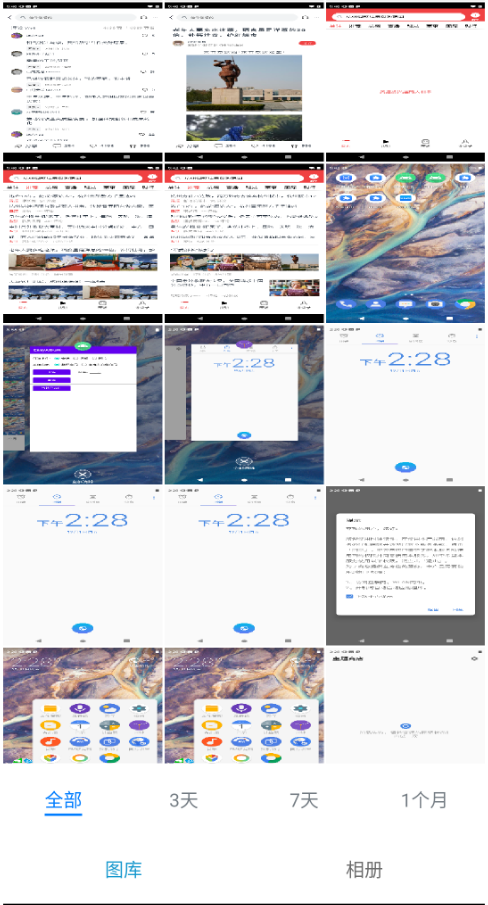
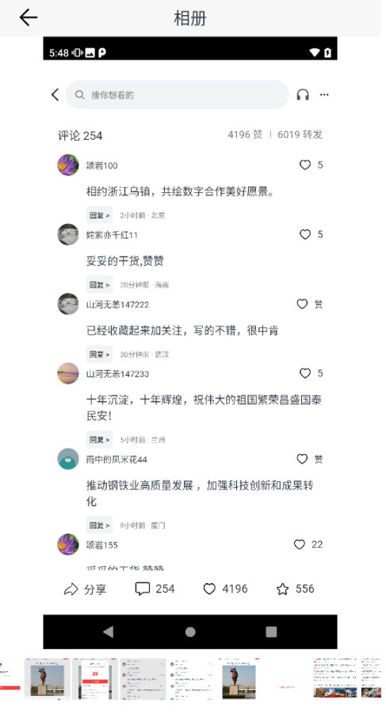
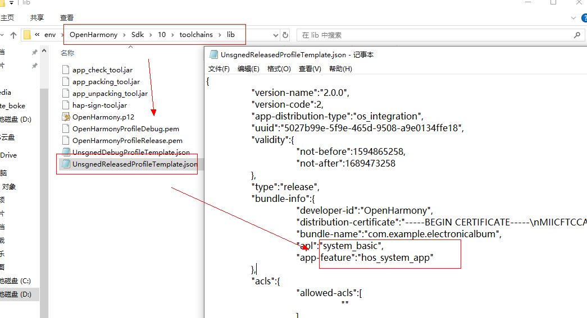

#### 简介
本示例通过 ace 创建的跨平台项目，可在ios、android中运行

#### 使用说明
1. 首页分为图库和相册
2. 图库分为全部、3天、7天、一个月
- 
- 图片和视频可点击查看详情
- 
3. 相册分为图片和截屏
- 
    #### 相关概念
    不涉及
    #### 相关权限
    不涉及
    #### 约束与限制
    1.本示例支持在Android\iOS\OpenHarmony平台上运行。
  2.本示例需要使用DevEco Studio 4.0 Beta2及以上版本才可编译运行。

# 

#### 问题与解决方案

问题：在开发板中遇到获取不到相册的情况？

解决方案：

打开openHarmony中的OpenHarmony\Sdk\10\toolchains\lib，
打开UnsgnedReleasedProfileTemplate.json，将apl的值修改成system_basic，
将app-feature的值修改成hos_system_app

- 