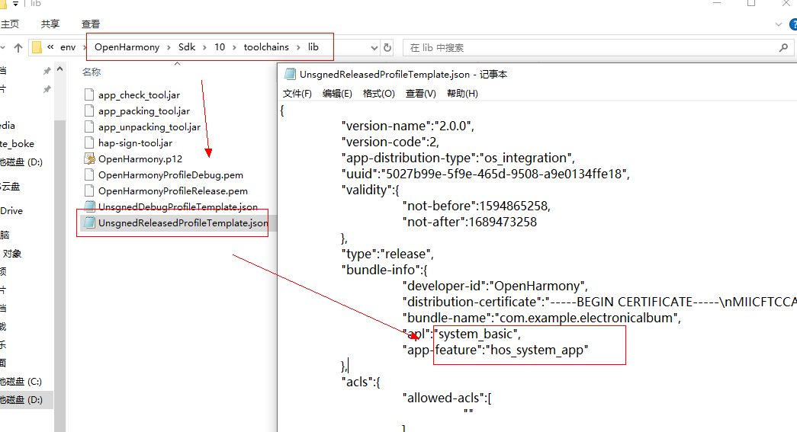

# 仿相册应用示例 
 
## 简介 
本示例通过 ace 创建的跨平台项目，混合开发实现相册的基本功能，可在ios、android中运行。 
 
注： 
 
	cross_platform 支持跨平台 
	harmony_album 支持OpenHarmony 
 
主要实现功能： 
 
	1、Android / IOS原生获取本地图片视频的功能 
	2、OpenHarmony获取本地图片视频功能 
	3、本地图片根据来源分类展示 
	4、根据时间显示最近3天、7天、一个月以及全部图片 
	5、图片详情查看 
	6、视频文件播放功能
 
 
## 相关概念 
 
	不涉及 
 
## 相关权限 
 
	不涉及 
 
## 使用说明 
1、进入相册首页后，有两个Tab：图库、相册。其中图库tab可以根据时间来进行分类：全部、3天、7天、一个月；相册tab可以分为：图片、截屏、视频。 

2、图库分为全部、3天、7天、一个月，仅展示对应时间段内的图片。 
	-  

3、 图片和视频可点击查看详情， 
	-  

4、 相册分为图片和截屏，有视频文件的话还有视频分类。 
	- 

5、 点击视频文件，实现播放功能。 
 
## 约束与限制 
  1、本示例支持在Android\iOS\OpenHarmony平台上运行。 
 
  2、本示例需要使用DevEco Studio 4.0 Beta2及以上版本才可编译运行。 
 
 
 
## 问题与解决方案 
 
问题：在开发板中遇到获取不到相册的情况？ 
 
解决方案： 
 
打开openHarmony中的OpenHarmony\Sdk\10\toolchains\lib， 
打开UnsgnedReleasedProfileTemplate.json，将apl的值修改成system_basic， 
将app-feature的值修改成hos_system_app 
 
- 