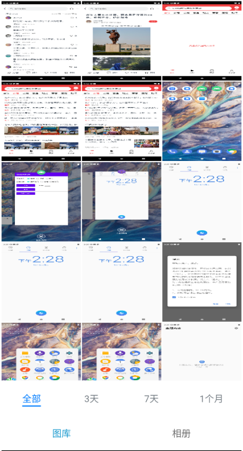

#### 简介
本示例通过 ace 创建的跨平台项目，可在oh中运行

#### 使用说明
1. 首页分为图库和相册
2. 图库分为全部、3天、7天、一个月
- 
- 图片和视频可点击查看详情
- 
3. 相册分为图片和截屏
- 
#### 相关概念
不涉及
#### 相关权限
不涉及
#### 约束与限制
1.本示例支持在Android\iOS\OpenHarmony平台上运行。
2.本示例需要使用DevEco Studio 4.0 Beta2及以上版本才可编译运行。
