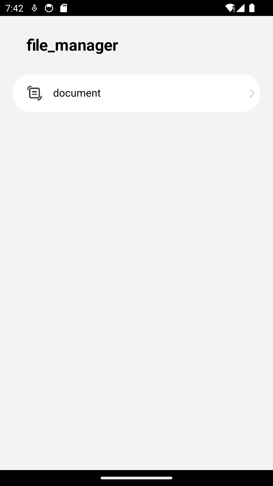
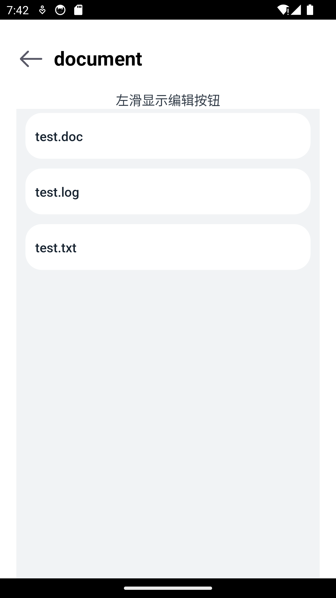
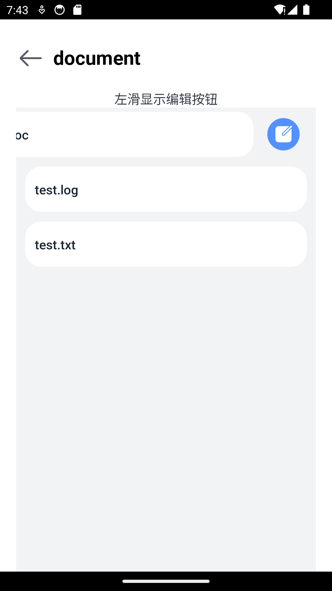
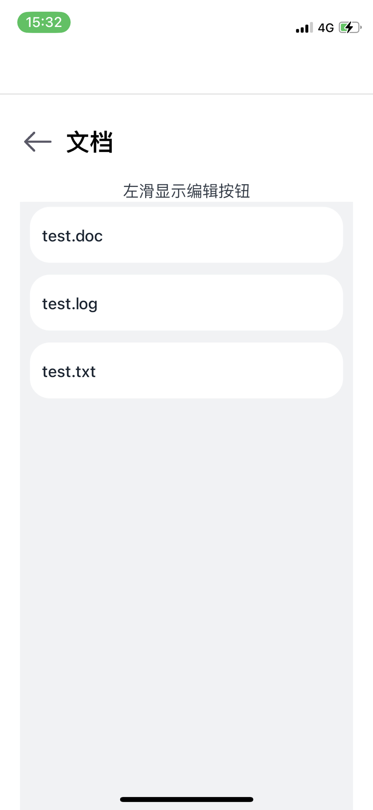
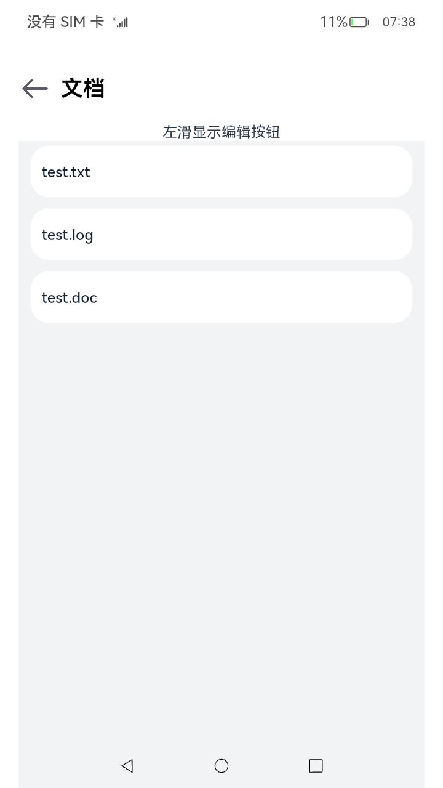
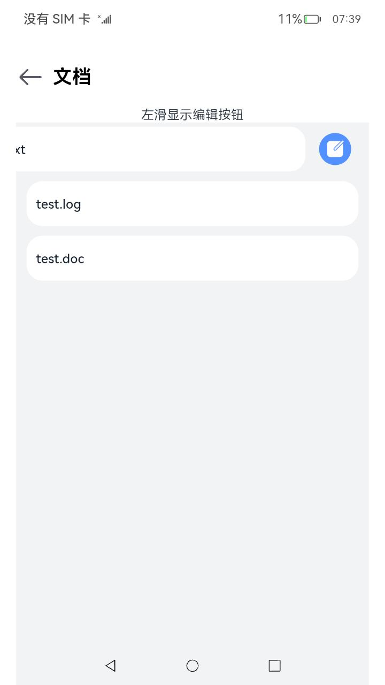

# 读写文件应用示例
## 简介
本示例通过[ArkUI-X] Entry Ability模版创建的一个工程。

## 此Sample实现的功能如下：
+ 读取本地txt/log/doc文件
+ 文件预览
+ 修改文件
+ 文件保存

### 效果图如下：

#### Android平台展示效果
  

  
- 读取本地txt/log/doc文件，先获取其应用沙箱路径，把路径存放在AppStorage里的pathDir中。然后获取上下文，封装getFiles方法，在方法内部调用fs.listFile(),会返回路径下的包含以txt/log/doc结尾的文件名的数组，定义fileList并存入文件名数组，定义filePathList并存入文件路径数组，读取本地文件效果图展示如下：

- 文件预览，在List组件中，在每一个item中，使用swipeAction组件，以左滑显示预览编辑按钮，在点击swipeAction后，跳转到"pages/EditFile"页面，在router中传入fileName 、filePathList 、fileContent，在EditFile.ets中，通过router.getParams获取到fileName 、filePathList 、fileContent，定义UI渲染组件TextInput和TextArea，渲染fileName 、fileContent，文件预览效果图展示如下：

 - 文件修改，在EditFile.ets中，给TextArea绑定onChange方法，获取到value的值，并把value赋值给newFileContent，根据当前文件的filePathList ，调用fs.openSync()方法，获得file.fd，调用fs.write()方法，传入file.fd和newFileContent，以完成文件的写入，文件修改效果图展示如下：
  

 - 文件保存，在TextArea绑定的onChange方法中，调用完fs.write()后，调用fs.closeSync()，传入调用fs.openSync()方法后返回的file，调用fs.closeSync()保存后在router中，跳转"filemanager/pages/document/DocumentFileList"页面，文件保存效果图展示如下：
  

#### iOS平台展示效果

  
  
  
  
  

#### OpenHarmomy平台展示效果

  
  
  
  
  

## 相关概念

不涉及

## 相关权限

不涉及

## 使用说明

1、打开应用，在中文环境下，首页会显示一个文件管理标题和一个文档按钮，如果英文环境下，首页会显示一个file_manager标题和一个document按钮。

2、点击文档按钮，会自动读取应用本地txt/log/doc文件并显示，如果没有相关的文件，则会创建test文件。

3、在文件项上左滑，会显示编辑按钮，左滑下一个文件项，会显示此文件项的编辑按钮且隐藏上一个文件项编辑按钮。

4、点击编辑按钮，会显示文件的内容且可编辑。

5、修改文件内容，点击确定按钮，会保存所修改的内容，点击返回按钮，不会保存修改内容。

## 约束与限制

1、本示例支持在Android\iOS\OpenHarmony平台上运行。

2、本示例需要使用DevEco Studio 4.0 Beta2及以上版本才可编译运行。