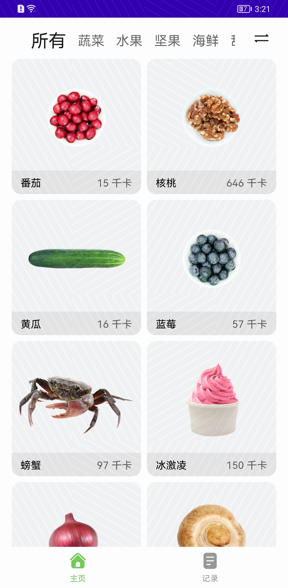
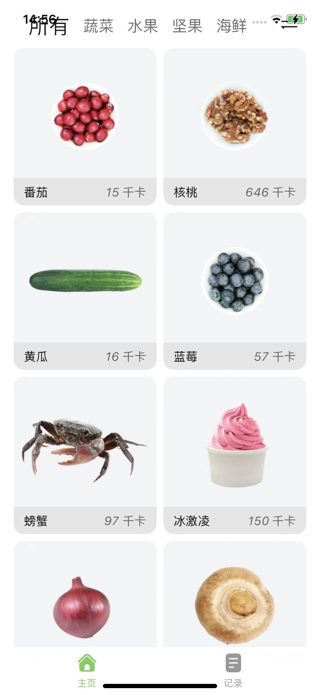

# 健康饮食
## 简介
这是一个记录饮食和查看食物信息的应用，主要用于管理饮食健康。可以添加饮食信息，包括食物的种类、重量以及用餐时间，如早餐、 午餐、晚餐和夜宵，并能统计得到相应用餐时间的总热量值、总蛋白质、总脂肪和总碳水值，并且用柱状图的形式展示出来。

* Android平台展示效果

|食物列表              |食物详情             |饮食添加              |
|---------------------|--------------------|---------------------|
||||

* iOS平台展示效果

|食物列表              |食物详情             |饮食添加              |
|---------------------|--------------------|---------------------|
||||

* OpenHarmomy平台展示效果

|食物列表              |食物详情             |饮食添加              |
|---------------------|--------------------|---------------------|
||||

## 相关概念

不涉及

## 相关权限

不涉及。

### 使用说明

1. 本应用一共有“启动动画页面”、“主页”和“食物详情”三个主页面；

2. 启动应用，进入“启动动画页面”，动画播放完成自动进入主页；

3. 主页，使用Tabs组件把应用分为两个页签，并使用网格分类和字母排序两种方式展示所有的食物，点击食物可进入相应的食物详情页面，查看食物详情；

4. 食物“记录”页签，记录了饮食信息，通过卡片展示，卡片信息包含有食物的种类、重量、卡路里值以及用餐时间，并且以柱状图的形式展示每一餐所有食物的热量值和包含的营养元素含量；可以在卡片里面通过使用加减按钮来修改食物的重量，同时会重新统计相应用餐时间的总热量值、总蛋白质、总脂肪和总碳水值，并且柱状图的数据会及时更新;

5. 食物详情页面，使用滑动组件展示食物的详细信息，包括使用画布组件展示单位重量的食物各个营养元素的的占比,使用进度条组件展示当前食物是否为高热食物，以及展示单位重量的食物所包含的热量、脂肪、蛋白质、碳水以及维他命C值；并且点击记录按钮可以弹出记录饮食的弹窗，包括记录食物的种类、重量以及用餐时间，可以通过点击完成添加饮食，同时添加的饮食信息会在“记录”Tab页签做展示。

## 约束与限制

1.本示例支持在Android\iOS\OpenHarmony平台上运行。

2.本示例需要使用DevEco Studio 4.0 Beta2 (Build Version: 4.0.3.313, built on July 22, 2023)及以上版本才可编译运行。

3.本示例已适配ArkUI-X-sdk 的IDE集成SDK，版本号：0.0.9.3。