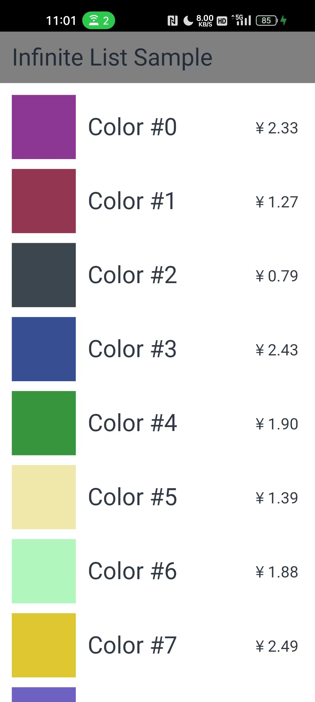
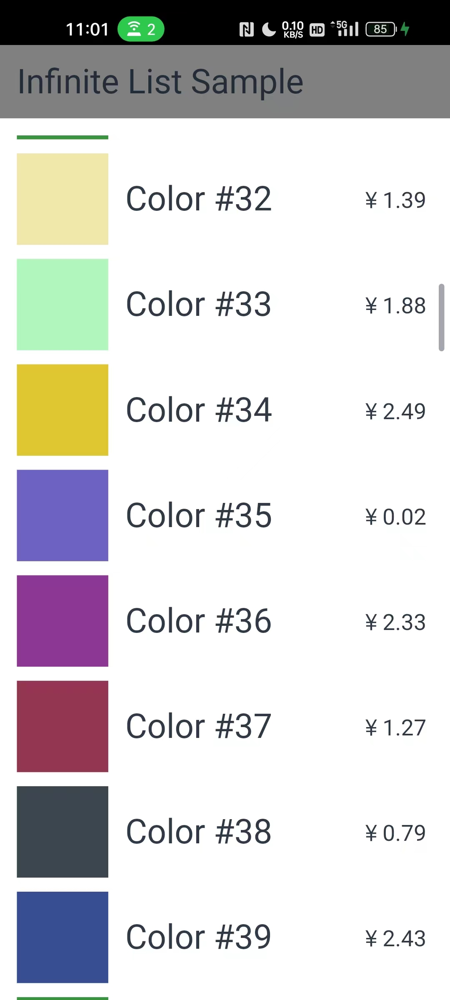
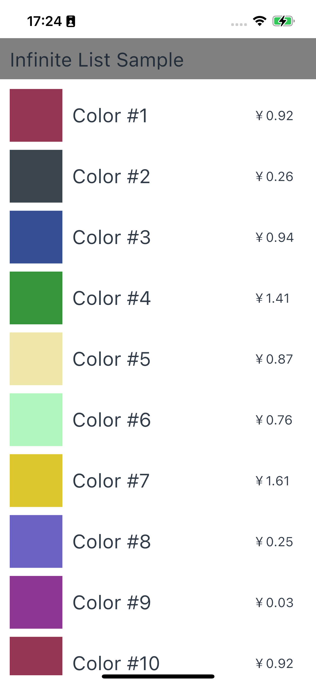
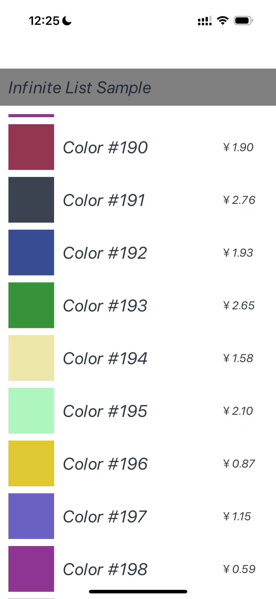
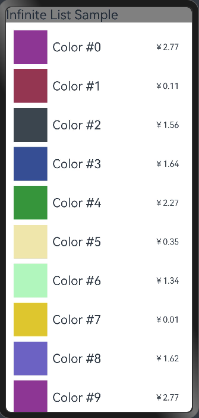
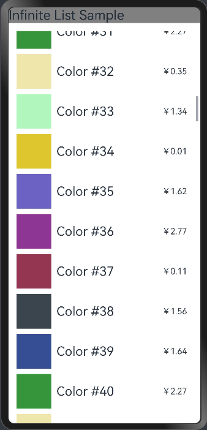

# InfiniteList应用示例
## 简介
本示例通过[ArkUI-X] Entry Ability模版创建的一个工程,可通过推拽列表来进行滑动位置。布局中包含三种①颜色资源、②文本索引、③价格标签，三种属性封装在类MyDataSource里，该MyDataSource类继承自BasicDataSource，BasicDataSource类实现了IDataSource接口并提供了许多与数据源相关的方法。效果图如下：

* Android平台展示效果

  
  

* iOS平台展示效果

   
  

* OpenHarmomy平台展示效果

  
  

## 相关概念

* ListItem
* LazyForEach

## 相关权限

不涉及。

## 使用说明

1、打开应用，首页面显示一个长列表界面，内部有Text、color、price、ListItem等。

2、拖拽页面上下滑动，看到色彩对应的价格，按需迭代去展示刷新到的数据，页面发生改变。

3、每加载200个数据，会提示一次是否继续加载。

## 约束与限制

1、本示例支持在Android\iOS\OpenHarmony平台上运行。

2、本示例需要使用DevEco Studio 4.0 Beta2及以上版本才可编译运行。