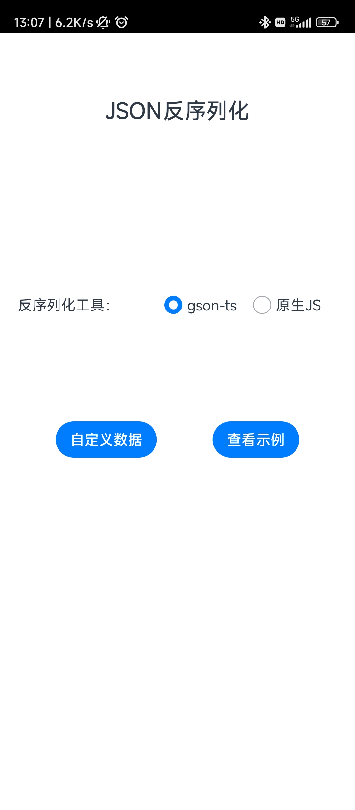
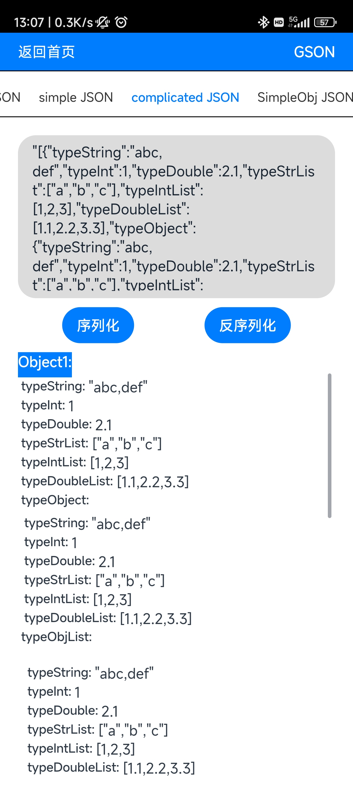
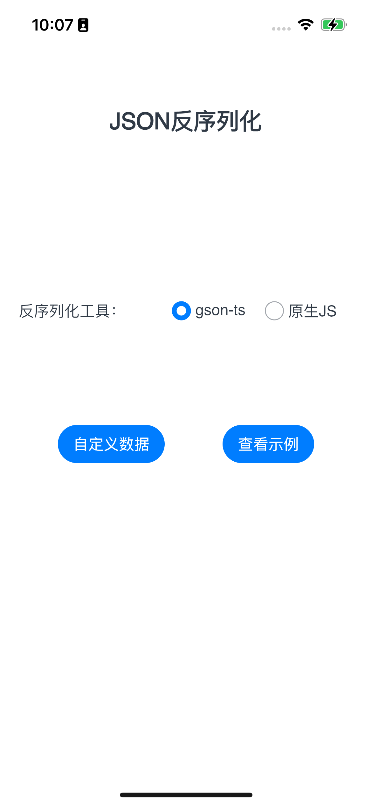
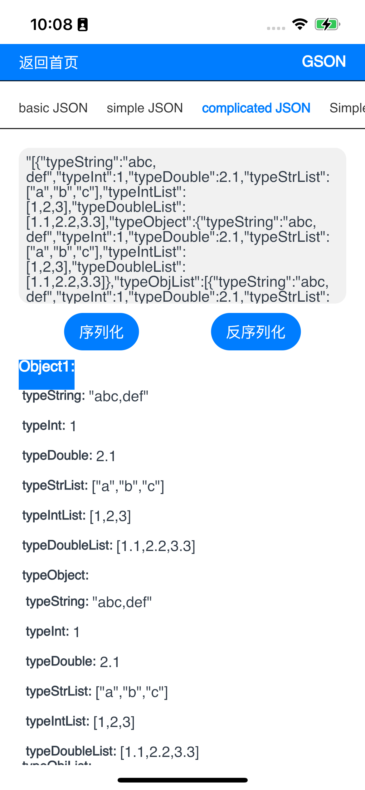
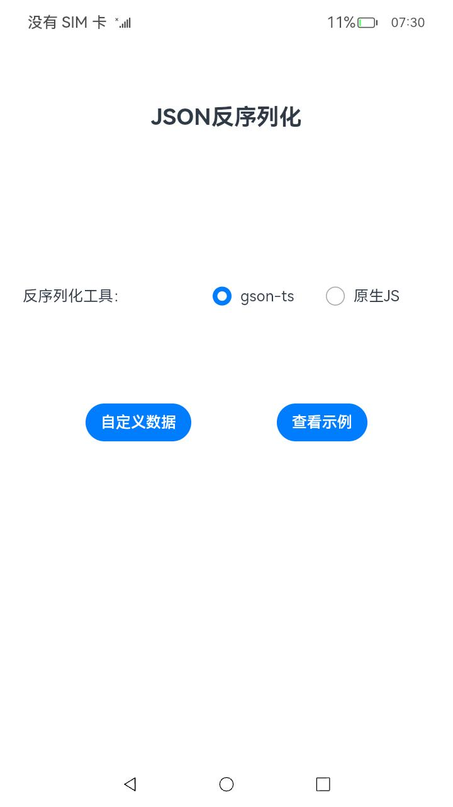
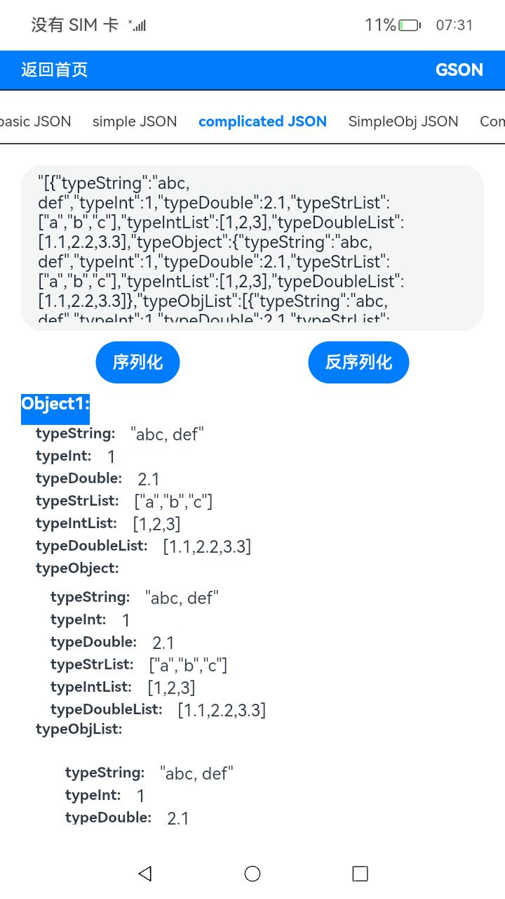

# 反序列化JSON应用示例
## 简介
本示例通过[ArkUI-X] Entry Ability模版创建的一个工程,可通过点击Button按钮反序列化JSON字符串展示内容。效果图如下：

* Android平台展示效果
   

* iOS平台展示效果
   

* OpenHarmony平台展示效果
   

## 相关概念

不涉及

## 相关权限

不涉及。

## 使用说明

1.打开应用，首页面显示一组单选按钮和一组按钮。

2.选择反序列化工具后，点击示例数据或自定义数据

3.点击反序列化按钮，反序列化JSON字符串。

## 约束与限制

1.本示例支持在Android\iOS\OpenHarmony平台上运行。

2.本示例需要使用DevEco Studio 4.0 Release及以上版本才可编译运行。