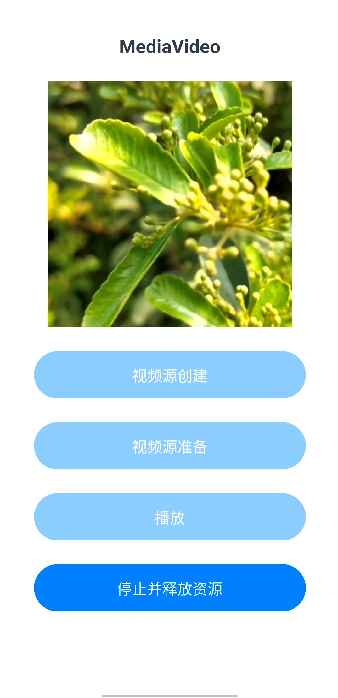
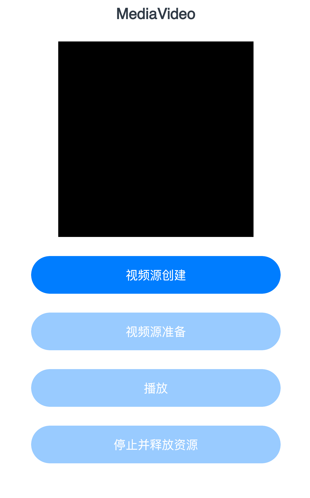
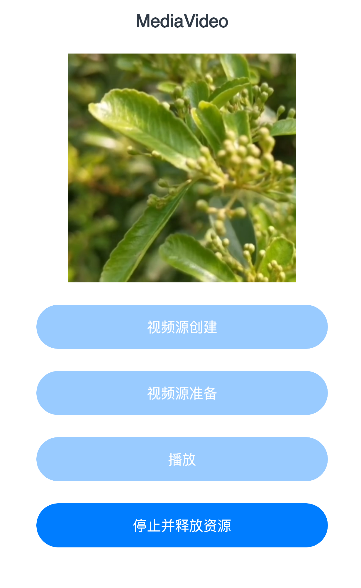

# 视频播放

## 介绍
XComponent控件常用于视频流的显示和游戏画面的绘制，可以配合 ‘@ohos.multimedia.media’相关接口，最终将视频显示到XComponent控件。本示例通过本示例通过[ArkUI-X]ace create project 创建的一个跨平台工程，配合 ‘@ohos.multimedia.media’相关接口实现在XComponent控件上播放视频。

## 简介

本示例通过[ArkUI-X]ace create project 创建的一个跨平台工程，使用Xcomponent组件实现播放视频功能。

### 效果预览

- Android平台展示效果

  |                           初始界面                           |                           播放完毕                           |
  | :----------------------------------------------------------: | :----------------------------------------------------------: |
  |  |  |

- IOS平台展示效果

  |                           初始界面                           |                           播放完毕                           |
  | :----------------------------------------------------------: | :----------------------------------------------------------: |
  |  |  |

## 相关概念

不涉及。

## 相关权限

不涉及。

## 使用说明

应用界面中展示了XComponent相关控件的使用，配合 ‘@ohos.multimedia.media’相关接口实现在XComponent控件上播放视频。可以通过Button控制视频的创建及播放。

1.打开app，首页面显示标题文本、一个Xcomponent控件和四个Button。

2.点击Button “视频源创建”。

3.点击Button “视频源准备”。

4.点击Button “播放”。

5.点击Button “停止并释放资源”。

## 约束与限制

1.本示例支持在Android/IOS平台上运行。

2.本示例需要使用DevEco Studio 4.0 Release及以上版本才可编译运行。