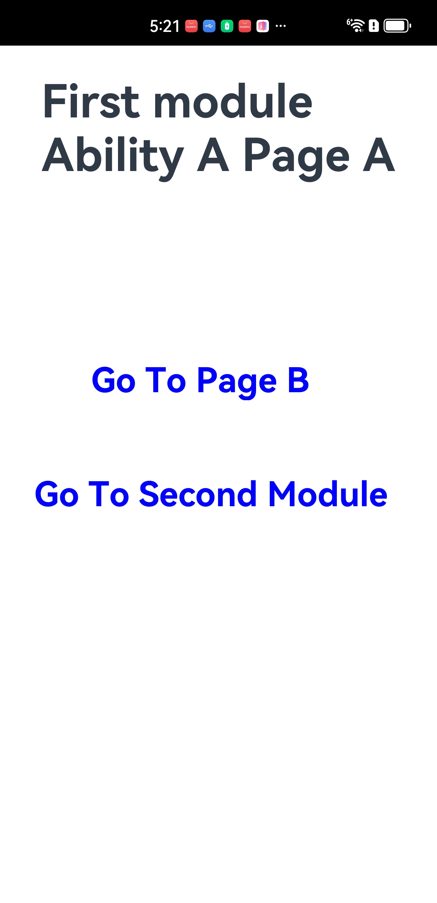
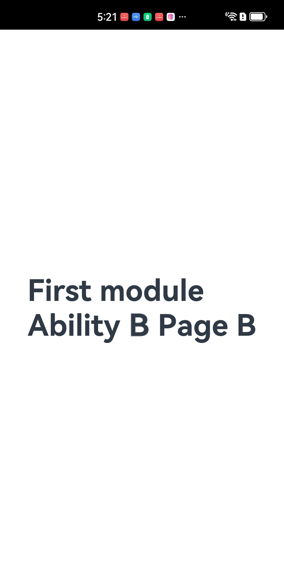
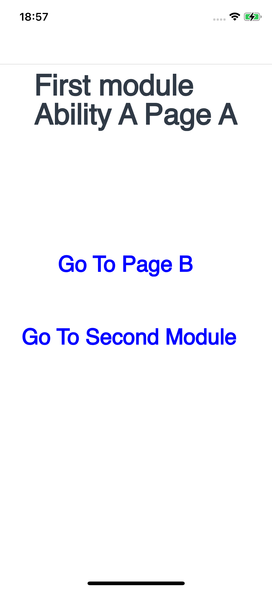
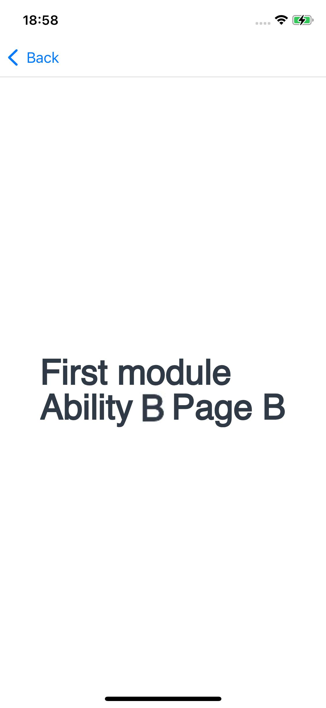
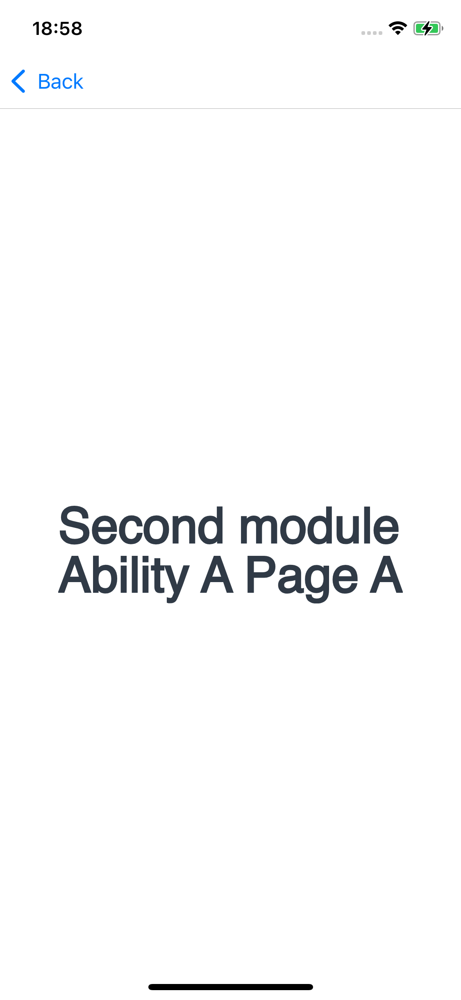
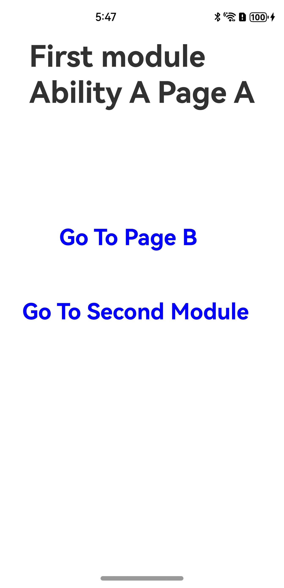
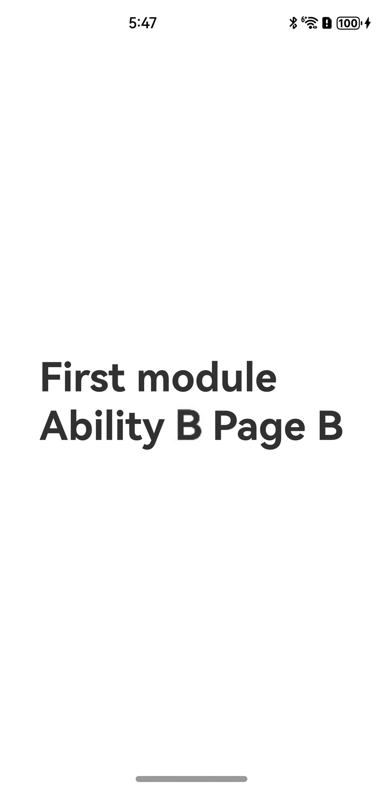
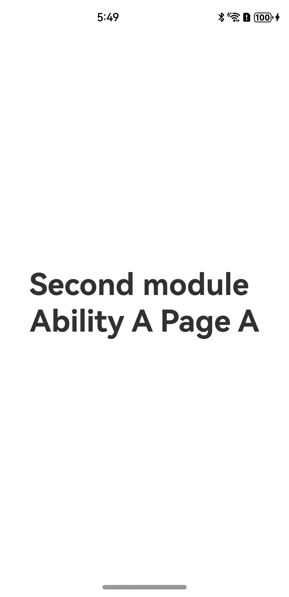

# 多Module和多Ability跳转应用示例
## 介绍
本示例通过DevEco Studio创建一个跨平台工程，在此基础上，展示多module之间的ability跳转，
以及同一个module下面的多个ability跳转功能。

## 效果预览

+ Android平台展示效果

  <table>
      <tr>
      <td>
          <center>
              
          </center>
      </td>
      <td>
          <center>
              
          </center>
      </td>
      <td>
          <center>
              
          </center>
      </td>
  </tr>
  </table>

+ iOS平台展示效果

  <table>
      <tr>
      <td>
          <center>
              
          </center>
      </td>
      <td>
          <center>
              
          </center>
      </td>
      <td>
          <center>
              
          </center>
      </td>
  </tr>
  </table>

+ 鸿蒙平台展示效果

  <table>
      <tr>
      <td>
          <center>
              
          </center>
      </td>
      <td>
          <center>
              
          </center>
      </td>
      <td>
          <center>
              
          </center>
      </td>
  </tr>
  </table>

### 使用说明

1. 打开app，首页显示第一个module第一个ability的标题以及两条文本内容，点击文本“Go To Page B”，会跳转到同一个module下另一个ability的页面，显示"First module Ability B Page B"。返回首页，点击“Go To Second Module”，会跳转到另外一个module下的ability的页面，显示“Second module Ability A Page A”。
2. iOS系统点击左上角back，安卓系统左滑都可以返回原来ability的page。

​	**注：在iOS设备上运行之前，需要在Xcode中的Info -> URL Types中的URL Schemes里添加包名：例如com.example.multiability。**

## 工程目录

```
MultiAbility
  ├── AppScope                    	// App信息配置文件
  ├── entry/src/main
  │   ├── ets
  │   │   ├── entryability        	// entry模块的应用入口
  │   │   ├── nextability         	// 同一个module下的第二个ability的入口
  │   │   └── pages               
  │   │       ├── Index.ets       	// 首页
  │   │       └── IndexNext.ets   	// 第二个ability的页面
  │   └── resources               	// 放置颜色、文字等资源
  ├── secondmodule/src/main
  │   ├── ets
  │   │   ├── secondmoduleability 	// 第二个模块secondmodule的应用入口
  │   │   └── pages               
  │   │       └── Index.ets       	// secondmodule模块的首页
  │   └── resources               	// 放置颜色、文字等资源
```

## 具体实现

+ 该工程包含两个模块，分别是secondmodule和entry模块。

+ 在secondmodule（Second Module）模块中，只有一个Ability（Ability A）以及一个Index（Page A）页面。具体代码见[Index.ets](secondmodule/src/main/ets/pages/Index.ets)。

+ 在entry（FIrst Module）模块中，有两个Ability，分别对应两个页面。

  - nextability（Ability B）对应IndexNext（Page B）页面。具体代码见[IndexNext.ets](entry/src/main/ets/pages/IndexNext.ets)。

  - entryability（Ability A）对应Index（Page A）页面，在Index页面的onClick方法里，通过设置wantInfo，可跳转到同一模块下的另一个ability的页面，也可以跳转到不同模块下ability的页面。具体代码见[Index.ets](entry/src/main/ets/pages/Index.ets)。

## 相关权限

不涉及。

## 依赖

不涉及。

## 约束与限制

1. 本示例支持在Android\iOS\鸿蒙系统上运行。 
2. 本示例已适配API version 12版本ArkUI-X SDK，版本号：2.0.0.27。 
3. 本示例需要使用DevEco Studio NEXT Developer Beta1 (Build Version: 5.0.3.403, built on June 20, 2024)及以上版本才可编译运行。

## 下载

```
git init
git config core.sparsecheckout true
echo /MultiAbility > .git/info/sparse-checkout
git remote add origin https://gitee.com/arkui-x/samples.git
git pull origin master
```
