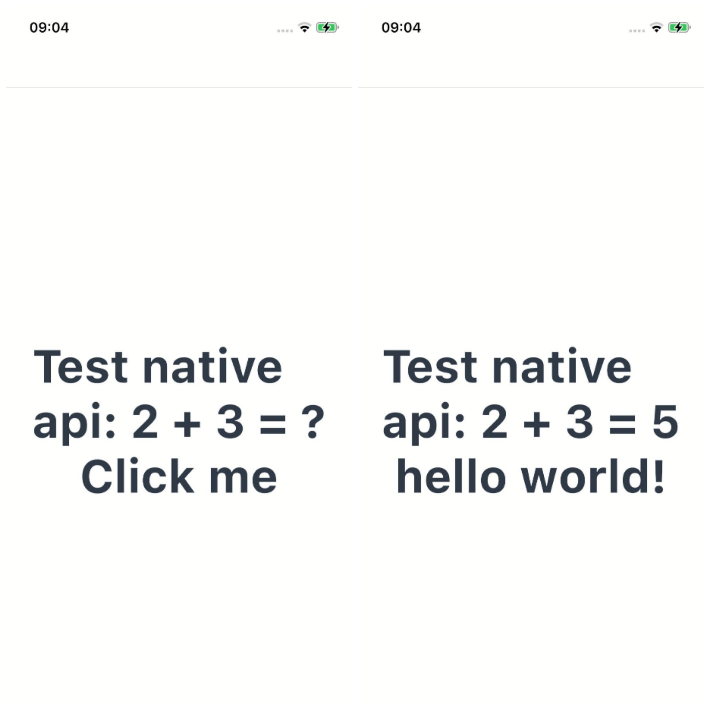

# Native应用示例
## 简介
本示例通过[ArkUI-X] Native C++模版创建的一个工程,增加了Native中调用ArkTS/TS/JS传入的方法的样例,可通过点击事件改变Text组件展示内容。效果图如下：

* Android平台展示效果
  

* iOS平台展示效果
  

* OpenHarmomy平台展示效果
  

## 相关概念

不涉及

## 相关权限

不涉及。

## 使用说明

1.打开应用，首页显示两个Text文本。

2.点击文字部分，Text内容发生改变。

## 约束与限制

1.本示例支持在Android\iOS\OpenHarmony平台上运行。

2.本示例需要使用DevEco Studio 4.0 Release及以上版本才可编译运行。