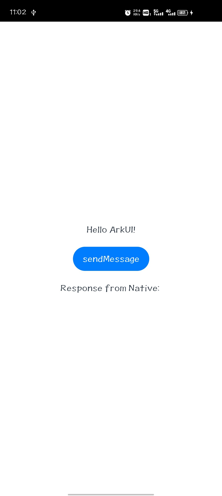
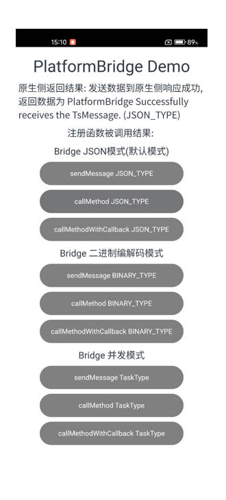
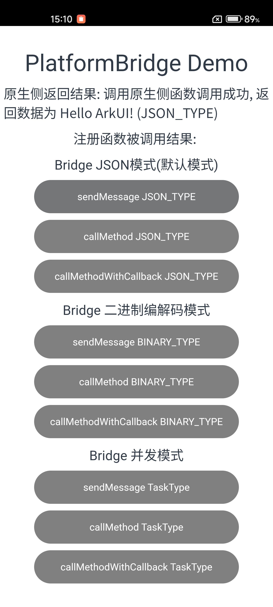
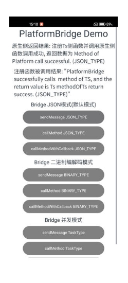
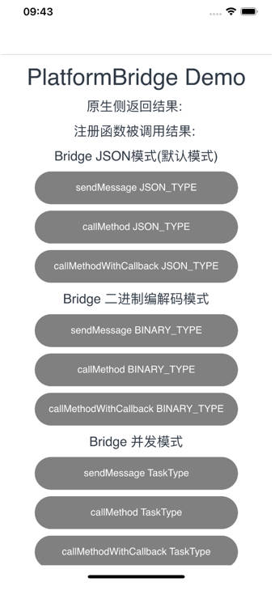
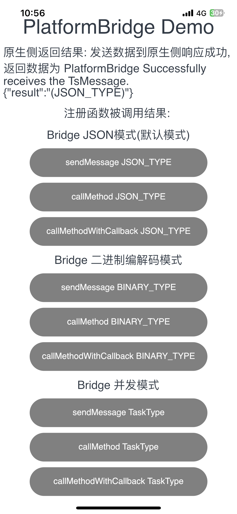
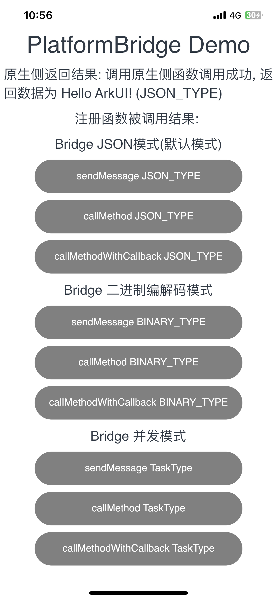
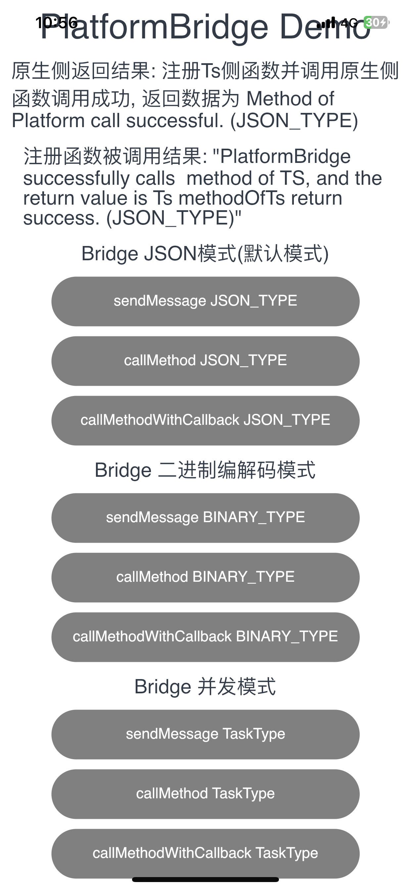

# Bridge平台桥接应用示例
## 介绍

本示例根据Bridge功能(提供ArkUI侧和原生侧消息通信的功能，包括数据传输、方法调用和事件调用)构建页面组件、布局和逻辑的应用。

## 效果预览

| Android平台                                                  |                                                              |                                                              |                                                              |
| ------------------------------------------------------------ | ------------------------------------------------------------ | ------------------------------------------------------------ | ------------------------------------------------------------ |
| 主页面展示效果                                               | 点击 “sendMessage JSON_TYPE” 按钮展示效果                    | 点击 “callMethod JSON_TYPE” 按钮展示效果                     | 点击 “callMethodWithCallback JSON_TYPE” 按钮展示效果         |
|  |  |  |  |
| **iOS平台**                                                  |                                                              |                                                              |                                                              |
| 主页面展示效果                                               | 点击 “sendMessage JSON_TYPE” 按钮展示效果                    | 点击 “callMethod JSON_TYPE” 按钮展示效果                     | 点击 “callMethodWithCallback JSON_TYPE” 按钮展示效果         |
|  |  |  |  |


### 使用说明

1.打开app，主页面显示三种Bridge模式和其对应的功能按钮。<br>
2.以Json模式为例，点击调用不同功能的Button按钮，Text内容发生改变。<br>
3.点击名为sendMessage按钮，ArkTS侧向原生侧发送数据，原生侧接收成功并返回数据，使用 “原生侧返回结果: ” Text文本接收原生侧返回数据并显示。<br>
4.点击名为callMethod按钮，ArkTS侧调用原生侧方法，原生侧方法调用成功并返回结果，使用“原生侧返回结果: ” Text文本接收原生侧返回数据并显示。<br>
5.点击名为callMethodWithCallback按钮，注册ArkTS侧方法并调用原生侧方法（在该原生侧方法里调用ArkTS侧刚注册的方法），原生侧方法调用成功并返回结果，使用“原生侧返回结果: ” Text文本接收原生侧返回数据并显示。同时ArkTS侧注册方法被调用成功并返回结果，使用 “注册函数被调用结果: ” Text文本接收原生侧返回数据并显示。<br>

## 工程目录

```bash
.arkui-x
|---android/app/src/main/java/com/example/platformbridge
|   |---Bridge.java	         			   // Android侧Bridge相关接口实现
|---/ios/app
|   |---BridgeClass.h	         		   // iOS侧Bridge相关接口实现
|   |---BridgeClass.m	         		   // iOS侧Bridge相关接口实现
entry/src/main/ets
|---entryability
|---pages
|   |---index.ets                          // 主页面以及ArkTs侧Bridge相关接口实现
```

## 具体实现

* Bridge相关接口文档参考[ @arkui-x.bridge.d.ts ](https://gitee.com/arkui-x/docs/blob/master/zh-cn/application-dev/reference/apis/js-apis-bridge.md) 。
* 创建平台桥接实例。
  * 需指定名称，该名称ArkTS侧与平台侧保持一致。
  * 在创建平台桥接实例时，可以指定平台桥接模式，平台桥接模式目前分为[JSON编解码模式](https://gitee.com/arkui-x/docs/blob/master/zh-cn/application-dev/reference/apis/js-apis-bridge.md#bridgetype)，[二进制编解码模式](https://gitee.com/arkui-x/docs/blob/master/zh-cn/application-dev/reference/apis/js-apis-bridge.md#bridgetype)，[线程并发模式](https://gitee.com/arkui-x/docs/blob/master/zh-cn/application-dev/reference/arkui-for-android/BridgePlugin.md#taskoption%E7%B1%BB11)，默认为JSON编解码模式（线程并发模式目前只能在平台侧指定）。
  * 平台桥接实例参考: [createBridge（ArkTS）](https://gitee.com/arkui-x/docs/blob/master/zh-cn/application-dev/reference/apis/js-apis-bridge.md#createbridge)， [BridgePlugin（Android）](https://gitee.com/arkui-x/docs/blob/master/zh-cn/application-dev/reference/arkui-for-android/BridgePlugin.md#bridgeplugin11)，[initBridgePlugin（iOS）](https://gitee.com/arkui-x/docs/blob/master/zh-cn/application-dev/reference/arkui-for-ios/BridgePlugin.md#initbridgeplugin11) 。
* 数据传递：ArkTS侧传递数据到平台侧，平台侧传递数据到ArkTS侧。
  * 发送数据，接口参考: [sendMessage（ArkTS）](https://gitee.com/arkui-x/docs/blob/master/zh-cn/application-dev/reference/apis/js-apis-bridge.md#sendmessage)， [sendMessage（Android）](https://gitee.com/arkui-x/docs/blob/master/zh-cn/application-dev/reference/arkui-for-android/BridgePlugin.md#sendmessage)，[ sendMessage（iOS）](https://gitee.com/arkui-x/docs/blob/master/zh-cn/application-dev/reference/arkui-for-ios/BridgePlugin.md#sendmessage) 。
  * 接收数据，接口参考: [setMessageListener（ArkTS）](https://gitee.com/arkui-x/docs/blob/master/zh-cn/application-dev/reference/apis/js-apis-bridge.md#setmessagelistener)， [setMessageListener（Android）](https://gitee.com/arkui-x/docs/blob/master/zh-cn/application-dev/reference/arkui-for-android/BridgePlugin.md#setmessagelistener)，[ messageListener（iOS）](https://gitee.com/arkui-x/docs/blob/master/zh-cn/application-dev/reference/arkui-for-ios/BridgePlugin.md#messagelistener) 。
  * 数据类型支持参考: [数据类型支持](https://gitee.com/arkui-x/docs/blob/master/zh-cn/application-dev/quick-start/platform-bridge-introduction.md#数据类型支持) 。
* 方法调用：ArkTS侧调用平台侧定义的方法，平台侧调用ArkTS侧定义的方法。
  * 定义方法：Android侧定义方法时需将访问修饰符定义为public。
  * 方法注册：ArkTS侧需要通过方法[registerMethod](https://gitee.com/arkui-x/docs/blob/master/zh-cn/application-dev/reference/apis/js-apis-bridge.md#registermethod)定义被平台侧调用的方法，以便平台侧调用。平台侧无需方法注册。
  * 调用方法，接口参考: [callMethod（ArkTS）](https://gitee.com/arkui-x/docs/blob/master/zh-cn/application-dev/reference/apis/js-apis-bridge.md#callmethod)， [callMethod（Android）](https://gitee.com/arkui-x/docs/blob/master/zh-cn/application-dev/reference/arkui-for-android/BridgePlugin.md#callmethod)，[ callMethod（iOS）](https://gitee.com/arkui-x/docs/blob/master/zh-cn/application-dev/reference/arkui-for-ios/BridgePlugin.md#callmethod) 。
* 本应用的基本页面展示封装在Index，源码参考:[Index.ets](entry/src/main/ets/pages/Index.ets) 。
  * 展示基本的UI界面：Text和Button组件的基本构造实现。
  * 点击按钮切换Text组件中的内容：通过点击按钮的方式调用Bridge接口，再通过.onClick方法监听点击，从而改变文本内容。
* 平台桥接开发指南参考：[Android](https://gitee.com/arkui-x/docs/blob/master/zh-cn/application-dev/tutorial/how-to-use-bridge-on-android.md)，[iOS](https://gitee.com/arkui-x/docs/blob/master/zh-cn/application-dev/tutorial/how-to-use-bridge-on-ios.md)

## 相关权限

不涉及。 

## 依赖

不涉及。

## 约束与限制

1.本示例仅支持标准Android/iOS/鸿蒙系统上运行。<br>

2.本示例已适配API version 12版本的ArkUI-X SDK，版本号：2.0.0.27及以上。<br>

3.本示例需要使用DevEco Studio 5.0 Beta1 (Build Version: 5.0.3.403, built on June 21, 2024)及以上版本才可编译运行。

##  下载

如需单独下载本工程，执行如下命令：

```
git init
git config core.sparsecheckout true
echo /PlatformBridge > .git/info/sparse-checkout
git remote add origin https://gitee.com/arkui-x/samples.git
git pull origin master
```

