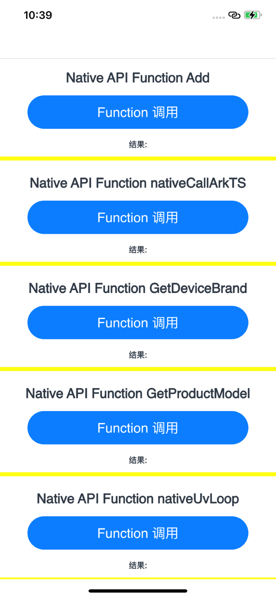

# Native应用示例
## 介绍
本示例涉及自定义Native方法如下

1. ArkTS 调用Native C++方法，并返回数据给ArkTS侧。具体用例：Add ；nativeCallArkTS

2. Native中调用libuv三方库进行简单事件轮询。具体用例：nativeUvLoop

3. ArkTS 调用Native C++方法，Native 通过ArkUI-X已封装的  Plugin Utils 调用Android/IOS原生方法，并将数据返回至ArkTS侧。

   实现 ArkTS-->Native-->JAVA/OC 以及数据返回的一整套流程。

   Plugin Utils 的具体工作流程可参考[Plugin Utils](https://gitcode.com/arkui-x/docs/blob/master/zh-cn/application-dev/reference/native-apis/_plugin_utils.md) 。

## 效果预览

**应用初始**

| Android平台                                                  | iOS平台                                                      |
| ------------------------------------------------------------ | ------------------------------------------------------------ |
|  |  |

**Button点击后**

| Android平台                                                  | iOS平台                                                      |
| ------------------------------------------------------------ | ------------------------------------------------------------ |
|  |  |

### 使用说明

1.打开应用，首页显示共5条分栏，每条分栏间用黄色分割线分开。

2.点击第一条分栏“ Native API Function Add ”下Button“Function 调用”，调用 “ Add ” 方法，下方文本栏 “结果” 输出调用结果

3.点击第二条分栏“ Native API Function nativeCallArkTS ”下Button“Function 调用”，调用 “ nativeCallArkTS ” 方法，下方文本栏 “结果” 输出调用结果

4.点击第三条分栏“ Native API Function GetDeviceBrand ”下Button“Function 调用”，调用 “ GetDeviceBrand ” 方法，下方文本栏 “结果” 输出调用结果

5.点击第四条分栏“ Native API Function GetProductModel ”下Button“Function 调用”，调用 “ GetProductModel ” 方法，下方文本栏 “结果” 输出调用结果

6.点击第五条分栏“ Native API Function nativeUvLoop ”下Button“Function 调用”，调用 “ nativeUvLoop  ” 方法，下方文本栏 “结果” 输出调用结果

## 工程目录

```
entry/src/main
├── cpp							    // native侧代码
│   ├── include						// C++头文件
│   │	├── native_common.h			
│   │	├── platform_napi_impl.h
│   │	├── platform_napi_jni.h
│   │	└── platform_napi.h
│   ├── src							// C++源文件	
│   │	├── platform_napi_impl.cpp	
│   │	├── platform_napi_impl.mm
│   │	└── platform_napi_jni.cpp
│   ├── types/libentry
│   │	├── index.d.ts				// 描述C++ API接口行为，如接口名、入参、返回参数等
│   │	└── oh-package.json5		// 配置.so三方包声明文件的入口及包名
│   ├── CMakeLists.txt				// CMake配置文件，提供CMake构建脚本
│   └── napi_module.cpp				// 定义C++ API接口的文件
├── ets
│   ├── entryability
│   │	└── EntryAbility.ets		// 应用/服务的入口
│   └── pages
│   	└── Index.ets				// 首页
├── resource
└── module.json5
```


## 具体实现

* 基本的页面展示封装在Index，源码参考:[Index.ets](entry/src/main/ets/pages/Index.ets)
    * 展示基本的UI界面：Text、Button、Divider组件的基本构造实现
    * 点击按钮切换Text组件中的内容：通过点击按钮的方式调用C++ API接口，再通过.onClick方法监听点击，从而改变文本内容
* 基本的Native侧代码位于cpp目录，源码参考:[cpp](entry/src/main/cpp)
    * ArkTS层调用Native动态库；源码参考:[Index.ets](entry/src/main/ets/pages/Index.ets)
      1. import PlatformNAPI from 'libentry.so'，通过PlatformNAPI调用动态库中实现的c++方法
      2. c++方法：add: (a: number, b: number) => number；实现加法计算，源码参考:[napi_module.cpp](entry/src/main/cpp/napi_module.cpp)
      3. c++方法：nativeCallArkTS: (a: Function) => string；Native侧实现方法，并返回string给ArkTS，源码参考:[napi_module.cpp](entry/src/main/cpp/napi_module.cpp)
      4. c++方法：nativeUvLoop: () => number；Native侧调用libuv三方库进行简单事件轮询，并返回number给ArkTS，源码参考:[napi_module.cpp](entry/src/main/cpp/napi_module.cpp)
    * Native动态库调用平台原生方法。
      1. 调用Android平台方法（JAVA方法）需依赖ArkUI-X已封装的 [Plugin Utils](https://gitcode.com/arkui-x/docs/blob/master/zh-cn/application-dev/reference/native-apis/_plugin_utils.md)  
      2. Android侧跨平台开发参考  [Android平台扩展@ohos接口](https://gitcode.com/arkui-x/docs/blob/master/zh-cn/framework-dev/tutorial/how-to-archieve-arkts-interface-on-android.md)  
      3. iOS侧跨平台开发参考  [iOS平台扩展@ohos接口 ](https://gitcode.com/arkui-x/docs/blob/master/zh-cn/framework-dev/tutorial/how-to-archieve-arkts-interface-on-ios.md)  

## 相关权限

不涉及。

## 依赖

不涉及。

## 约束与限制

1.本示例仅支持标准Android/iOS系统上运行。

2.本示例已适配API version 12版本的ArkUI-X SDK，版本号：2.0.0.27及以上。

3.本示例需要使用DevEco Studio 5.0 Beta1 (Build Version: 5.0.3.403, built on June 21, 2024)及以上版本才可编译运行。

##### 针对CMakeLists.txt的检查说明：

- 代码路径：.arkui-x/android/app/src/main/cpp/CMakeLists.txt

1. 本示例需要配置“ARKUIX_SDK_HOME”的环境变量，用于CMakeLists.txt文件读取ArkUI-X SDK的文件位置。

2. CMakeLists.txt文件中的include路径需要检查对应API下的路径是否存在，例如下面路径，需要有API 12的ArkUI-X SDK存在：

```shell
set(NATIVE_INCLUDE_PATH "$ENV{ARKUIX_SDK_HOME}/12/arkui-x/engine/lib/include/")
```

## 下载
如需单独下载本工程，执行如下命令：

```
git init
git config core.sparsecheckout true
echo /SuperFeature/PlatformNAPI > .git/info/sparse-checkout
git remote add origin https://gitcode.com/arkui-x/samples.git
git pull origin master
```