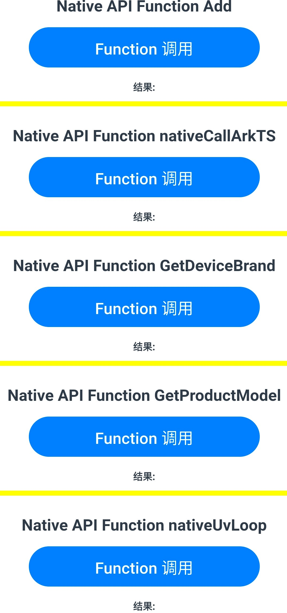
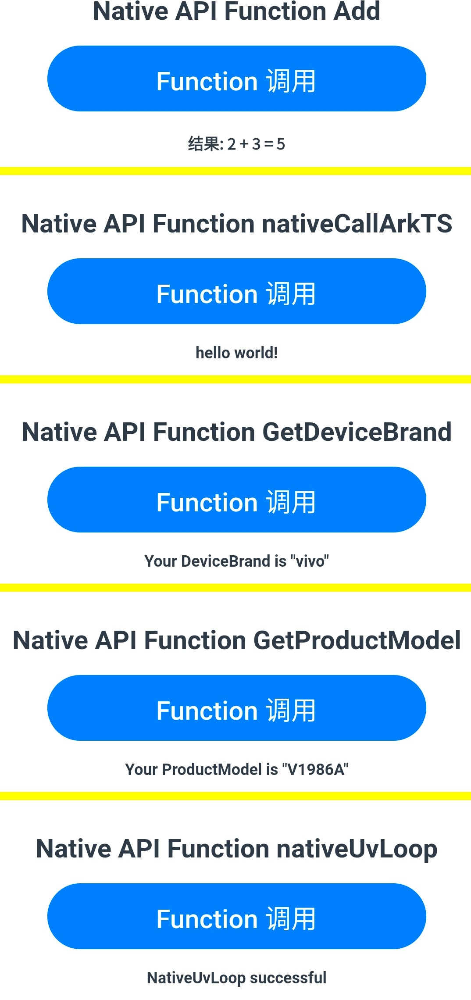
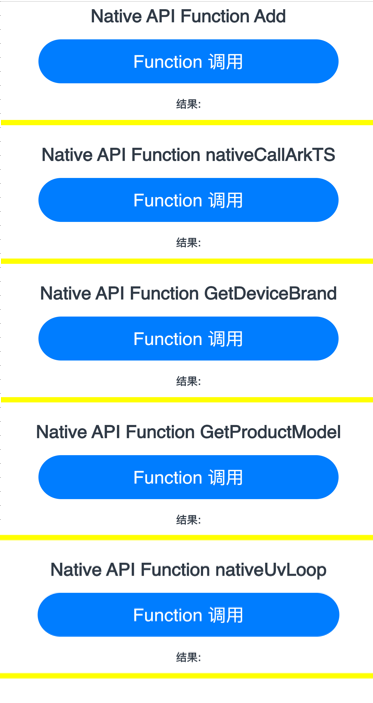
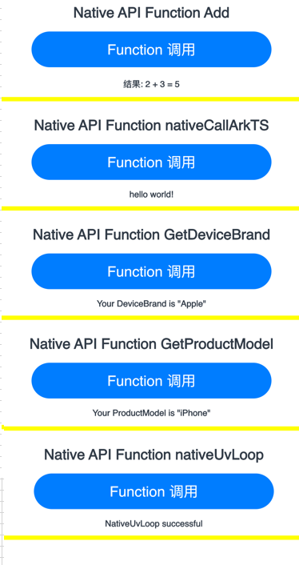

# Native应用示例
## 简介
本示例通过[ArkUI-X] Native C++模版创建的一个工程，实现ArkTS调用Native中方法。前端UI界面可通过Button点击事件触发函数调用，将函数返回结果通过Text组件展示。

Native方法如下

1. ArkTS 调用Native C++方法，并返回数据给ArkTS侧。具体用例：Add ；nativeCallArkTS

2. Native中调用libuv三方库进行简单事件轮询。具体用例：nativeUvLoop

3. ArkTS 调用Native C++方法，Native 通过Arkui-X已封装的  Plugin Utils 调用Android/IOS原生方法，并讲数据返回至ArkTS侧。

   实现 ArkTS-->Native-->JAVA/OC 以及数据返回的一套流程。
   
   Plugin Utils 的具体工作流程可参考[Plugin Utils](https://gitee.com/arkui-x2/docs/blob/master/zh-cn/application-dev/reference/native-apis/_plugin_utils.md) 。

应用效果图如下：

* Android平台展示效果如下图：

  |                                                              |                                                              |
  | :----------------------------------------------------------: | :----------------------------------------------------------: |
  |  |  |

* iOS平台展示效果如下图：
  
  |                                                              |                                                              |
  | :----------------------------------------------------------: | :----------------------------------------------------------: |
  |  |  |

## 相关概念

[Plugin Utils](https://gitee.com/arkui-x2/docs/blob/master/zh-cn/application-dev/reference/native-apis/_plugin_utils.md) 

## 相关权限

不涉及。

## 使用说明

1.打开应用，首页显示共5条分栏，每条分栏间用黄色分割线分开。

2.点击第一条分栏“ Native API Function Add ”下Button“Function 调用”，调用 “ Add ” 方法，下方文本栏 “结果” 输出调用结果

3.点击第二条分栏“ Native API Function nativeCallArkTS ”下Button“Function 调用”，调用 “ nativeCallArkTS ” 方法，下方文本栏 “结果” 输出调用结果

4.点击第三条分栏“ Native API Function GetDeviceBrand ”下Button“Function 调用”，调用 “ GetDeviceBrand ” 方法，下方文本栏 “结果” 输出调用结果

5.点击第四条分栏“ Native API Function GetProductModel ”下Button“Function 调用”，调用 “ GetProductModel ” 方法，下方文本栏 “结果” 输出调用结果

6.点击第五条分栏“ Native API Function nativeUvLoop ”下Button“Function 调用”，调用 “ nativeUvLoop  ” 方法，下方文本栏 “结果” 输出调用结果

## 约束与限制

1.本示例仅支持在Android\iOS平台上运行。

2.本示例需要使用DevEco Studio 4.0 Release及以上版本才可编译运行。