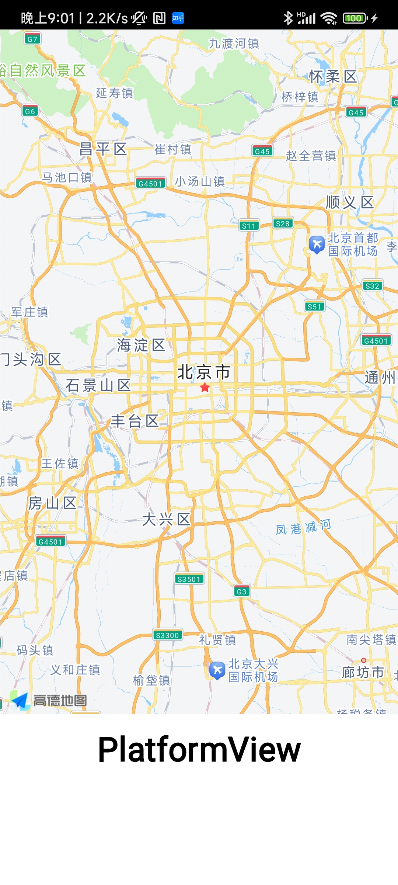
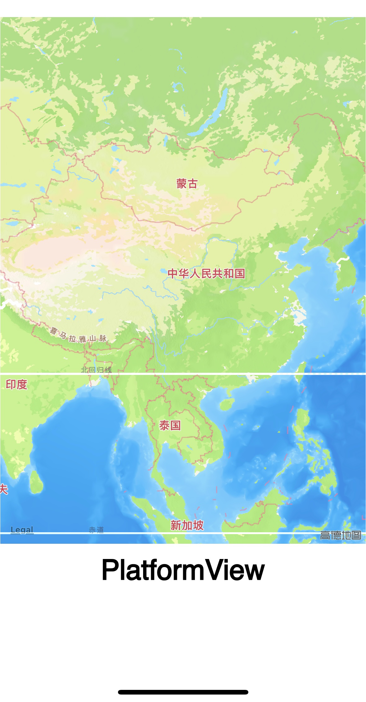

#  平台视图

## 介绍

平台视图，在ArkUI-X框架提供了支持将原生View和ArkUI组件混合显示的能力，用户可以编写ArkTS代码，原生代码，就可以在ArkUI-X框架上显示原生组件的视图。

## 简介
本示例通过[ArkUI-X] ACE工具链创建的一个跨平台工程，效果展示如下。

### 效果预览

- Android平台展示效果

  |                             首页                             |                               |
  | :----------------------------------------------------------: | :-----------------------------------------------------: |
  |  | 

- IOS平台展示效果

  |                             首页                             |                         |
  | :----------------------------------------------------------: | :---------------------------------------: |
  |  |

## 相关概念

不涉及。

## 相关权限

不涉及。

## 使用说明

应用界面中展示了平台视图与arkui组件混合显示，采用高德地图相关标准API绘制地图。

1.打开app，首页面显示一个text和一个显示了高德地图的平台视图

2.可在平台视图区域触摸滑动，以使高德地图缩放、旋转

## 约束与限制

1.本示例支持在Android\iOS平台上运行。

2.本示例需要使用DevEco Studio 4.0 Release及以上版本才可编译运行，OpenHarmony SDK 为11版本及以上。

