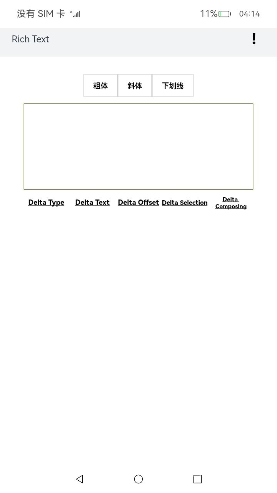
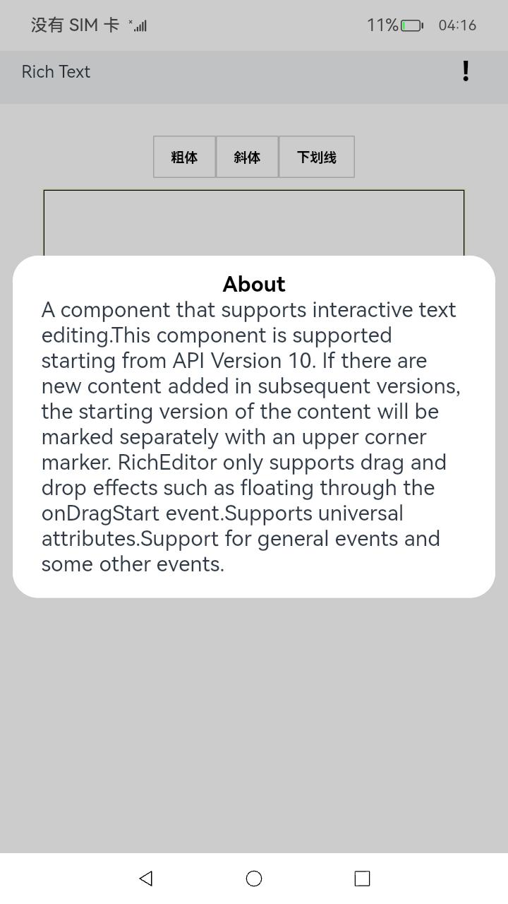
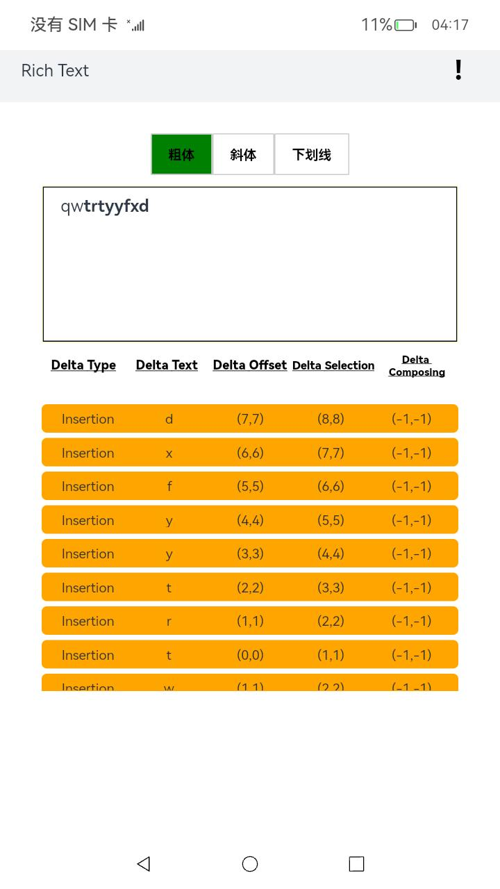
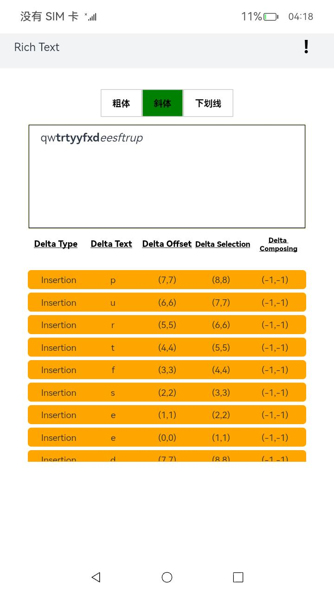
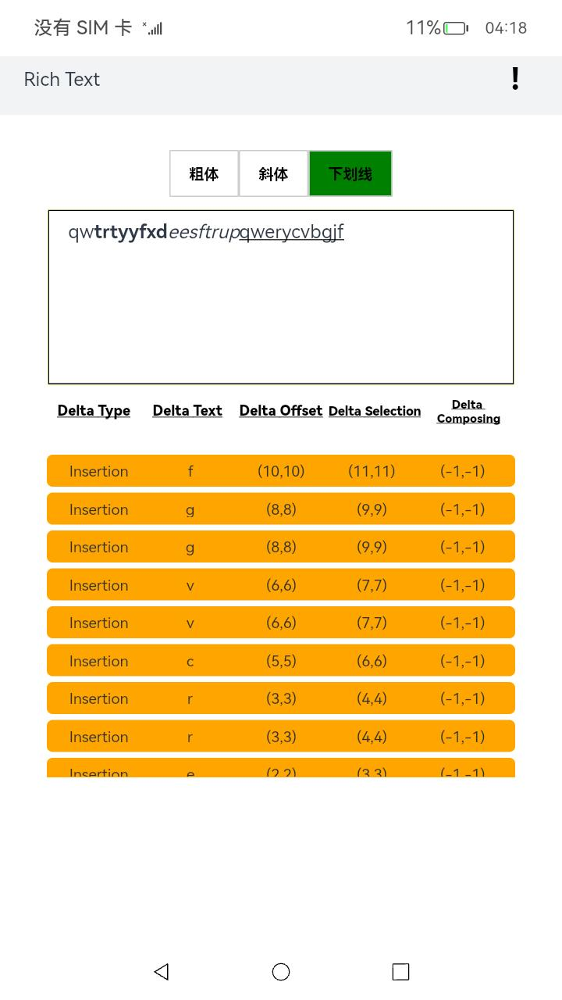
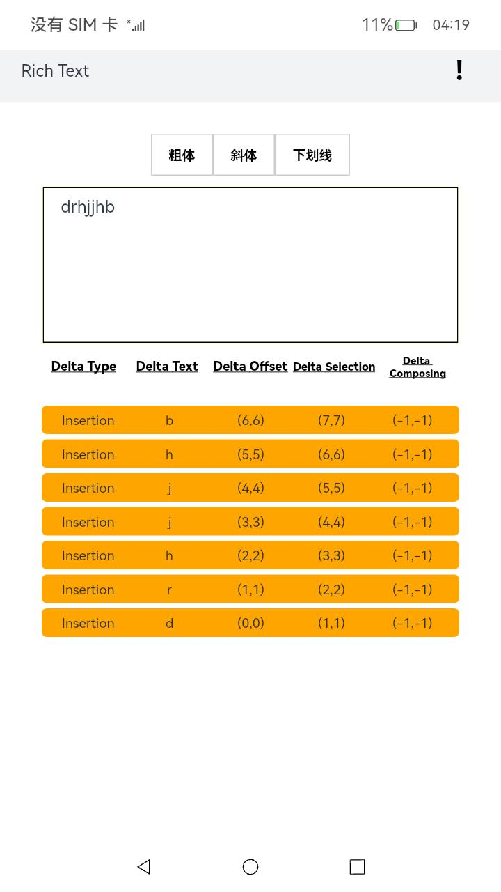
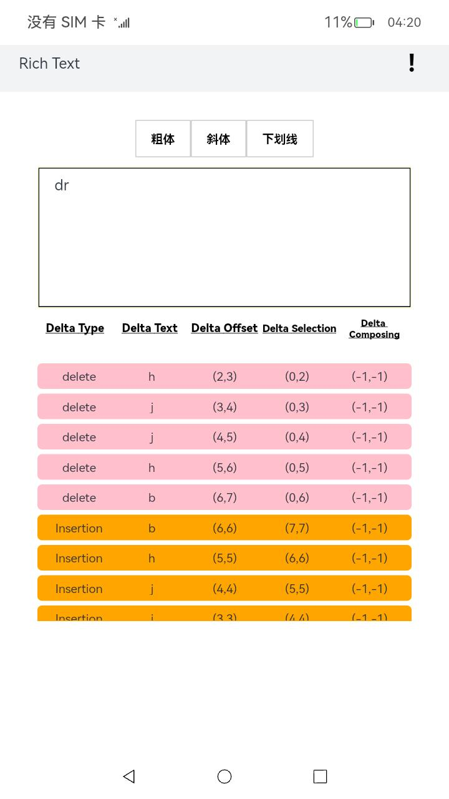
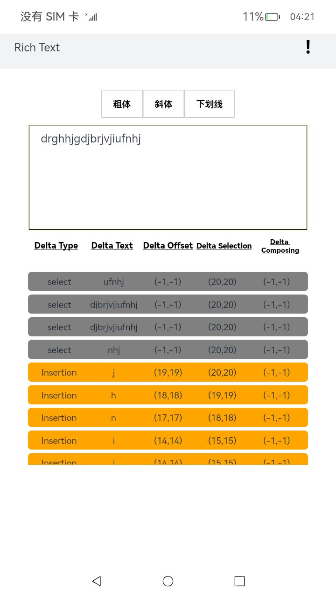

# RichText应用示例
## 简介
富文本作为一种非常流行的文件结构，很多文字编辑器都支持它，其写作最大的特点是：所见即所得，当你需要修改字体、行间距等属性时，只需要找到工具栏，点一下，即可获得所需要的效果。本示例是一个通过[ArkUI-X] Entry Ability模版创建，可以实现，一个大文本框；有粗体、斜体、下划线按钮修改输入字体格式功能的rich text。

效果图如下：

* Android平台展示效果
    + 暂不支持跨平台
* iOS平台展示效果
  + 暂不支持跨平台
* OpenHarmomy平台展示效果
  
  
  
  
  
  
  
  

## 相关概念

不涉及

## 相关权限

不涉及

## 使用说明

1、启动应用进入首页界面，整个应用分为三个部分"文本输入框"、"字体功能"、"弹窗按钮"，可以通过点击实现对应功能。
 
2、"文本输入框"：在文本框内输入、删除、选择文字，会渲染相应的提示信息。
 
3、"字体功能"：点击粗体、斜体、下划线按钮修改输入字体格式，输入文字会渲染对应的字体样式。
 
4、"弹窗按钮"：点击右上角感叹号，页面出现“about”弹窗。

## 约束与限制

1、本示例支持在Android\iOS\OpenHarmony平台上运行。

2、本示例需要使用DevEco Studio 4.0 Beta2及以上版本才可编译运行。