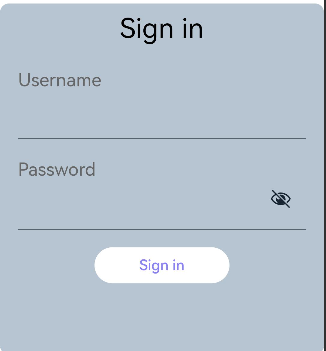
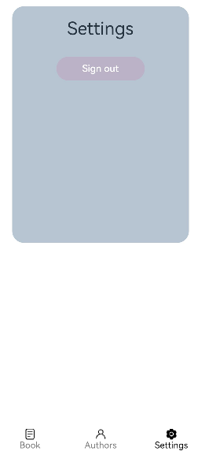

# Router路由跳转应用示例
## 简介
本示例通过[ArkUI-X] ace create Router创建的一个跨平台工程

## 相关概念

* Router
* Navigator

## 相关权限

不涉及

## 使用说明

- 打开app，输入用户名、密码，点击sign in
 - 
- 进入主页面，tab切换进行相应页面
 - 
- 选择push方式
 - 
 - 
- 点击登出
 - 

## 约束与限制

1.本示例支持在Android\iOS\OpenHarmony平台上运行。

2.本示例需要使用DevEco Studio 4.0 Beta2及以上版本才可编译运行。