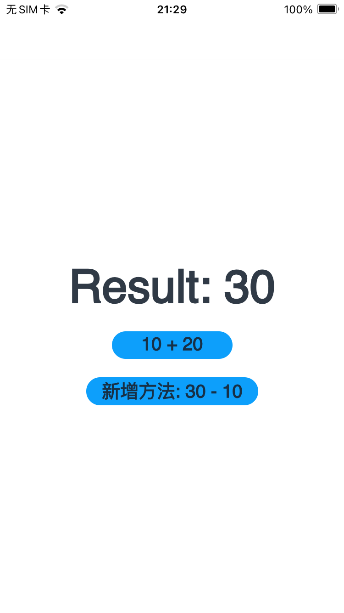

# ArkUI-X支持Rust sample开发
## 介绍
本示例通过DevEco 5.0.4 Release创建一个Native C++跨平台工程，用来实现HarmonyOS、Android和iOS调用rust接口。 

## 效果预览

* Android平台展示效果

    <table>
    <tr>
        <td>
            <center>
                
            </center>
        </td>
        <td>
            <center>
                
            </center>
        </td>
        <td>
            <center>
                
            </center>
        </td>
    </tr>
    </table> 

* iOS平台展示效果

    <table>
    <tr>
        <td>
            <center>
                
            </center>
        </td>
        <td>
            <center>
                
            </center>
        </td>
        <td>
            <center>
                
            </center>
        </td>
    </tr>
    </table> 

* OH平台展示效果

    <table>
    <tr>
        <td>
            <center>
                
            </center>
        </td>
        <td>
            <center>
                
            </center>
        </td>
        <td>
            <center>
                
            </center>
        </td>
    </tr>
    </table> 

### 使用说明

1、在运行本示例前，需要参照[配置说明](#配置说明)进行相关环境与工程的配置。

2、打开应用，进入 "Hello Rust" 页面。

3、点击 "10 + 20" 按钮调用rust的默认提供的add接口，主页面上显示得到的结果。

4、点击 "新增方法: 30 - 10" 按钮调用rust增加的subtract接口，主页面上显示得到的结果。

## 工程目录
```
rust_add								// rust工程
├── src
│   └── lib.rs							// rust接口文件
├── build.rs							// rust构建配置文件
└── Cargo.toml

RustDev									// Native C++跨平台工程
├── .arkui-x
│   ├── android							// Android 工程
│   ├── ios								// iOS 工程
│   └── arkui-x-config.json5
├── AppScope
├── entry
│   ├── build-profile.json5
│   ├── hvigorfile.ts
│   ├── obfuscation-rules.txt
│   ├── oh-package.json5
│   └── src
│       ├── main
│       │   ├── cpp
│       │   ├── ets
│       │   │   ├── pages
│       │   │   │   └── Index.ets		// 主界面
│       │   │   └── entryability
│       │   │       └── EntryAbility.ets
│       │   ├── module.json5
│       │   └── resources
│       ├── mock
│       ├── ohosTest
│       └── test
├── hvigor
├── build-profile.json5
├── hvigorfile.ts
├── oh-package.json5
├── screenshots
└── README.md
```


## 具体实现

* 打开应用后进入首页[Index.ets](entry/src/main/ets/pages/Index.ets)。通过引入rust工程编译出的动态库librust_add.so，来调用rust的接口。

## 配置说明

### 相关环境配置

#### 1、安装Rust工具链

（1）打开终端，执行以下命令下载并安装 Rust

**Mac端**

```shell
curl --proto '=https' --tlsv1.2 -sSf https://sh.rustup.rs | sh
```

**Windows端**

需要进入Rust官网下载rustup-init.exe，进行安装。

（2）激活环境变量

安装完成后，需加载 Rust 工具链的路径到当前 Shell 环境：

**Mac端**

```shell
source "$HOME/.cargo/env"
```

若后续重启终端后命令失效，可将该命令添加到 Shell 配置文件（如 ~/.zshrc 或 ~/.bash_profile）中。

**Windows端**

无需配置环境变量。

（3）验证安装

执行以下命令检查rust和cargo版本信息，若显示版本号则安装成功:

```shell
rustc --version
cargo --version
```

#### 2、需要安装 Rust 的 toolchain 来帮助构建相应平台的动态库

**HarmonyOS平台**

```shell
rustup target add aarch64-unknown-linux-ohos
rustup target add armv7-unknown-linux-ohos
rustup target add x86_64-unknown-linux-ohos
```

**Android平台**

```shell
rustup target add aarch64-linux-android
rustup target add armv7-linux-androideabi
rustup target add x86_64-linux-android
```

**iOS平台**

```shell
rustup target add aarch64-apple-ios
rustup target add x86_64-apple-ios
rustup target add aarch64-apple-ios-sim
```

### HarmonyOS上如何调用rust

#### 环境

1、配置​**OHOS_NDK_HOME**​环境变量：

**Mac端**

```shell
export OHOS_NDK_HOME=/Applications/DevEco-Studio.app/Contents/sdk/default/openharmony
```

**Windows端**

需要在环境变量中配置，如下图：


```shell
变量：OHOS_NDK_HOME，值：OpenHarmony SDK路径
```

2、使用cargo安装脚手架工具ohrs

```shell
cargo install ohrs
```

3、修改Cargo配置文件名称

进入.cargo文件夹，修改config文件的名称为config.toml，若找不到config文件可直接新建一个config.toml文件，可通过以下命令找到.cargo文件夹位置：

```shell
where cargo
```

#### 编译

1、先检查ohrs的相关环境是否OK：

```shell
ohrs doctor
```

运行结果如下：

> Windows端可能会有乱码，不影响正常使用

```shell
✔  Environment variable OHOS_NDK_HOME should be set.
✔  Rust version should be >= 1.78.0.
✔  Rustup target: aarch64-unknown-linux-ohos should be installed.
✔  Rustup target: armv7-unknown-linux-ohos should be installed.
✔  Rustup target: x86_64-unknown-linux-ohos should be installed.
```

2、使用ohrs来初始化rust项目：

```shell
ohrs init rust_add
```

运行结果如下：

```shell
Create lib.rs succeed.
Create build.rs succeed.
Create .gitignore succeed.
Create Cargo.toml succeed.
```

3、之后使用ohrs来构建项目：

```shell
cd rust_add
ohrs build
```

执行完成后会生成一个dist目录，其中含有librust_add.so文件和index.d.ts文件。

4、使用HarmonyOS开发工具DevEco 5.0.4 Release创建一个Native C++ 工程。

5、之后可以参考：[示例文档](https://developer.huawei.com/consumer/cn/blog/topic/03166271011531112)中的第3-5步，手动改造工程，进行编译引用。

### ArkUI-X（iOS）如何调用rust

#### 环境

1、编辑 .cargo目录中的config.toml文件，加入以下内容：

```shell
[target.aarch64-apple-ios]  # iPhone 真机 (ARM64)
ar = "/Applications/Xcode.app/Contents/Developer/Toolchains/XcodeDefault.xctoolchain/usr/bin/ar"
linker = "/Applications/Xcode.app/Contents/Developer/Toolchains/XcodeDefault.xctoolchain/usr/bin/clang"
rustflags = [
    "-C", "rpath=yes"
]

[target.x86_64-apple-ios]  # 模拟器 (Intel)
ar = "/Applications/Xcode.app/Contents/Developer/Toolchains/XcodeDefault.xctoolchain/usr/bin/ar"
linker = "/Applications/Xcode.app/Contents/Developer/Toolchains/XcodeDefault.xctoolchain/usr/bin/clang"
rustflags = [
    "-C", "rpath=yes"
]

[target.aarch64-apple-ios-sim]  # 模拟器 (Apple Silicon)
ar = "/Applications/Xcode.app/Contents/Developer/Toolchains/XcodeDefault.xctoolchain/usr/bin/ar"
linker = "/Applications/Xcode.app/Contents/Developer/Toolchains/XcodeDefault.xctoolchain/usr/bin/clang"
rustflags = [
    "-C", "rpath=yes"
]
```

#### 编译

基于以上ohrs创建的rust应用工程，进行以下操作：

1、修改rust工程中的build.rs文件为如下内容：

```shell
use std::env;
use std::path::Path;

fn main() {
    napi_build_ohos::setup();
    // 指定某个源文件如果有修改就重新编译
    println!("cargo:rerun-if-changed=src/lib.rs");

    // HarmonyOS 构建配置
    if env::var("OHOS_BUILD").is_ok() {
        return;
    }

	// 获取目标平台架构，如 aarch64-linux-android
    let target = env::var("TARGET").unwrap_or_default();

    // Android 构建配置
    if target.contains("android") {
    	let arch = env::var("CARGO_CFG_TARGET_ARCH").unwrap_or_default();
        let arch_folder = match arch.as_str() {
            "aarch64" => "arm64-v8a",
            "arm"     => "armeabi-v7a",
            "x86_64"  => "x86_64",
            other => panic!("Unsupported Android architecture: {}", other),
        };

		// 根据项目的实际目录进行修改
        let lib_path = Path::new("../RustDev/.arkui-x/android/app/libs/")
            .join(arch_folder);

        println!("cargo:rustc-link-search=native={}", lib_path.display());
    	println!("cargo:rustc-link-lib=arkui_android");
    }

    // iOS 构建配置
    if target.contains("apple") {
    	// 获取项目根目录的绝对路径
        let manifest_dir = env::var("CARGO_MANIFEST_DIR").unwrap();
        // 根据项目的实际目录进行修改
        let framework_dir = Path::new(&manifest_dir)
            .join("../RustDev/.arkui-x/ios/frameworks/libarkui_ios.xcframework");

        let platform_subdir = if target.contains("simulator") {
            "ios-arm64_x86_64-simulator"
        } else {
            "ios-arm64"
        };
        let framework_path = framework_dir.join(platform_subdir);

		// 输出绝对路径（但路径是基于项目结构的相对路径生成的）
        println!("cargo:rustc-link-search=framework={}", framework_path.display());
        println!("cargo:rustc-link-lib=framework=libarkui_ios");
        println!("cargo:rustc-link-lib=framework=JavaScriptCore");
        println!("cargo:rustc-link-lib=framework=CoreFoundation");
        println!("cargo:rustc-link-lib=framework=UIKit");
    }
}
```

2、先进入ArkUI-X跨平台工程，进入DevEco 5.0.4 Release点击菜单上的构建->编译Hap(s)/APP(s)->编译APP(s)按钮，以同步信息与动态库到ArkUI-X跨平台工程中。

3、进入rust工程中，编译target为iOS的.dylib文件：

```shell
cargo build --target aarch64-apple-ios --release
```

动态库生成的目录：

```shell
rust工程/target/aarch64-apple-ios/release/librust_add.dylib
```

**备注：在iOS工程中引入的libarkui_ios.xcframework与rust依赖的libarkui_ios.xcframework必须是同一个。**

4、拷贝rust生成的librust_add.dylib到ArkUI-X工程目录：

​				ArkUI-X工程/.arkui-x/ios/frameworks

5、把.arkui-x/ios/frameworks目录的librust_add.dylib放到iOS的工程当中（Frameworks目录）导入动态库到应用中


6、打开项目的TARGETS，点击Build Phases 之后点击“+”按钮，点击菜单中的New Copy Files Phase以添加Copy Files。

展开Copy Files，其中的Destination选择Frameworks，在Copy Files中添加librust_add.dylib，以便把动态库复制到Frameworks目录。


7、再次构建跨平台工程即可。

### ArkUI-X（Android）如何调用rust

#### 环境

1、配置Android NDK环境变量（以Android NDK版本28.0.13004108和CMake版本3.31.6为例）

**Mac端**

```shell
export ANDROID_NDK_HOME=/Android NDK路径/28.0.13004108
```

**Windows端**

需要在环境变量中配置，如下图：


```shell
变量：ANDROID_NDK_HOME 值：Android NDK路径/28.0.13004108
```

2、Android NDK（Native Development Kit）生成一个独立的工具链

**该步骤仅需Mac端配置**

```shell
# aarch64-linux-android
python3 /Android NDK路径/28.0.13004108/build/tools/make_standalone_toolchain.py --api 30 --arch arm64 --install-dir 自定义路径/arm64

# armv7-linux-androideabi
python3 /Android NDK路径/28.0.13004108/build/tools/make_standalone_toolchain.py --api 30 --arch arm --install-dir 自定义路径/arm

# x86_64-linux-android
python3 /Android NDK路径/28.0.13004108/build/tools/make_standalone_toolchain.py  --api 30 --arch x86_64 --install-dir 自定义路径/x86_64
```

3、编辑 .cargo目录中的config.toml文件，加入以下内容

**Mac端**

以下为api设置为27版本时生成的：

```shell
[target.aarch64-linux-android]
ar = "生成的独立工具链路径/arm64/bin/llvm-ar"
linker = "生成的独立工具链路径/arm64/bin/aarch64-linux-android-clang"

[target.armv7-linux-androideabi]
ar = "生成的独立工具链路径/arm/bin/llvm-ar"
linker = "生成的独立工具链路径/arm/bin/arm-linux-androideabi-clang"

[target.x86_64-linux-android]
ar = "生成的独立工具链路径/x86_64/bin/llvm-ar"
linker = "生成的独立工具链路径/x86_64/bin/x86_64-linux-android-clang"
```

以下为api设置为30版本时生成的：

如果生成的工具链中没有aarch64-linux-android-ar等ar文件，则可以使用llvm-ar，例如：ar = "生成的独立工具链路径/arm64/bin/llvm-ar"

```shell
[target.aarch64-linux-android]
ar = "生成的独立工具链路径/arm64/bin/aarch64-linux-android-ar"
linker = "生成的独立工具链路径/arm64/bin/aarch64-linux-android-clang"

[target.armv7-linux-androideabi]
ar = "生成的独立工具链路径/arm/bin/arm-linux-androideabi-ar"
linker = "生成的独立工具链路径/arm/bin/arm-linux-androideabi-clang"

[target.i686-linux-android]
ar = "生成的独立工具链路径/x86/bin/i686-linux-android-ar"
linker = "生成的独立工具链路径/x86/bin/i686-linux-android-clang"
```

**Windows端**

```shell
[target.aarch64-linux-android]
ar = "Android NDK路径/28.0.13004108/toolchains/llvm/prebuilt/windows-x86_64/bin/llvm-ar"
linker = "Android NDK路径/28.0.13004108/toolchains/llvm/prebuilt/windows-x86_64/bin/aarch64-linux-android35-clang.cmd"

[target.armv7-linux-androideabi]
ar = "Android NDK路径/28.0.13004108/toolchains/llvm/prebuilt/windows-x86_64/bin/llvm-ar"
linker = "Android NDK路径/28.0.13004108/toolchains/llvm/prebuilt/windows-x86_64/bin/armv7a-linux-androideabi35-clang.cmd"

[target.x86_64-linux-android]
ar = "Android NDK路径/28.0.13004108/toolchains/llvm/prebuilt/windows-x86_64/bin/llvm-ar"
linker = "Android NDK路径/28.0.13004108/toolchains/llvm/prebuilt/windows-x86_64/bin/x86_64-linux-android35-clang.cmd"
```

#### 编译

基于以上ohrs创建的rust应用工程，进行以下操作：

1、修改rust工程中的build.rs文件为如下内容：[参考代码](#编译-2)。

2、先进入ArkUI-X跨平台工程中，进入DevEco 5.0.4 Release点击菜单上的构建->编译Hap(s)/APP(s)->编译APP(s)按钮，以同步信息与动态库到ArkUI-X跨平台工程中。

3、进入rust工程中，编译target为Android 的.so文件：

```shell
cargo build --target aarch64-linux-android --release
```

动态库生成的目录：

```shell
rust工程/target/aarch64-linux-android/release/librust_add.so
```

**备注：在Android工程中引入的libarkui_android.so与rust依赖的libarkui_android.so必须是一致的。**

4、拷贝rust生成的librust_add.so到ArkUI-X工程目录：ArkUI-X工程/.arkui-x/android/app/libs/arm64-v8a

5、再次构建跨平台工程即可。

### 添加Rust方法

1、打开rust工程，在lib.rs中添加新方法，例如：

```shell
#[napi]
pub fn subtract(left: i32, right: i32) -> i32 {
  left - right
}
```

2、重新使用ohrs来构建项目：

```shell
ohrs build
```

将rust项目中dist目录下的东西全部拷贝到libs目录下进行替换。

3、在ArkUI-X工程中添加subtract方法的调用，并打印返回结果。

4、进入ArkUI-X跨平台工程中，进入DevEco 5.0.4 Release点击菜单上的构建->编译Hap(s)/APP(s)->编译APP(s)按钮，重新同步信息到ArkUI-X跨平台工程中。

5、重新编译rust工程：

**Android平台**

```shell
cargo build --target aarch64-linux-android --release
```

**iOS平台**

```shell
cargo build --target aarch64-apple-ios --release
```

6、将生成的动态库拷贝到ArkUI-X工程中的对应位置替换原来的rust动态库。

7、再次构建跨平台工程即可。

## 相关权限 

不涉及 

## 依赖

不涉及


## 约束与限制 

1.本示例仅支持标准Android/iOS/HarmonyOS系统上运行。

2.本示例已适配API version 20版本的ArkUI-X SDK，版本号：5.1.0.61及以上。

3.本示例需要使用DevEco Studio 5.0.4 Release (Build Version: 5.0.11.100, built on March 28, 2025) 及以上版本才可编译运行。

## 下载
如需单独下载本工程，执行如下命令：

```
git init
git config core.sparsecheckout true
echo /Rust > .git/info/sparse-checkout
git remote add origin https://gitee.com/arkui-x/samples.git
git pull origin master
```