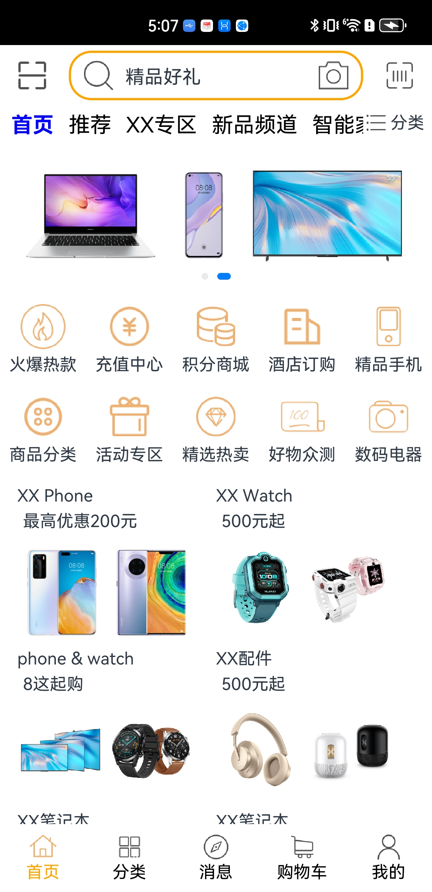
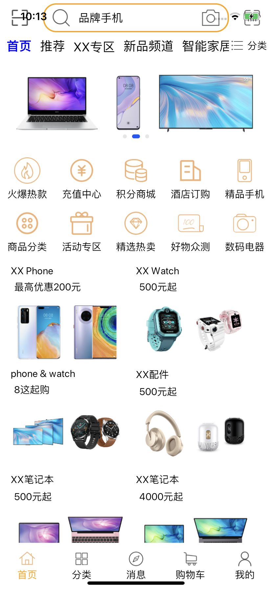
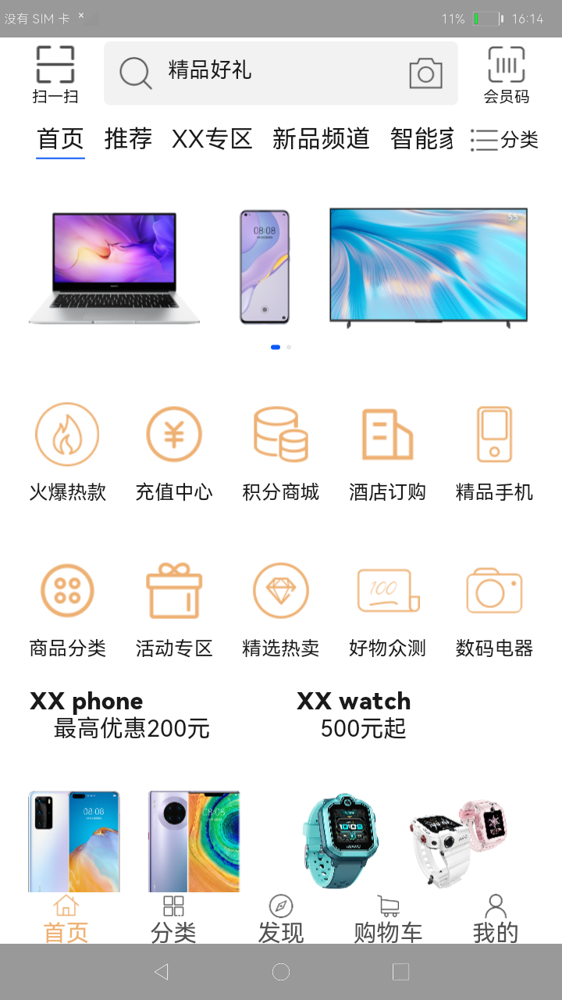

# 购物应用示例
## 简介
本示例是根据购物场景构建页面组件、布局和逻辑。效果图如下：

* Android平台展示效果

* iOS平台展示效果

* OpenHarmomy平台展示效果

## 相关概念

不涉及

## 相关权限

不涉及。

## 注意事项

1.本示例需要在工程的hvigor文件夹中添加一些配置文件,否则会编译失败，配置文件可以在下载完跨平台IDE之后，对hvigorPackage文件中的hvigorAndPlugin解压获取，获取完添加到hvigor文件夹中，并对hvigor中的hvigor-config.json5文件进行配置更新。
2.本示例已适配ArkUI-X-sdk 的IDE集成SDK，版本号：4.0.8.5。

## 使用说明

1.打开应用，首页面显示购物场景的首页。

2.点击首页中不同的物品和菜单栏，可进入相应的页面。

## 约束与限制

1.本示例支持在Android\iOS\OpenHarmony平台上运行。

2.本示例需要使用DevEco Studio 4.0 Canary2 (Build Version: 4.0.3.217, built on June 30, 2023)及以上版本才可编译运行。