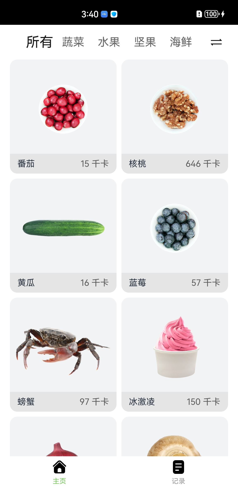
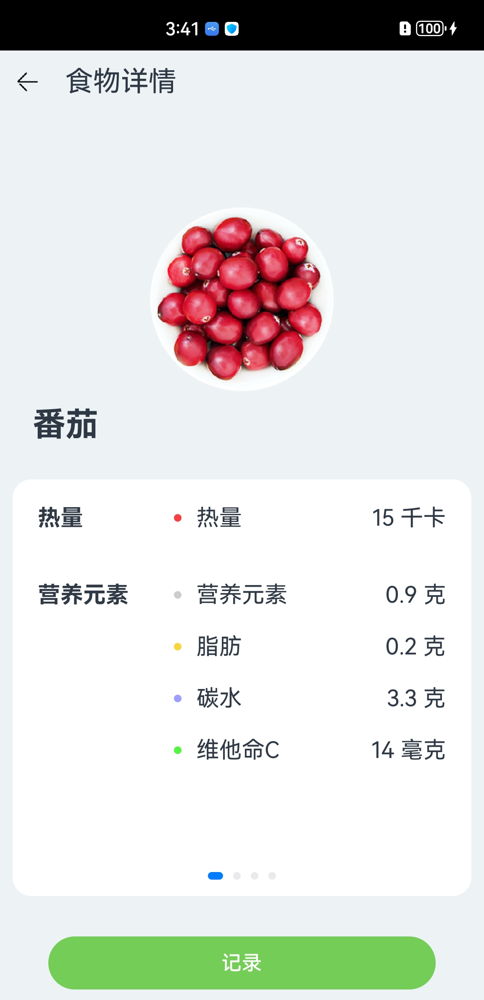
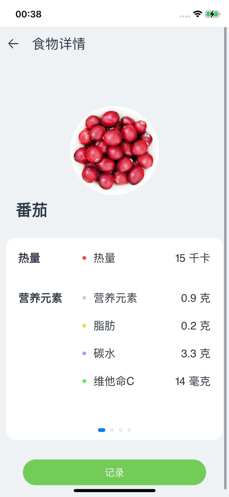
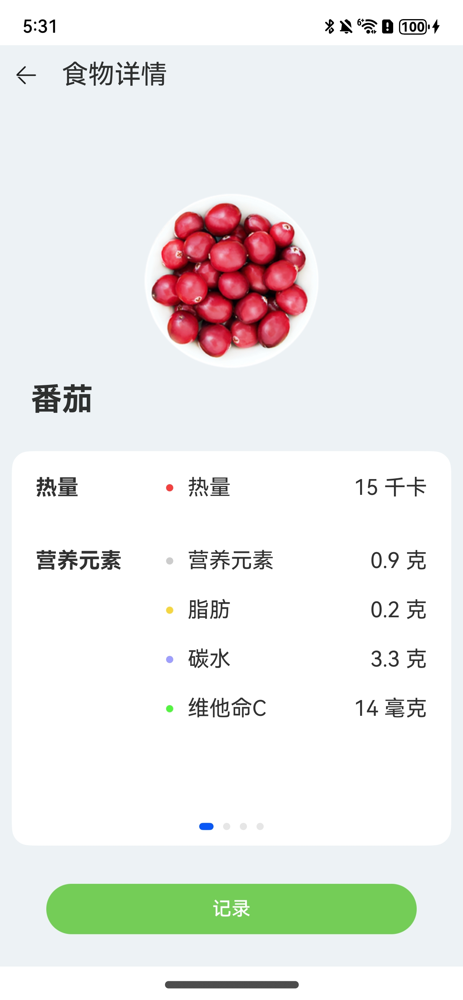

# 健康饮食应用示例
## 介绍
本示例是一个记录饮食和查看食物信息的应用，主要用于管理饮食健康。用户可以添加饮食信息，包括食物的种类、重量以及用餐时间，如早餐、 午餐、晚餐和夜宵，该应用还能统计得到相应用餐时间的总热量值、总蛋白质、总脂肪和总碳水值，并且用柱状图的形式展示出来。

## 效果预览

* Android平台展示效果

  <table>
  <tr>
      <td>
          <center>
              
          </center>
      </td>
      <td>
          <center>
              
          </center>
      </td>
      <td>
          <center>
              
          </center>
      </td>
  </tr>
  </table> 

* iOS平台展示效果

  <table>
  <tr>
      <td>
          <center>
              
          </center>
      </td>
      <td>
          <center>
              
          </center>
      </td>
      <td>
          <center>
              
          </center>
      </td>
  </tr>
  </table> 

* 鸿蒙平台展示效果

  <table>
  <tr>
      <td>
          <center>
              
          </center>
      </td>
      <td>
          <center>
              
          </center>
      </td>
      <td>
          <center>
              
          </center>
      </td>
  </tr>
  </table> 

### 使用说明

1. 本应用一共有“启动动画页面”、“主页”和“食物详情”三个主页面。

2. 启动应用，进入“启动动画页面”，动画播放完成自动进入主页。

3. 主页，使用Tabs组件把应用分为两个页签，并使用网格分类和字母排序两种方式展示所有的食物，点击食物可进入相应的食物详情页面，查看食物详情。

4. 食物“记录”页签，记录了饮食信息，通过卡片展示，卡片信息包含有食物的种类、重量、卡路里值以及用餐时间，并且以柱状图的形式展示每一餐所有食物的热量值和包含的营养元素含量；可以在卡片里面通过使用加减按钮来修改食物的重量，同时会重新统计相应用餐时间的总热量值、总蛋白质、总脂肪和总碳水值，并且柱状图的数据会及时更新。

5. 食物详情页面，使用滑动组件展示食物的详细信息，包括使用画布组件展示单位重量的食物各个营养元素的的占比,使用进度条组件展示当前食物是否为高热食物，以及展示单位重量的食物所包含的热量、脂肪、蛋白质、碳水以及维他命C值；并且点击记录按钮可以弹出记录饮食的弹窗，包括记录食物的种类、重量以及用餐时间，可以通过点击完成添加饮食，同时添加的饮食信息会在“记录”Tab页签做展示。

## 工程目录

```
HealthyDiet
  ├── AppScope                    				// App信息配置文件
  ├── entry/src/main
  │   ├── ets
  │   │   ├── common              				// 存放公共类
  │   │   |   ├── Constants.ets					// 常量
  │   │   |   └── BreakpointSystem.ets			// 封装调整页面布局和样式的方法
  │   │   ├── mock                				
  │   │   |   └── MockData.ets					// 存放所有食物的详细信息
  │   │   ├── model               				
  │   │   |   ├── DataModels.ets				// 所有实体类
  │   │   |   └── DataUtil.ets					// 封装获取食物信息的方法
  │   │   ├── entryability        				
  │   │   |   └── EntryAbility.ets				// 应用入口
  │   │   └── pages               				
  │   │       ├── Components					// 组件
  │   │       |   ├── CustomCounter.ets			// 定义调节重量的组件
  │   │       |   └── DietRecord.ets			// 用户记录饮食的页面
  │   │       ├── FoodDetail.ets 				// 食物详情页面，展示该食物详细信息
  │   │       ├── Home.ets 						// 主页，展示所有食物
  │   │       └── Logo.ets 						// 启动页面
  │   └── resources               				// 放置颜色、文字等资源
```

## 具体实现

+ 在[DataModels.ets](entry/src/main/ets/model/DataModels.ets)中定义出所有需要用到的实体类，其中包含该类的各种属性以及构造器。
+ 之后在[MockData.ets](entry/src/main/ets/mock/MockData.ets)中引用[DataModels.ets](entry/src/main/ets/model/DataModels.ets)里定义的类，创建对象并实例化，添加所有食物的信息。
+ 在[DataUtil.ets](entry/src/main/ets/model/DataUtil.ets)中，封装对食物信息进行获取、统计等方法。
+ 封装[BreakpointSystem.ets](entry/src/main/ets/common/BreakpointSystem.ets)类，在该类中引入mediaQuery接口，允许根据设备的不同特性（如屏幕大小、屏幕方向、分辨率、颜色深度等）来动态地调整网页的样式和布局。
+ 在[CustomCounter.ets](entry/src/main/ets/pages/components/CustomCounter.ets)里设置自定义小组件来调节重量，并显示。
+ 添加[DietRecord.ets](entry/src/main/ets/pages/components/DietRecord.ets)页面，内部调用CustomCounter，BreakPointType，statistics等自定义接口，在该组件中为用户展现统计信息，用户也可以使用自定义组件对数值进行修改并记录。
+ 添加[FoodDetail.ets](entry/src/main/ets/pages/FoodDetail.ets)文件，该页面展示食物的具体信息。使用@CustomDialog注解自定义Record对话框，当点击记录按钮时，可通过router路由跳转到该对话框。
+ 新建[Home.ets](entry/src/main/ets/pages/Home.ets)页面，设置主页样式，调用DataUtil，DietRecord中的接口，展示所有食物缩略图。并添加router路由，通过点击图片实现跳转到食物详情页面。
+ 在[Logo.ets](entry/src/main/ets/pages/Logo.ets)中，设置启动页的样式与显示效果，在显示一段时间后，跳转到Home主界面。

## 相关权限

不涉及。

## 依赖

不涉及。

## 约束与限制

1. 本示例支持在Android\iOS\鸿蒙系统上运行。 
2. 本示例已适配API version 12版本ArkUI-X SDK，版本号：2.0.0.27。 
3. 本示例需要使用DevEco Studio NEXT Developer Beta1 (Build Version: 5.0.3.403, built on June 20, 2024)及以上版本才可编译运行。

## 下载

如需单独下载本工程，执行如下命令：

```
git init
git config core.sparsecheckout true
echo /HealthyDiet > .git/info/sparse-checkout
git remote add origin https://gitcode.com/arkui-x/samples.git
git pull origin master
```