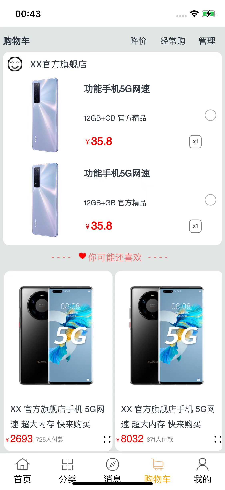

# 购物应用示例
## 介绍
本示例是根据购物场景构建页面组件、布局和逻辑。包含首页，消息页面，个人信息页，搜索页面，购物车页面和分类页面。效果图如下：

## 效果预览

* Android平台展示效果
  
  <table>
  <tr>
      <td>
          <center>
              
          </center>
      </td>
      <td>
          <center>
              
          </center>
      </td>
      <td>
          <center>
              
          </center>
      </td>
  </tr>
  <tr>
      <td>
          <center>
              
          </center>
      </td>
      <td>
          <center>
              
          </center>
      </td>
      <td>
          <center>
              
          </center>
      </td>
  </tr>
  </table> 
  
* iOS平台展示效果
  
  <table>
  <tr>
      <td>
          <center>
              
          </center>
      </td>
      <td>
          <center>
              
          </center>
      </td>
      <td>
          <center>
              
          </center>
      </td>
  </tr>
  <tr>
      <td>
          <center>
              
          </center>
      </td>
      <td>
          <center>
              
          </center>
      </td>
      <td>
          <center>
              
          </center>
      </td>
  </tr>
  </table> 
  
* 鸿蒙平台展示效果
  
  <table>
  <tr>
      <td>
          <center>
              
          </center>
      </td>
      <td>
          <center>
              
          </center>
      </td>
      <td>
          <center>
              
          </center>
      </td>
  </tr>
  <tr>
      <td>
          <center>
              
          </center>
      </td>
      <td>
          <center>
              
          </center>
      </td>
      <td>
          <center>
              
          </center>
      </td>
  </tr>
  </table> 

### 使用说明

1. 打开应用，首页面显示购物场景的首页。
2. 点击首页中的物品，可进入商品详情页。
3. 可以点击搜索栏进入搜索页。
4. 可以点击消息进入消息查看页面。
5. 可以点击分类进入商品分类页面。
6. 可以点击购物车进入购物车页面。
7. 可以点击我的进入个人信息页面。

## 工程目录

```
Shopping
  ├── AppScope								// App信息配置文件
  ├── entry/src/main
  │   ├── ets
  │   │   ├── Application
  │   │   ├── resources
  │   │   ├── data							// 存放各个页面，以及搜索框呈现物品的数据信息
  │   │   ├── model							// 存放基础的实体类
  │   │   ├── entryability					// 应用入口
  │   │   └── pages               
  │   │       ├── collect
  │   │       │   ├── collected.ets			// 收藏页面
  │   │       ├── detailPage
  │   │       │   └── detail.ets			// 商品详情页面
  │   │       ├── homePage
  │   │       │   ├── boutique.ets			// 展示商品缩略图以及简要信息组件
  │   │       │   ├── cart.ets				// 购物车页面展示加入购物车商品的组件
  │   │       │   ├── core1.ets				// 展示各种分区的组件
  │   │       │   ├── core2.ets
  │   │       │   ├── find.ets				// 展示搜索框以及渲染商品信息组件
  │   │       │   ├── goodsList.ets			// 首页展示商品信息的列表组件
  │   │       │   ├── imageItem.ets			// 分类页面展示商品信息组件
  │   │       │   ├── informance.ets		// 消息页面
  │   │       │   ├── main.ets				// 首页
  │   │       │   ├── other.ets				// 购物车页面展示推荐商品信息的组件
  │   │       │   ├── shopCart.ets			// 购物车页面
  │   │       │   ├── User.ets				// 个人信息页面
  │   │       │   └── visitPage.ets			// 分类展示商品页面
  │   │       ├── search
  │   │       │   └── searchPage.ets		// 搜索页面
  │   │       └── index.ets					// 应用首页
  │   └── resources							// 放置颜色、文字等资源
```

## 具体实现

+ 首先在[model](entry/src/main/ets/model)目录下定义该应用用到的所有实体类的结构，包括属性和构造器。例如[detailModel.ets](entry/src/main/ets/model/detailModel.ets), [homeModel.ets](entry/src/main/ets/model/homeModel.ets), [searchModel.ets](entry/src/main/ets/model/searchModel.ets)。
+ 然后在[data](entry/src/main/ets/data)目录中，根据model定义的实体类，进行实例化，添加所有商品信息。例如[detailData.ets](entry/src/main/ets/data/detailData.ets), [homeData.ets](entry/src/main/ets/data/homeData.ets), [searchData.ets](entry/src/main/ets/data/searchData.ets)。此外在该目录中还定义了商品类型的类[GoodsType](entry/src/main/ets/data/singleData.ets)。
+ 之后在[pages](entry/src/main/ets/pages)目录下，添加所有组件和页面。
  - 首先在[collect](entry/src/main/ets/pages/collect)目录下添加收藏页面[collected.ets](entry/src/main/ets/pages/collect/collected.ets)，在该ets文件中，调用并展示自定义的商品信息组件，例如：[nullPage.ets](entry/src/main/ets/pages/collect/nullPage.ets), [singlePage1.ets](entry/src/main/ets/pages/collect/singlePage1.ets)等。
  - 之后在[detailPage](entry/src/main/ets/pages/detailPage)目录下添加商品信息页[detail.ets](entry/src/main/ets/pages/detailPage/detail.ets)，调用detailModel与detailData中自定义类，完成对商品信息页面内容的展示。
  - 在[search](entry/src/main/ets/pages/search)目录下添加点击搜索框后呈现的搜索页面[searchPage.ets](entry/src/main/ets/pages/search/searchPage.ets)。
  - 在[homePage](entry/src/main/ets/pages/homePage)目录下，添加所有子页面与子组件。
    - 在[visitPage.ets](entry/src/main/ets/pages/homePage/visitPage.ets)文件中引用[find.ets](entry/src/main/ets/pages/homePage/find.ets)中的FindPage组件来展示分类页面内容。
    - 在[User.ets](entry/src/main/ets/pages/homePage/User.ets)文件中引用[core2.ets](entry/src/main/ets/pages/homePage/core2.ets)中的Core2组件来展示个人信息页面。
    - 在[shopCarts.ets](entry/src/main/ets/pages/homePage/shopCart.ets)文件中引用[cart.ets](entry/src/main/ets/pages/homePage/cart.ets)的Cart组件和[other.ets](entry/src/main/ets/pages/homePage/other.ets)的Other组件来展示购物车页面内容。
    - 在[main.ets](entry/src/main/ets/pages/homePage/main.ets)文件中，调用[core1.ets](entry/src/main/ets/pages/homePage/core1.ets)，[boutique.ets](entry/src/main/ets/pages/homePage/boutique.ets)，[goodsList.ets](entry/src/main/ets/pages/homePage/goodsList.ets)的组件来展示主页面。
  - 在首页[Index.ets](entry/src/main/ets/pages/index.ets)中，调用mediaquery接口来调整页面和样式。调用homeModel中TabTitleModel来设置下方导航栏。同时引用上述自定义的User，ShopCart，Information，VisitPage，MainPage组件来展示不同界面。

## 相关权限

不涉及。

## 依赖

不涉及。

## 约束与限制

1. 本示例支持在Android\iOS\鸿蒙系统上运行。

2. 本示例已适配API version 12版本ArkUI-X SDK，版本号：2.0.0.27。 
3. 本示例需要使用DevEco Studio NEXT Developer Beta1 (Build Version: 5.0.3.403, built on June 20, 2024)及以上版本才可编译运行。
## 下载

如需单独下载本工程，执行如下命令：

```
git init
git config core.sparsecheckout true
echo /Shopping > .git/info/sparse-checkout
git remote add origin https://gitee.com/arkui-x/samples.git
git pull origin master
```

