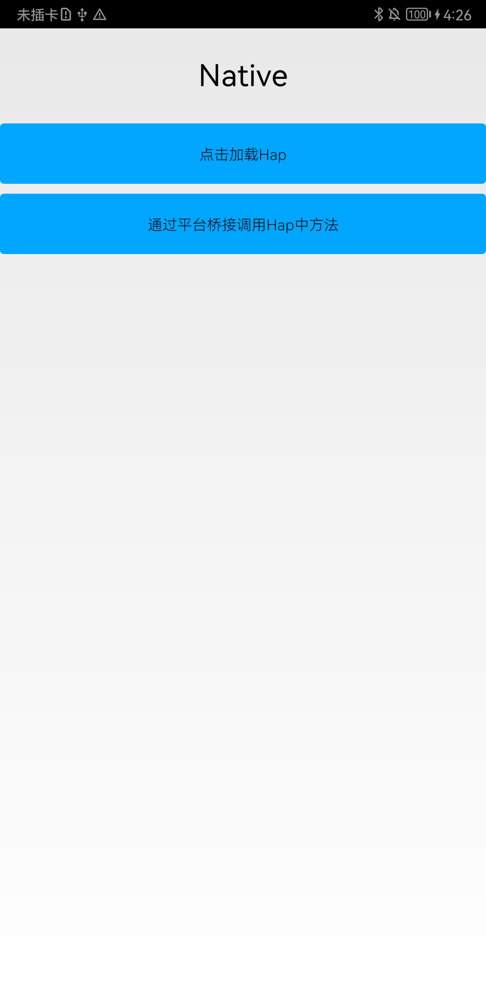
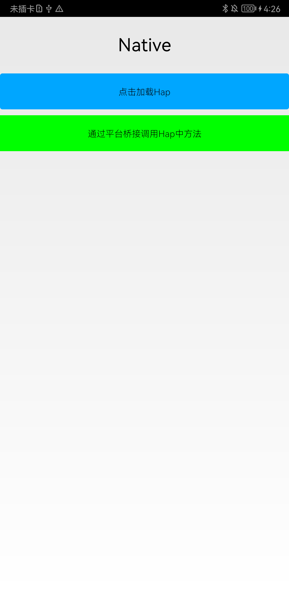
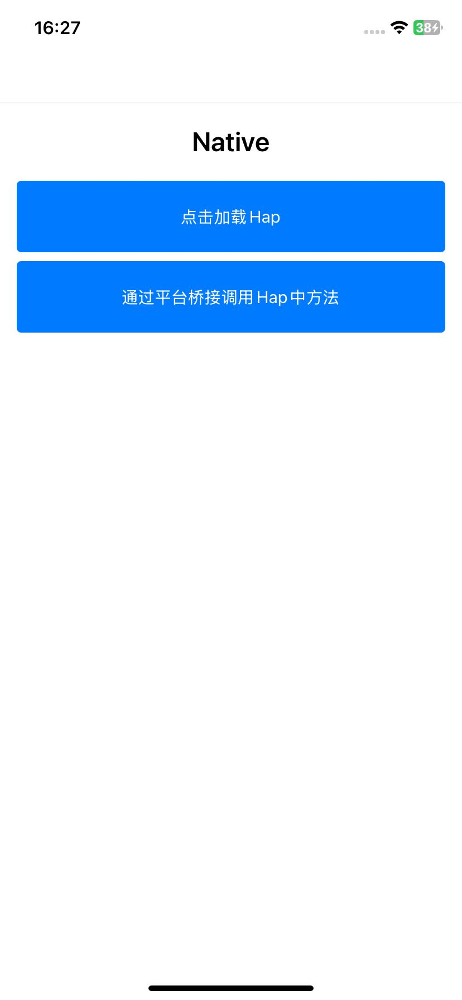
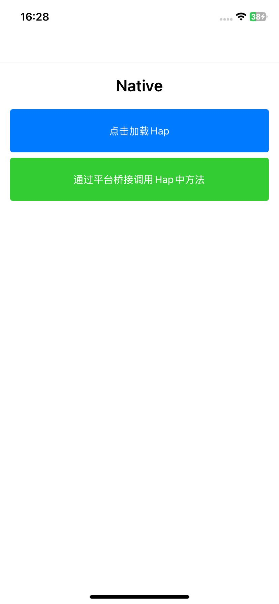

# 支持UI与业务解耦，实现不带UI的独立业务逻辑跨平台应用示例

## 介绍

ArkUI-X框架支持加载特殊形式的ArkTS侧Hap包，在该Hap中，开发者可以不实现UI界面，而只关心业务逻辑的开发实现。<br>
应用UI使用原生侧（Android/iOS）能力实现，通过平台桥接能力调用ArkTS侧Hap包的业务逻辑。从而实现应用UI与业务逻辑解耦的目的。

## 效果预览

|                 Android平台                 |                                                            |                 iOS平台                 |                                                        |
| :-----------------------------------------: | :--------------------------------------------------------: | :-------------------------------------: | :----------------------------------------------------: |
|                  应用首页                   |                     调用hap包方法效果                      |                应用首页                 |                   调用hap包方法效果                    |
|  |  |  |  |

### 使用说明

1. 打开app，进入应用首页，主页面显示页面标题："Native"，存在两个按钮，分别为"点击加载Hap"、"通过平台桥接调用Hap中方法"。<br>
2. 点击界面按钮"点击加载Hap"，触发加载Hap包。<br>
3. 点击界面按钮"通过平台桥接调用Hap中方法"，通过平台桥接调用Hap包中方法，调用成功后按钮变为绿色。<br>

## 工程目录

```
.
├── .arkui-x
│   ├── android
│   │   ├── app
│   │   │   └── src
│   │   │       └── main
│   │   │           ├── AndroidManifest.xml
│   │   │           ├── java
│   │   │           │   └── com
│   │   │           │       └── example
│   │   │           │           └── hspui
│   │   │           │               ├── BridgeUtil.java						// Android端 实现Bridge核心功能
│   │   │           │               ├── NativeActivity.java					// Android端 原生 Activity
│   │   │           │               └── MyApplication.java
│   │   │           └── res
│   │   ├── build.gradle
│   │   ├── gradle
│   │   ├── gradle.properties
│   │   ├── gradlew
│   │   ├── gradlew.bat
│   │   └── settings.gradle
│   ├── arkui-x-config.json5
│   └── ios
│       ├── app
│       │   ├── AppDelegate.h
│       │   ├── AppDelegate.m
│       │   ├── Assets.xcassets
│       │   ├── Base.lproj
│       │   ├── BridgeUtil.h												// iOS端 实现Bridge核心功能
│       │   ├── BridgeUtil.m
│       │   ├── Info.plist
│       │   ├── main.m
│       │   ├── NativeViewController.h										// iOS端 原生 ViewController
│       │   └── NativeViewController.m
│       └── app.xcodeproj
├── build-profile.json5
├── code-linter.json5
├── entry
│   ├── build-profile.json5													// 配置MyModuleLoader路径信息
│   ├── hvigorfile.ts
│   ├── obfuscation-rules.txt
│   ├── oh-package.json5
│   └── src
│       └── main
│           ├── ets
│           │   ├── BridgeUtil.ets											// ArkTS端 实现Bridge核心功能
│           │   ├── MyModuleLoader.ets										// ArkTS端 继承ModuleLoader的实例class
│           │   ├── entryability
│           │   │   └── EntryAbility.ets
│           │   └── pages
│           │       └── EnterPage.ets
│           ├── module.json5
│           └── resources
├── hvigor
│   └── hvigor-config.json5
├── hvigorfile.ts
├── oh-package.json5
├── README.md
└── screenshots
```

## 具体实现

* 平台桥接Bridge相关文档参考[ArkTS侧](https://gitcode.com/arkui-x/docs/blob/master/zh-cn/application-dev/reference/apis/js-apis-bridge.md) 、[Android侧](https://gitcode.com/arkui-x/docs/blob/master/zh-cn/application-dev/tutorial/how-to-use-bridge-on-android.md)，[iOS侧](https://gitcode.com/arkui-x/docs/blob/master/zh-cn/application-dev/tutorial/how-to-use-bridge-on-ios.md)。
* ArkTS侧：实现[MyModuleLoader.ets](./entry/src/main/ets/MyModuleLoader.ets)。在onLoad回调中实现ArkTS侧Bridge初始化。
* ArkTS侧：在[build-profile.json5](./entry/build-profile.json5)中配置`MyModuleLoader.ets`的路径信息。
* 原生侧：调用`loadModule`接口，触发加载ArkTS侧Hap
* 原生侧：确认加载Hap完毕后，通过平台桥接能力调用ArkTS侧Hap包中方法。

## 相关权限

不涉及。

## 依赖

不涉及。

## 约束与限制

1. 开发前请务必阅览[开发文档](https://gitcode.com/arkui-x/docs/blob/master/zh-cn/application-dev/quick-start/decoupled-UI-and-Logic.md)，尤其注意`约束与限制`。
2. 本示例仅支持标准Android和iOS和设备系统上运行。

2. 本示例已适配API version 23及以上版本的ArkUI-X SDK。

3. 本示例需要使用DevEco Studio 6.0.1 Release及以上版本才可编译运行。

##  下载

如需单独下载本工程，执行如下命令：

```
git init
git config core.sparsecheckout true
echo /SuperFeature/DecoupledUIAndLogic > .git/info/sparse-checkout
git remote add origin https://gitcode.com/arkui-x/samples.git
git pull origin master
```
