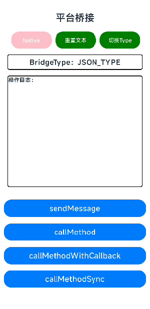
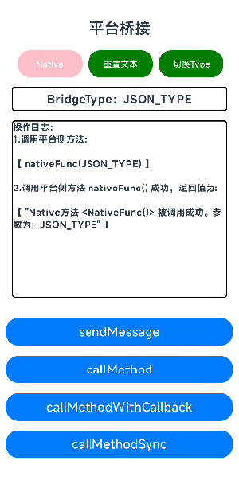
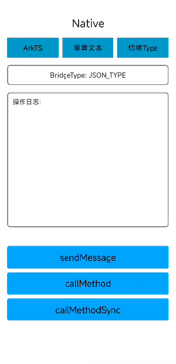
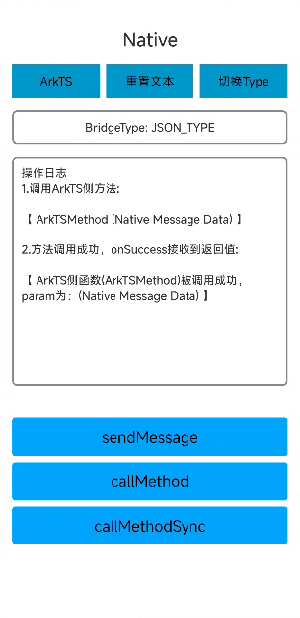
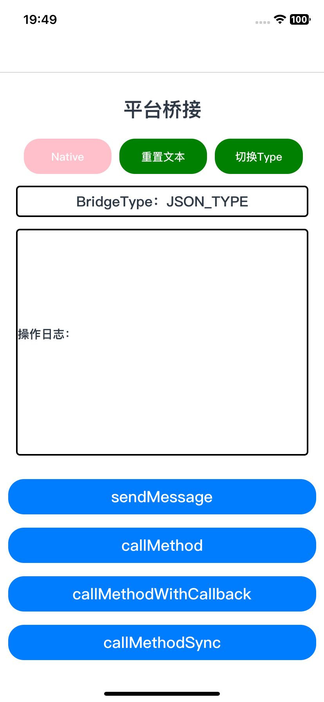
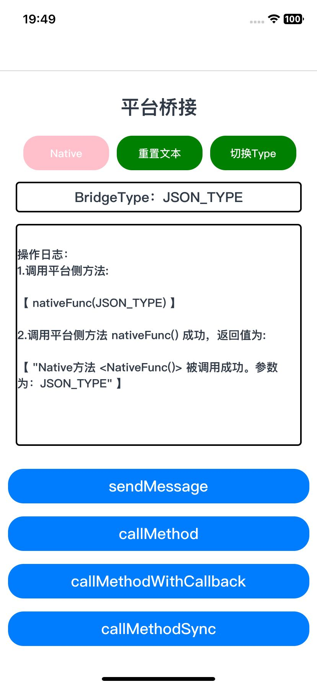
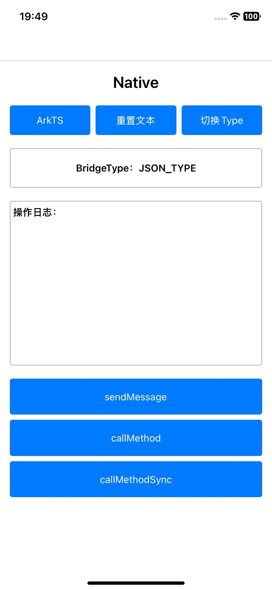
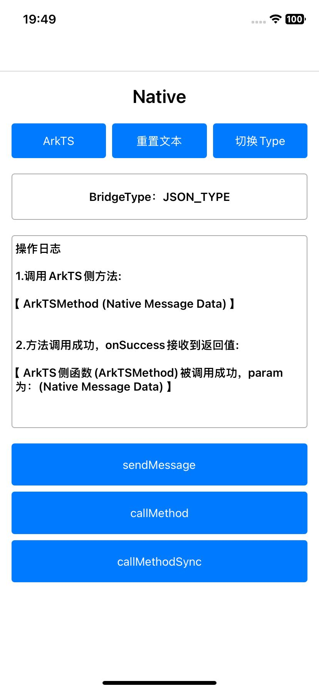

# Bridge平台桥接应用示例

## 介绍

本示例是根据Bridge功能(提供ArkTS侧和原生侧消息通信的功能，包括数据传输、方法调用)构建页面组件、布局和逻辑的应用。

## 效果预览

|                         Android平台                          |                                                              |                                                              |                                                              |
| :----------------------------------------------------------: | :----------------------------------------------------------: | :----------------------------------------------------------: | :----------------------------------------------------------: |
|                          ArkTS主页                           |             ArkTS侧点击"callMethod"按钮展示效果              |                       Android原生主页                        |            Android侧点击“callMethod”按钮展示效果             |
|  |  |  |  |


| iOS平台                                                 |                                                              |                                                           |                                                              |
| ------------------------------------------------------- | ------------------------------------------------------------ | --------------------------------------------------------- | ------------------------------------------------------------ |
| ArkTS主页                                               | ArkTS侧点击"callMethod"按钮展示效果                          | iOS原生主页                                               | iOS侧点击“callMethod”按钮展示效果                            |
|  |  |  |  |


### 使用说明

1.打开app，进入ArKTS主页，主页面上方三个Button从左到右分别为"Native"，"重置文本"，"切换Type"。

- "Native"：实现ArkTS页面和Native页面的页面切换。
- "重置文本"：重置界面的“操作日志”文本组件内容。
- "切换Type"：切换当前Bridge对象的BridgeType。

2.点击“切换Type”按钮将BridgeType切换成JSON_TYPE，点击按钮“callMethod”，ArkTS调用平台侧方法"nativeFunc(String param)",调用成功后，ArkTS获取其函数返回值，在界面的“操作日志”文本组件输出结果。

3.点击按钮“Native”切换至平台原生界面。 

4.点击“切换Type”按钮将BridgeType切换成JSON_TYPE，点击按钮“callMethod”，平台侧调用ArkTS侧已注册方法"ArkTSMethod(...parameters: bridge.Message[])",调用成功后，平台侧获取其函数返回值，在界面的“操作日志”文本组件输出结果。

## 工程目录

```
.
├── .arkui-x
│   ├── android
│   │   ├── app
│   │   │   └── src
│   │   │       └── main
│   │   │           ├── AndroidManifest.xml
│   │   │           ├── java
│   │   │           │   └── com
│   │   │           │       └── example
│   │   │           │           └── bridge
│   │   │           │               ├── BridgeManager.java					// Android端 Bridge核心管理器
│   │   │           │               ├── BridgeUtil.java						// Android端 实现Bridge核心功能
│   │   │           │               ├── EntryEntryAbilityActivity.java		// Android端 ArkTS Activity
│   │   │           │               ├── EntryNativeAbilityActivity.java		// Android端 原生 Activity
│   │   │           │               └── MyApplication.java
│   │   │           └── res
│   │   ├── build.gradle
│   │   ├── gradle
│   │   ├── gradle.properties
│   │   ├── gradlew
│   │   ├── gradlew.bat
│   │   └── settings.gradle
│   ├── arkui-x-config.json5
│   └── ios
│       ├── app
│       │   ├── AppDelegate.h
│       │   ├── AppDelegate.m
│       │   ├── Assets.xcassets
│       │   ├── Base.lproj
│       │   ├── bridge
│       │   │   ├── BridgeManager.h											// iOS端 Bridge核心管理器
│       │   │   ├── BridgeManager.m									
│       │   │   ├── BridgeUtil.h											// iOS端 实现Bridge核心功能
│       │   │   └── BridgeUtil.m
│       │   ├── entry
│       │   │   ├── EntryEntryAbilityViewController.h						// iOS端 ArkTS Activity
│       │   │   └── EntryEntryAbilityViewController.m
│       │   ├── Info.plist
│       │   ├── main.m
│       │   └── nativeAbility
│       │       ├── NativeAbilityViewController.h							// iOS端 原生 Activity
│       │       └── NativeAbilityViewController.m
│       └── app.xcodeproj
├── build-profile.json5
├── code-linter.json5
├── entry
│   ├── build-profile.json5
│   ├── hvigorfile.ts
│   ├── obfuscation-rules.txt
│   ├── oh-package.json5
│   └── src
│       └── main
│           ├── ets
│           │   ├── BridgeManager.ets										// ArkTS端 Bridge核心管理器
│           │   ├── BridgeUtil.ets											// ArkTS端 实现Bridge核心功能
│           │   ├── entryability
│           │   │   └── EntryAbility.ets
│           │   └── pages
│           │       └── EnterPage.ets										// ArkTS端 应用界面
│           ├── module.json5
│           └── resources
├── hvigor
│   └── hvigor-config.json5
├── hvigorfile.ts
├── oh-package.json5
├── README.md
└── screenshots
```

## 具体实现

* Bridge相关接口文档参考[ @arkui-x.bridge.d.ts ](https://gitcode.com/arkui-x/docs/blob/master/zh-cn/application-dev/reference/apis/js-apis-bridge.md) 。
* 创建平台桥接实例。
  * 需指定名称，该名称ArkTS侧与平台侧保持一致。
  * 在创建平台桥接实例时，可以指定平台桥接模式，平台桥接模式目前分为[JSON编解码模式](https://gitcode.com/arkui-x/docs/blob/master/zh-cn/application-dev/reference/apis/js-apis-bridge.md#bridgetype)，[二进制编解码模式](https://gitcode.com/arkui-x/docs/blob/master/zh-cn/application-dev/reference/apis/js-apis-bridge.md#bridgetype)，默认为JSON编解码模式。
  * 平台桥接实例参考: [createBridge（ArkTS）](https://gitcode.com/arkui-x/docs/blob/master/zh-cn/application-dev/reference/apis/js-apis-bridge.md#createbridge)， [BridgePlugin（Android）](https://gitcode.com/arkui-x/docs/blob/master/zh-cn/application-dev/reference/arkui-for-android/BridgePlugin.md#bridgeplugin11)，[initBridgePlugin（iOS）](https://gitcode.com/arkui-x/docs/blob/master/zh-cn/application-dev/reference/arkui-for-ios/BridgePlugin.md#initbridgeplugin11) 。
* 数据传递：ArkTS侧传递数据到平台侧，平台侧传递数据到ArkTS侧。
  * 发送数据，接口参考: [sendMessage（ArkTS）](https://gitcode.com/arkui-x/docs/blob/master/zh-cn/application-dev/reference/apis/js-apis-bridge.md#sendmessage)， [sendMessage（Android）](https://gitcode.com/arkui-x/docs/blob/master/zh-cn/application-dev/reference/arkui-for-android/BridgePlugin.md#sendmessage)，[ sendMessage（iOS）](https://gitcode.com/arkui-x/docs/blob/master/zh-cn/application-dev/reference/arkui-for-ios/BridgePlugin.md#sendmessage) 。
  * 接收数据，接口参考: [setMessageListener（ArkTS）](https://gitcode.com/arkui-x/docs/blob/master/zh-cn/application-dev/reference/apis/js-apis-bridge.md#setmessagelistener)， [setMessageListener（Android）](https://gitcode.com/arkui-x/docs/blob/master/zh-cn/application-dev/reference/arkui-for-android/BridgePlugin.md#setmessagelistener)，[ messageListener（iOS）](https://gitcode.com/arkui-x/docs/blob/master/zh-cn/application-dev/reference/arkui-for-ios/BridgePlugin.md#messagelistener) 。
  * 数据类型支持参考: [数据类型支持](https://gitcode.com/arkui-x/docs/blob/master/zh-cn/application-dev/quick-start/platform-bridge-introduction.md#数据类型支持) 。
* 方法调用：ArkTS侧调用平台侧定义的方法，平台侧调用ArkTS侧定义的方法。
  * 定义方法：Android侧定义方法时需将访问修饰符定义为public。
  * 方法注册：ArkTS侧需要通过方法[registerMethod](https://gitcode.com/arkui-x/docs/blob/master/zh-cn/application-dev/reference/apis/js-apis-bridge.md#registermethod)定义被平台侧调用的方法，以便平台侧调用。平台侧无需方法注册。
  * 调用方法，接口参考: [callMethod（ArkTS）](https://gitcode.com/arkui-x/docs/blob/master/zh-cn/application-dev/reference/apis/js-apis-bridge.md#callmethod)， [callMethod（Android）](https://gitcode.com/arkui-x/docs/blob/master/zh-cn/application-dev/reference/arkui-for-android/BridgePlugin.md#callmethod)，[ callMethod（iOS）](https://gitcode.com/arkui-x/docs/blob/master/zh-cn/application-dev/reference/arkui-for-ios/BridgePlugin.md#callmethod) 。
* 本应用ArkTS侧基本页面展示封装在EnterPage中，源码参考：[EnterPage.ets](entry/src/main/ets/pages/EnterPage.ets)
  * 展示基本的UI界面：包含Text和Button组件的基本构造实现。
  * 通过点击按钮的方式调用Bridge接口，将结果信息写入界面Text组件中进行展示。
* 本应用Android原生页面展示封装在EntryNativeAbilityActivity中，源码参考：[EntryNativeAbilityActivity.java](.arkui-x/android/app/src/main/java/com/example/bridge/EntryNativeAbilityActivity.java)
  * 展示原生交互界面：包含操作日志显示区、Bridge类型显示区以及多个功能按钮。
  * 通过点击按钮的方式调用Bridge接口，再将其执行情况写入TextView中进行展示。
* 本应用iOS原生页面展示封装在NativeAbilityViewController中，源码参考：[NativeAbilityViewController.m](.arkui-x/ios/app/nativeAbility/NativeAbilityViewController.m)
  * 展示原生交互界面：UITextView和UIButton组件的基本构造实现。
  * 通过点击按钮的方式调用Bridge接口，再将其执行情况写入UITextView中进行展示。
* 平台桥接开发指南参考：[Android](https://gitcode.com/arkui-x/docs/blob/master/zh-cn/application-dev/tutorial/how-to-use-bridge-on-android.md)，[iOS](https://gitcode.com/arkui-x/docs/blob/master/zh-cn/application-dev/tutorial/how-to-use-bridge-on-ios.md)

## 相关权限

不涉及。

## 依赖

不涉及。

## 约束与限制

1.本示例仅支持标准Android和iOS和设备系统上运行。

2.本示例已适配API version 22及以上版本的ArkUI-X SDK。

3.本示例需要使用DevEco Studio 6.0.0 Release及以上版本才可编译运行。

##  下载

如需单独下载本工程，执行如下命令：

```
git init
git config core.sparsecheckout true
echo /SuperFeature/PlatformBridge > .git/info/sparse-checkout
git remote add origin https://gitcode.com/arkui-x/samples.git
git pull origin master
```

