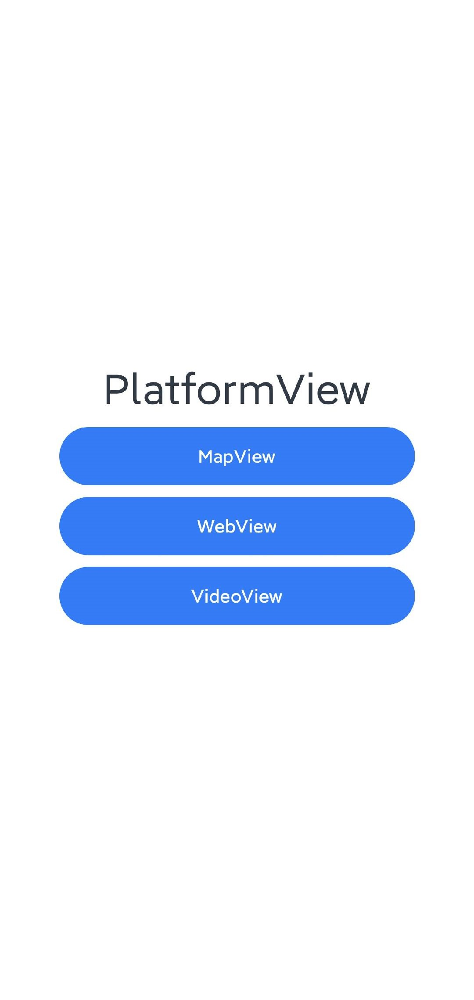
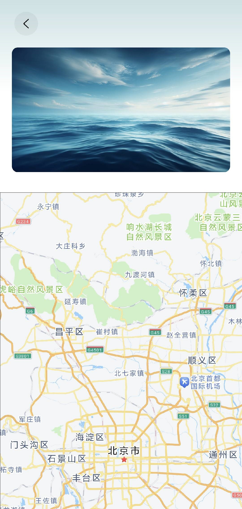
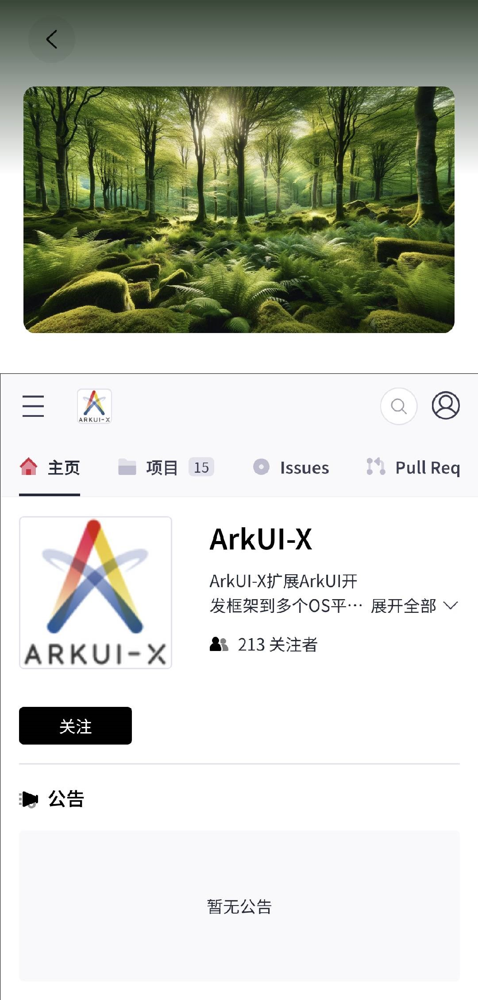

# PlatformView 平台视图应用示例

## 介绍

本示例使用 PlatformView 功能（原生组件嵌入 ArkUI 界面中）在 ArkUI 界面中使用原生 Mapview , WebView 和 播放视频。

## 效果预览

| Android 平台                                                 |                                                              |                                                              |                                                              |
| ------------------------------------------------------------ | ------------------------------------------------------------ | ------------------------------------------------------------ | ------------------------------------------------------------ |
| 主页面展示效果                                               | PlatformView MapView 展示效果                                | PlatformView Webview 展示效果                                | PlatformView Videoview 展示效果                              |
|  |  |  |  |
| **iOS 平台**                                                 |                                                              |                                                              |                                                              |
| 主页面展示效果                                               | PlatformView MapView 展示效果                                | PlatformView Webview 展示效果                                | PlatformView Videoview 展示效果                              |
|       |  |  |  |


### 使用说明

1.打开 app，主页面显示 MapView, WebView 和VideoView对应按钮。

2.点击按钮进入对应界面，使用原生的 MapView , WebView 和VideoView 功能。

## 工程目录

```
.arkui-x
|---android/app/src/main/java/com/example/platformview
|   |---EntryEntryAbilityActivity.java	   			// Android侧注册PlatformViewFactory类
|   |---MyPlatformViewFactory.java					// Android侧PlatformViewFactory接口实现
|   |---MyMapView.java								// Android侧IPlatformView接口实现，使用原生地图组件
|   |---MyWebView.java								// Android侧IPlatformView接口实现，使用原生WebView
|   |---MyVideoView.java							// Android侧IPlatformView接口实现，使用原生播放视频
|---/ios/app
|   |---EntryEntryAbilityActivity.m	         		// iOS侧注册PlatformViewFactory类
|   |---MyPlatformViewFactory.h						// iOS侧PlatformViewFactory接口实现
|   |---MyPlatformViewFactory.m						// iOS侧PlatformViewFactory接口实现
|   |---MyMapView.h									// iOS侧IPlatformView接口实现，使用原生地图组件
|   |---MyMapView.m									// iOS侧IPlatformView接口实现，使用原生地图组件
|   |---MyWebView.h									// iOS侧IPlatformView接口实现，使用原生WebView
|   |---MyWebView.m									// iOS侧IPlatformView接口实现，使用原生WebView
|   |---MyVideoView.h								// iOS侧IPlatformView接口实现，使用原生播放视频
|   |---MyVideoView.m								// iOS侧IPlatformView接口实现，使用原生播放视频
entry/src/main/ets
|---entryability
|---pages
|   |---index.ets                          			// 主页面
|   |---MapView.ets									// arkui-x ets侧PlatformView-MapView实现
|   |---WebView.ets									// arkui-x ets侧PlatformView-WebView实现
|   |---VideoView.ets								// arkui-x ets侧PlatformView-VideoView
```

## 具体实现

+ ets 侧创建 PlatformVIew 实例，确保 ID 唯一，用于区分原生组件。
+ 平台侧实现 PlatformVIew 相关接口。
  + 新建一个实现 IPlatformView 接口的类，并实现 getView 、onDispose() 接口，同时完成原生组件的创建等相关操作。
  + 新建一个实现 PlatformViewFactory 接口的类，并实现 getPlatformView() 接口，根据 ID 创建 IPlatformView 对象。

+ 平台侧注册 PlatformViewFactory 类
  + Android 在继承 StageActivity 的类中，在其 onCreate 方法中创建 PlatformViewFactory 对象，并调用 registerPlatformViewFactory()方法注册。
  + iOS 在继承 ViewController 的类中，在其 viewDidLoad 方法中创建 PlatformViewFactory 对象，并调用 registerPlatformViewFactory()方法注册。
+ PlatformView 相关接口文档参考：[Android](https://gitcode.com/arkui-x/docs/blob/master/zh-cn/application-dev/reference/arkui-for-android/platformview-interface-android.md)，[iOS](https://gitcode.com/arkui-x/docs/blob/master/zh-cn/application-dev/reference/arkui-for-ios/platformview-interface-ios.md)
+ Platformview 平台视图开发指南参考：[Android](https://gitcode.com/arkui-x/docs/blob/master/zh-cn/application-dev/tutorial/how-to-use-platformview-on-android.md)，[iOS](https://gitcode.com/arkui-x/docs/blob/master/zh-cn/application-dev/tutorial/how-to-use-platformview-on-ios.md)

## 相关权限

需要网络权限。

## 依赖

对于 Android 平台的 MapView，需要下载 [高德地图 3D 地图合包(AAR包)](https://lbs.amap.com/api/android-sdk/download/)，并将压缩包里的内容拷贝至 Android 工程的 app/libs 目录下。

## 约束与限制

1.本示例仅支持标准 Android/iOS 上运行。

2.本示例已适配 API version 14以上版本的 ArkUI-X SDK，需要配套 API version 14以上版本的 OpenHarmony SDK。

3.本示例需要使用 API version 14以上版本的 DevEco Studio才可编译运行。

## 下载

如需单独下载本工程，执行如下命令：

```
git init
git config core.sparsecheckout true
echo /SuperFeature/PlatformView > .git/info/sparse-checkout
git remote add origin https://gitcode.com/arkui-x/samples.git
git pull origin master
```