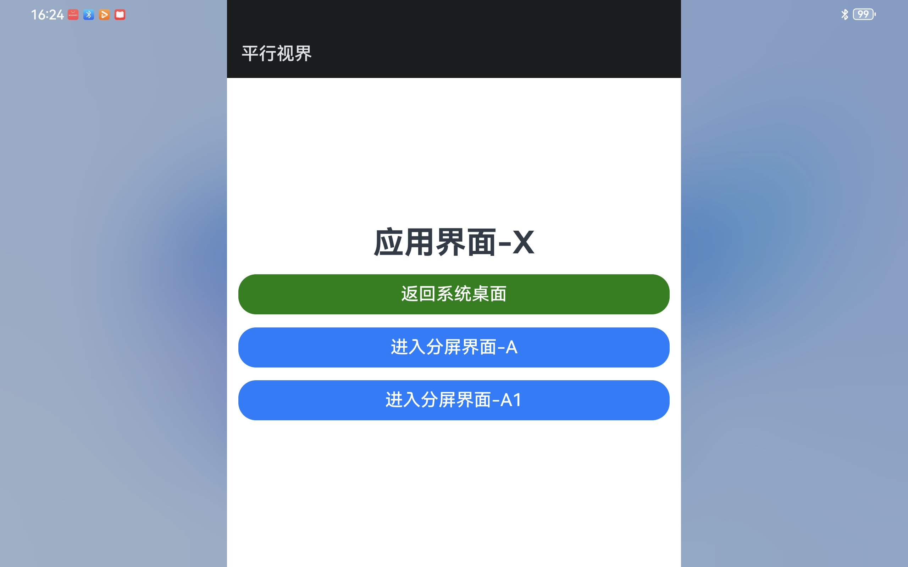
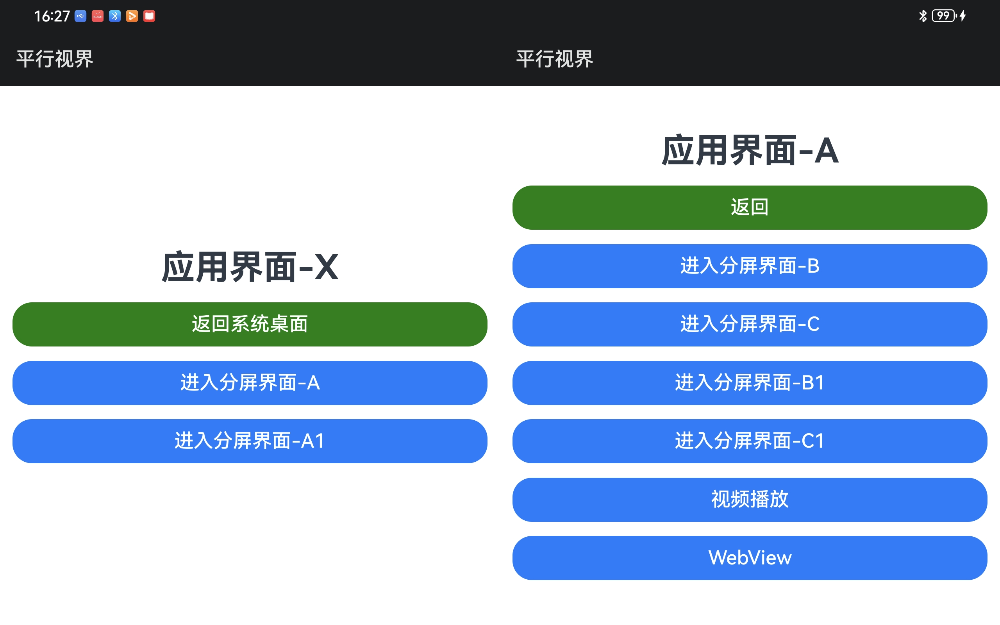

# 平行视界应用示例

## 介绍

平行视界以Activity作为基本单位，利用左右窗口分离显示技术双窗口生命周期管理、双窗口显示模式和切换逻辑等核心技术，实现应用内分屏的系统级解决方案。应用可以根据自身业务需求设计分屏显示的Activity组合，最优的单应用多窗口用户体验，并支持一次开发、多端部署。

有关详细的配置指导请参考[平行视界开发指南](https://gitcode.com/arkui-x/docs/blob/master/zh-cn/application-dev/tutorial/how-to-use-split-screen-view.md)。

## 效果预览

| Android 平台                                                 |                                                              |
| ------------------------------------------------------------ | ------------------------------------------------------------ |
| 主页面展示效果                                               | 分屏展示效果                                                 |
|  |  |

### 使用说明

1.打开 app，主页面标题文本为 “应用界面-X”。

2.点击按钮 “进入分屏界面-A”，触发分屏展示，左侧页面标题文本为 “应用界面-X”；右侧页面标题文本为 “应用界面-A”。

3.左分屏页面点击按钮 “进入分屏界面-A1”，触发右分屏界面刷新，新页面标题文本为 “应用界面-A1”。

4.左分屏页面点击按钮 “进入分屏界面-A”，触发右分屏界面刷新，新页面标题文本为 “应用界面-A”。右分屏点击界面按钮 “进入分屏界面-B”。触发新的分屏展示，左分屏展示页面标题文本为 “应用界面-A”；右分屏页面标题文本为 “应用界面-B”。

5.在步骤4的结果界面基础上，左分屏页面点击按钮 “视频播放”，进入视频播放页面。

6.在步骤4的结果界面基础上，左分屏页面点击按钮 “WebView”，进入网页页面。（正确查看网页需提前为手机连接网络）

## 工程目录

```
.arkui-x
    ├── android
    │   ├── app
    │   │   ├── build.gradle
    │   │   └── src
    │   │       └── main
    │   │           ├── AndroidManifest.xml
    │   │           ├── assets
    │   │           │   └── easygo.json			//平行视界核心配置文件
    │   │           ├── java
    │   │           │   └── com
    │   │           │       └── example
    │   │           │           └── splitscreenview
    │   │           │               ├── EntryEntryAbilityActivity.java
    │   │           │               ├── EntryFeature1AbilityActivity.java
    │   │           │               ├── EntryFeature2AbilityActivity.java
    │   │           │               ├── EntryFeature3AbilityActivity.java
    │   │           │               ├── EntryMain1AbilityActivity.java
    │   │           │               ├── EntryMain2AbilityActivity.java
    │   │           │               ├── EntryMain3AbilityActivity.java
    │   │           │               ├── MyApplication.java
    │   │           │               ├── MyPlatformViewFactory.java
    │   │           │               ├── MyVideoView.java
    │   │           │               └── MyWebView.java
    │   │           └── res
    │   │               ├── drawable
    │   │               │   └── arkuix.png
    │   │               └── values
    │   │                   └── strings.xml
    │   ├── buildArkTS
    │   ├── buildArkTS.bat
    │   ├── build.gradle
    │   ├── gradle
    │   ├── gradle.properties
    │   ├── gradlew
    │   ├── gradlew.bat
    │   └── settings.gradle
    ├── arkui-x-config.json5
```

## 具体实现

+ 创建多个Activity实例，分别加载页面“应用界面-X”、“应用界面-A”、“应用界面-B”、“应用界面-A1”等。
+ 于.arkui-x/android/app/src/main/assets/easygo.json中实现平行视界的相关配置，可参考[平行视界开发指南](https://gitcode.com/arkui-x/docs/blob/master/zh-cn/application-dev/tutorial/how-to-use-split-screen-view.md)
+ 平台侧实现 PlatformVIew 相关接口，用于加载视频播放。
+ 平台侧实现 PlatformVIew 相关接口，用于加载网页。

## 相关权限

需要网络权限。

## 约束与限制

1.本示例仅支持 Android系统的折叠屏设备和平板设备上运行。要求运行设备系统本身支持平行视界功能。安装应用后在系统设置中打开应用的“平行视界”开关。

注意：不同设备系统关于“平行视界”功能的描述名称、相应系统设置的设置方式请以实际厂家标准为准。

2.本示例已适配 API version 20以上版本的 ArkUI-X SDK，需要配套 API version 20以上版本的 OpenHarmony SDK。

3.本示例需要使用 API version 20以上版本的 DevEco Studio才可编译运行。

## 下载

如需单独下载本工程，执行如下命令：

```
git init
git config core.sparsecheckout true
echo /SuperFeature/SplitScreenView > .git/info/sparse-checkout
git remote add origin https://gitcode.com/arkui-x/samples.git
git pull origin master
```