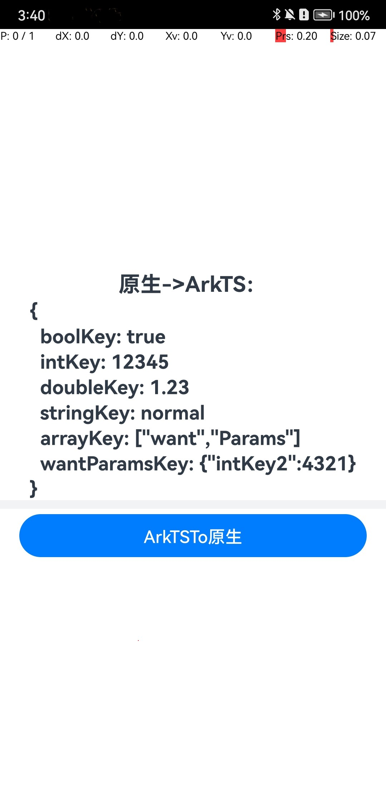
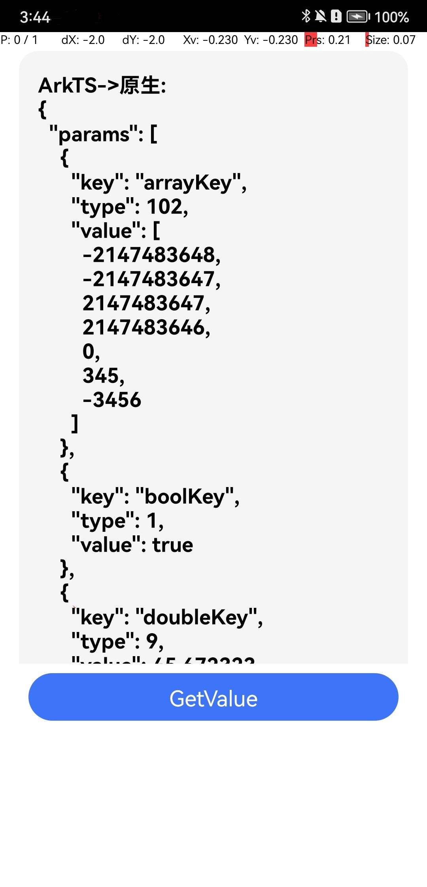
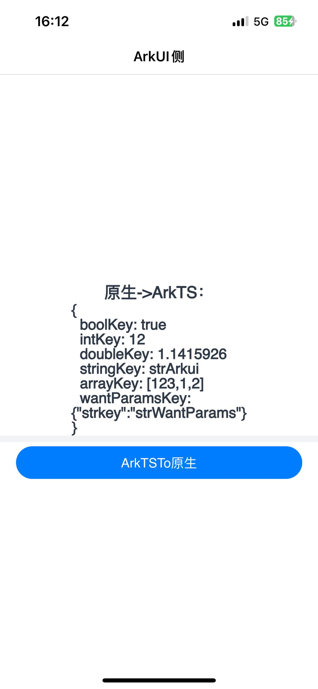
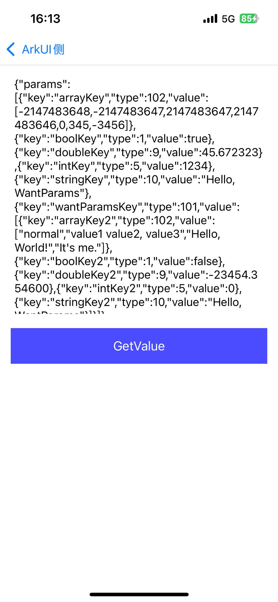

# WantParams应用示例
## 介绍
本示例展示ArkUI-X中使用原生平台中WantParams的工程，进入主页面后，主页面显示原生平台传递到ArkTS的WantParams数据；点击页面上的Button【ArkTSTo原生】
按钮后，跳转到原生页面，页面上显示从ArkTS传递到原生平台的Want数据，点击Button【GetValue】按钮后，显示通过getValue接口获取的数据。

## 效果预览

* Android平台展示效果

  <table>
  <tr>
      <td>
          <center>
              
          </center>
      </td>
      <td>
          <center>
              
          </center>
      </td>
  </tr>
  </table> 

* iOS平台展示效果

  <table>
  <tr>
      <td>
          <center>
              
          </center>
      </td>
      <td>
          <center>
              
          </center>
      </td>
  </tr>
  </table>

### 使用说明

1. 打开应用，首页面显示原生平台传递到ArkTS的WantParams数据和一个Button【ArkTSTo原生】。
2. 点击Button【ArkTSTo原生】按键，跳转到原生页面，原生页面显示ArkTS传递到原生平台层的Want数据和一个Button【GetValue】。
3. 点击原生页面中的Button【GetValue】按钮，显示通过getValue接口获取的Want数据。

## 工程目录

```
WantParams
  ├── .arkui-x
  │   ├── android/app/src/main/java/com/example/wantparams
  │   │   └── EntryWantActivity.java
  │   └── ios/app
  │       └── WantViewController.m
  ├── AppScope                    // App信息配置文件
  └── entry/src/main
      ├── ets
      │   ├── entryability        // 应用入口
      │   └── pages               // 应用页面
      └── resources               // 放置颜色、文字等资源
```

## 具体实现

### Android实现
+ 基本的页面展示封装在Index，源码参考: [Index.ets](entry/src/main/ets/pages/Index.ets)
    + 展示基本的UI界面：Text和Button组件的基本构造实现。通过aboutToAppear获取从原生平台传递而来的数据，并将数据设置到到message中，从而在页面上显示。
    + 点击【ArkTSTo原生】按钮跳转到原生页面：通过设置Want数据结构，指定需要加载原生原生页面，然后通过调用startAbility实现原生页面的拉起。
+ 原生的页面展示封装在EntryWantActivity，源码参考: [EntryWantActivity.java](.arkui-x/android/app/src/main/java/com/example/wantparams/EntryWantActivity.java)
    + 展示基本的UI界面：Text和Button组件的基本构造实现。通过Intent的getStringExtra获取从ArkTS传递而来的数据，并将数据显示到Text中。
    + 点击【GetValue】按钮显示getValue获取的值：通过调用WantParams中的getValue接口获取指定key对应的值，并将其显示在Text控件中。

### iOS实现
+ 基本的页面展示封装在Index，源码参考: [Index.ets](entry/src/main/ets/pages/Index.ets)
  + 展示基本的UI界面：Text和Button组件的基本构造实现。通过aboutToAppear获取从原生平台传递而来的数据，并将数据设置到到message中，从而在页面上显示。
  + 点击【ArkTSTo原生】按钮跳转到原生页面：通过设置Want数据结构，指定需要加载原生原生页面，然后通过调用startAbility实现原生页面的拉起。
+ 原生的页面展示封装在WantViewController，源码参考: [WantViewController.m](.arkui-x/ios/app/WantViewController.m)
  + 展示基本的UI界面：Text和Button组件的基本构造实现。通过AppDelegate.m文件中的application:openURL:options:获取从ArkTS传递而来的数据，并将数据显示到Text中。
  + 点击【GetValue】按钮显示getValue获取的值：通过调用WantParams中的getValue接口获取指定key对应的值，并将其显示在Text控件中。


## 相关权限

不涉及。

## 依赖

不涉及。

## 约束与限制

1. 本示例支持在Android\iOS上运行。

2. 本示例已适配API version 16版本ArkUI-X SDK，版本号：5.1.0.50。

3. 本示例需要使用DevEco Studio 5.0.1 Release (Build Version: 5.0.5.306, built on December 6, 2024)及以上版本才可编译运行。

## 下载

如需单独下载本工程，执行如下命令：

```
git init
git config core.sparsecheckout true
echo /WantParams > .git/info/sparse-checkout
git remote add origin https://gitcode.com/arkui-x/samples.git
git pull origin master
```